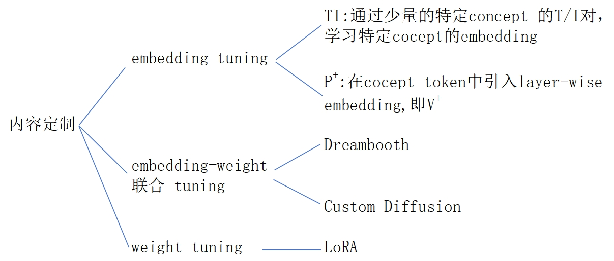
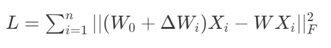

# Mix-of-Show: Decentralized Low-Rank Adaptation for Multi-Concept Customization of Diffusion Models

新国立，开源     

|||
|--|--|
| LoRA | Low Rank Adaptation|
| TI | Textual Inversion |

## 核心问题是什么?

 

### 目的

基于T2I大模型的个性化内容生成。       
.    
.    
.    
.    

### 现有方法及局限性

使用 LoRA 可以实现 Concept Customization.     
但联合多个 LoRA 实现 Multi-concept Customization 是个挑战。       
.    
.    
.    

### 本文方法

Mix-of-show 框架，可解决   

方法：   
1. 单个 LoRA 训练时使用 embedding-decomposed LoRA，解决多个 LoRA 之间的 concept 冲突问题。     
2. LoRA 结合时使用 gadient 混合可保留单个 LoRA 的 in-domain essence，解决模型 fusion 引入的 ID 特征丢失的问题。    
3. 引入区域可控 sampling，解决 multi-concept sampling 中的特征与控制信号绑定的问题。   

.    
.    
.    
.    

### 效果

可以组合定制不同的 concept (角色、对象、场景)且高质量生成。   
.    
.    
.    
.    
.    

## 核心贡献是什么？

.    
.    
.    
.    
.    
.    
.    
.    
.    
.    
.    
.    
.    
.    
.    
.    
.    
.    
.    
.    

## 大致方法是什么？

  

Mix-of-show 框架分为两部分：Single-Clinent和 Center-Node.   
Single-Client 基于 LoRA 学习特定对象，其关键技术为layer-wise Embedding 和 multi-world 表示。    

Center-Node 用于接入各种 Single-Client 以实现定制化的效果，其关键技术为 gradient fusion.    

### 任务描述    

**目的：** 结合2个及以上 concept 的定制化 Diffusion 生成模型。    

**当前方法：** 多个 concept 的联合训练。这种训练方法缺少扩展性和可复用性。    

**解决方法：** 分别训练每个 concept 模型，并将它们合并。    
在本文中,单个 concept 模型用 LoRA 实现。合并的方法为把多个concept 模型集成的权重到 center-node 上(类似LoRA)。    

$$
W= f(W_0,\Delta W_1,\Delta W_2,\dots ,\Delta W_n),
$$

### Single Client：ED-LoRA   

原始 LoRA 是不能做 Concept 融合的。   

假设关于 concept 的 \\(V\\) 已经训好,\\(P^\ast\\) 为名 \\(V\\) 的 text prompt. 可视化 \\(V\\) 是指使用完整的推断流程，根据\\(P^\ast\\)  sample 出一幅画。    
对比模型：     
1. TI，知只学习 \\(V\\)，不更新模型参数。    
2. TI + LoRA，即学习 \\(V\\)，且以 \\(\Delta \phi \\) 的形式更新模型参数。    
这是因为，不更新预训练模型，就必须让 \\(V\\) 学到全部的 concept 特征。\\(V\\) 可以学到in-domain part，却不足以学习 out-domain part. 导致 \\(V\\) 的部有细节的丢失。       

> &#x2753; in-domain 和 out-domain 分别代表什么了？   
> 答：in-domain concept：目标是预训练基模型生成出来的图像。    
> out-domain concept：目标不是由这个基模型生成出来的，可能与基模型的生成分布有较大差异。    

**结论1**: 不更新预训练模型的 TI 方法只能学习(和生成) in-domain concept，对  out-domain concept 效果不好，在 TI 基础上，以 LoRA 方式更新预训练模型可以学习和生成out-domain concept.    

**结论2**: concept 的独特特征主要是通过 LoRA (而不是embedding)学到的，使得语义相似的 embedding 映射到不同的视觉空间，因此导致了多 Concept 融合时的 Conflicts.（每个 LoRA 都试图把同一个 embedding 映射到自己的视觉空间）    

ED - LoRA = embedding(in-domain) + LoRA(out-domain),其中embedding 部分通过两种方式增强其表达能力。    
1. 将相似的 embedding 替换成不同 concept 解耦的
embedding.   
2. 采用 layer-wise embedding (引用自\\(P^+\\))    

$$
V=V^{+} _{rand} V^{+} _{class}
$$

\\(V^{+} _{rand}\\)：随机初始化，用于提取 concept 的外观特征。    

\\(V^{+} _{class}\\)：根据 concept 的类别初始化。     

[&#x2753;] 分别是怎么定义的？      

\\(V^{+} _{rand} 、V^{+} _{class}\\). LoRA 矩阵(B、A)都是可学习参数，其中 V 学习目标 concept 的 in-domain 特征，LoRA 提取目标 concept 其它特征。    
[&#x2753;] 每个 concept 独立学习的，怎么保证每个 concept 学到 V 的都较大的区分度？    

每个 client 分别要学习 \\(V^{+} _{rand} 、V^{+} _{class}\\). LoRA 矩阵(B、A)，因此 center 也要分别结合这些参数。    

### Center-Node   

如何把 LoRA 矩阵结合到预训练模型的权重上？    

**结论3**：直接混合 LoRA 权重，会导致生成结果的 concept ID 特征丢失。   
因为，\\(n\\)个 LoRA 矩阵的简单平均，会导致每个矩阵都变为原来的\\(\frac{1}{n} \\).    
Gradient Fusion：利用 “decode concepts from text prompts” 的能力，在没有数据的情况下更新预训练模型的权重。   

1. 使用每个单独的 LoRA 分别 从 text prompts decode 出 concept.    
> 这里的 decode 应该是 inference 的意思吧。从 text 到 image 是完整的 sample 过程,仅仅一个 decoder 是不够的。    

2. 提取每个 LoRA 的 LoRA 对应的 input / output feature.   
3. 位于同一层的各个 LoRA 的 feature Concat 到一起。   
> [&#x2753;] 怎么么理解 concat? concat 之后维度就不对了，公式中也没有体现出 concat.      
答：通过图4(b)可知，是 batch 维度的 concat.    

4. fused gradients 更新 W，目标函数。   

$$
L= {\textstyle \sum_{i=1}^n{}} ||(W_0+ \Delta W_i)X_i-WX_i||^2_F
$$

目标函数第1项为由 single Client‌ 训练出的GT. 第二项是待训练的 layer.
\\(X_i\\) 是 LoRA layer Input 经过 activation 的结果，即 dctivate 部分保持不变，通过训好的 LoRA layer 生成训练数据采优化 UNet layer,使得 \\(W\\) 逼近 \\(W_0+ \Delta W_i\\) 的效果。    

### 区域可控的 Sampling

当前的控制信号注入方式（空间控制 ControlNet，T2I）能保留目标特征，但如果要生成多个目标，不能将特定目标与特定控制信号绑定。     

**本文方法：区域控制**     
控制信号：    

|||
|--|--|
|\\(P_g\\)|global prompt：提供 overall context|
|\\(P_{ri}\\)|regional prompt：描述特定目标的位置与特证|
 

注入控制：     
1. \\(h = CA (z, P_g)\\)    
2. 
$$
\begin{align*}
 z_i&=z\odot M_i\\\\ h_i&=CA(z_i,P_{ri})
\end{align*} 
$$   

3. \\(h[M_i] = h_i\\)    

|||
|--|--|
|\\(z\\)| UNet fedture |
|\\(M_i\\)| mask,描述控制信号i所控制的区域 |

.    
.   

## 相关工作    

 

多内容融合：
1. Custom Diffusion：多内容联合训练，约束优化    
2. SVDiff：数据增强，防止 concept mixing    
3. Cones    

多速推断内容定制     
1. Instantbooth    
2. ELITE    
3. Jia     

### 联邦学习    

不同 client 在不同享数据情况下学习相互协作。    
1. FedAvg：不同 Client 的权重混合    
2. 基于 LoRA 的 local client + raining/global server aggregation
.  
.  
.  
.  
.  
.  
.  
.  
.  
.  
.  
.  
.  
.  
.  
.  
.  
.  
.  
.  
.  
.  
.  
.  
.  
.  
.  
.  
.  

## 训练

||||
|--|--|--|
| Stage 1 | Single Client | center node|
| 可学习参数 | V,LoRA | UNet 中加了 LoRA 的层|
| 数据 | 特定 Concept 的自采数据 | 由 Stage 1 构造数据 |  
| Loss |  | \\(L= {\textstyle \sum_{i=1}^n{}} ||(W_0+ \Delta W_i)X_i-WX_i||^2_F\\) |

||||
|--|--|--|
| Stage 1 | Single Client | center node|
| 可学习参数 | V,LoRA | UNet 中加了 LoRA 的层|
| 数据 | 特定 Concept 的自采数据 | 由 Stage 1 构造数据 |  
| Loss |  |  |

.  
.  
.
.  
.  
.  
.  
.  

.  
.  
.  
.  
.  
.  
.  
.  
.  
.  
. 
.  
.  
.  
.  
.  
.  
.  
.  

### 训练策略

在 text Encoder 和 UNet 的所有 attention 模块中的 Linear 层加入 LoRA，rank = 4       

单 Client训练：    
Adam learninq rate，text embedding：1 e -3, text encoder：1 e -5,UNet, ：1 e -4    

gradient fusion：   
LBFGS,text optimizer：50, UNet: 50      

||||
|--|--|--|
| | Stage 1 | Stage 2 |
| 学习率 | text embedding：1 e -3, text encoder：1 e -5,UNet, ：1 e -4  ||
| Optimizer | Adam |LBFGS,text optimizer：50, UNet: 50 |

预训练模型：    
Chilloutimix：即图4中的 pretrained-V1      
Anything-V4：即图4中的 pretrained-V2      

单模块训练:    
0.01 noise offset 是 encoding stable identity 的关键。    

.  
.  
.  
.  
.  
.  

## 实验与结论

**实验1：** 单内容/多内容生成    
1. LoRA + weight fusion     
2. Custom Diffusion + 合并 CA 中的 K.V    
3. \\(P+\\) + 多 concept embedding     
4. ED \\(-\\) LoRA + gradient fusion    
多内容生成时，所有方法使用“区域可控” prompt.    

**效果:** 对于单内容生成，4 生成质量相当好且能更好保留角色持征。   

对于多内容生成，2 和 3 的生成结果不自然。1 在多内容生成时会丢失目标特征，4 生成结果自然且能保留每个ID的特征。 

**分析:** 1 和 4 会调整整个模型的所有 CA 层，2 和 3 只调整文本相关的模块。导致 2 和 3 的 embedding 超负荷地承担了编码 out-domain low-level 细节的工作，影响了生成质量。    
1 没有多内容融合的能力。    

**实验二：** 文本一致性 (CLIP)     

**效果:**       
 

1. 单内容生成中，1 和 4 的文本一致性比较好，在多内容生成中，1 的文本一致性有明显下降，但4没有。    
**分析：** 由于 1 和 4 调整了 spatial 相关层的权重，因此能更好地捕获复杂的ID特征。

**实验三：** Ablation           
1. LoRA + Weight fusion     
2. ED - LoRA + Weight fusion    
3. ED-LoRA + gradient fusion     

**效果:**       
 

**结论:** ED 编码和 gradient fusion 能好较地保留 ID 特征。     

### 评价指标
CLIP-Score: T/I 相似度    
CIIP: 生成图像与 target conept 的相似度     
.  
.  
.  
.  
.  
.  
.  
.  
.  
.  
.  
.  
.  
.  
.  
.  
.  
.  
.  
.  
.  
.  
.  
.  
.  
.  
.  
.  
.  
.  
.  
.  
.  
.  
.  
.  
.  

## 有效

.  
.  
.  
.  
.  
.  
.  
.  
.  
.  
.  
.  

## 局限性

1. attributes from one region may influence another due to the encoding of some attributes in the global Single-Concept Model Methods embedding.

       
Figure 10: Limitation of Mix-of-Show. (a) Attribute leakage in regionally controllable sampling.

**解决方法：** negative prompts    

2. 训练 Center-node 的时间较长 (30min,1 A100)      
3. 生成 small faces 因为 VAE 丢失了高频细节    

**解决方法：** 提升生成图像的分辨率。    
.  
.  
.  
.  
.  

## 启发

.  
.  
.  
.  
.  
.  
.  
.  
.  
.  
.  
.  
.  
.  
.  
.  
.  
.  
.  
.  

## 遗留问题

.  
.  
.  
.  
.  
.  
.  
.  
.  
.  
.  
.  
.  
.  
.  
.  
.  
.  
.  
.  

## 参考材料

1. https://showlab.github.io/Mix-of-Show     
2. diffusion model    
3. [LoRA](./38.md)     
