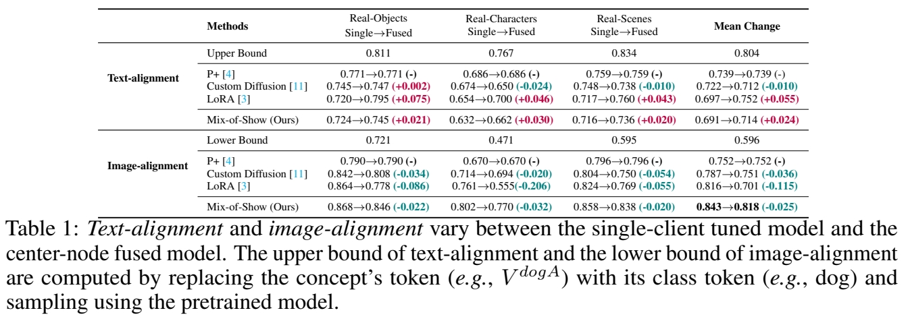
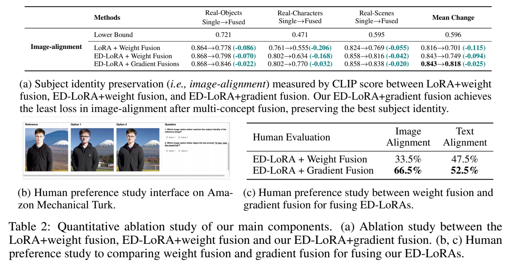
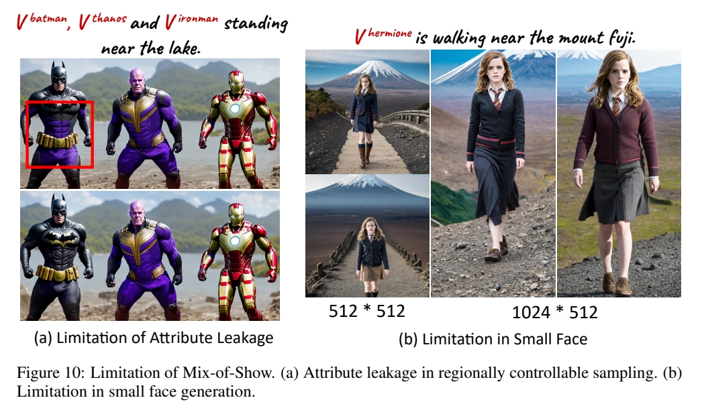

# Mix-of-Show: Decentralized Low-Rank Adaptation for Multi-Concept Customization of Diffusion Models

新国立，开源     

|||
|--|--|
| LoRA | Low Rank Adaptation|
| TI | Textual Inversion |

## 核心问题是什么?

 

### 目的

基于T2I大模型的个性化内容生成。       
.    
.    
.    
.    

### 现有方法及局限性

使用 LoRA 可以实现 Concept Customization.     
但联合多个 LoRA 实现 Multi-concept Customization 是个挑战。       
.    
.    
.    

### 本文方法

Mix-of-show 框架，可解决：   
1. 多个 LoRA 引入的 concept 冲突。   
2. 模型 fusion 引入的 ID 特征丢失。   

方法：   
1. 单个 LoRA 训练时使用 embedding-decomposed LoRA.    
2. gadient 混合时保留单个 LoRA 的 in-domain essence.   
3. 引入区域可控 sampling，解决 multi-concept sampling 中的特征绑定和ID特征丢失的问题。   

.    
.    
.    
.    

### 效果

可以组合不同的 concept (角色、对象、场景)且高质量生成。   
.    
.    
.    
.    
.    

## 核心贡献是什么？

.    
.    
.    
.    
.    
.    
.    
.    
.    
.    
.    
.    
.    
.    
.    
.    
.    
.    
.    
.    

## 大致方法是什么？

  

Mix-of-show 框架分为两部分：Single-Clinent和 Center-Node.   
Single-Client 基于 LoRA 学习特定对象，其关键技术为layer-wise Embedding 和 multi-world 表示。    

【&#x2753;】Layer-wise Embedding 体现在哪里？   

Center-Node 用于接入各种 Single-Client 以实现定制化的效果。    

### 任务描述    

**目的：** 结合2个及以上 concept 的定制化 Diffusion 生成模型。    

**当前方法：** 多个 concept 的联合训练。这种训练方法，缺少扩展性和可复用性。    

**解决方法：** 分别训练每个 concept 模型，并将它们合并。    
在本文中,单个 concept 模型用 LoRA 实现。合并的方法为把多个concept 模型集成的权重到 center-node 上(类似LoRA)。    

$$
W= f(W_0,\Delta W_1,\Delta W_2,\dots ,\Delta W_n),
$$

### Single Client：ED-LoRA   

原始 LoRA 是不能做 Concept 融合的。   

[&#x2753;] embedding tuning (TI ) 与 embedding-weight tuning (LoRA) 的对比实验，没有看懂。    

[&#x2753;] in-domain 和 out-domain 分别代表什么了？   

in-domain concept：目标是预训练基模型生成出来的图像。    

out-domain concept：目标不是由这个基模型生成出来的，可能与基模型的生成分布有较大差异。    

**结论1**: TI 只能学习和生成 in-domain concept，对  out-domain concept 效果不好，TI + LoRA 可以学习和生成out-domain concept.    

**结论2**: 当前的 LoRA 能对 concept ID 编码，且不同的  LoRA会把不同的外观信息映射到相似的 embedding， 因此导致了多 Concept 融合时的 Conflicts.    

针对结论2，本文将相似的 embedding 替换成不同 concept 解耦的
embedding.   

$$
V=V^{+} _{rand} V^{+} _{class}
$$

\\(V^{+} _{rand}\\)：随机初始化，用于提取 concept 的外观特征。    

\\(V^{+} _{class}\\)：根据 concept 的类别初始化。    

\\(V^{+} _{rand} 、V^{+} _{class}\\). LoRA 矩阵(B、A)都是可学习参数，其中 V 学习目标 concept 的 in-domain 特征，LoRA 提取目标 concept 其它特征。    
[&#x2753;] 每个 concept 独立学习的，怎么保证每个 concept 学到 V 的都较大的区分度？    

### Center-Node   

如何把 LoRA 矩阵结合到预训练模型的权重上？    

**结论3**：直接混合 LoRA 权重，会导致生成结果的 concept ID 特征丢失。   
因为，\\(n\\)个 LoRA 矩阵的简单平均，会导致每个矩阵都变为原来的\\(\frac{1}{n} \\).    
利用 “decode concepts from text prompts” 的能力，在没有数据的情况下更新预训练模型的权重。   

1. 使用每个单独的 LoRA 分别 decode 出 concept.    
2. 提取每个 LoRA 对应的 input / output feature.   
3. 各个 LoRA 的 feature Concat 到一起。   
4. fused gradients 更新 W，目标函数。   

$$
L= {\textstyle \sum_{i=1}^n{}} ||(W_0+ \Delta W_i)X_i-WX_i||^2_F
$$

[&#x2753;] 与联邦学习有什么关系？      
[&#x2753;] \\(X_i\\) 代表第i个 LoRA concept 的 input activatlion      
[&#x2753;] 第3步的 concat featdare 怎么用？    

### 区域可控的 Sambling

直接多内容生成会丢失目标特征。    
空间可控的生成 (ControlNet，T2) 能保留目标特征，但如果要生成多个目标，不能将特定目标与特定控制信号绑定。     

**本文方法：**     
控制信号：     
1. global prompt：提供 overall context  \\(P_g\\)      
2. regional prompt：描述特定目标的位置与特证。\\(P_{ri}\\)

注入控制：     
1. \\(h = CA (Z. P_g)\\)    
2. 
$$\begin{align*}Z_i&=Z\odot M_i \\ h_i&=CA(Z_i,P_{ri})
\end{align*}$$   
3. \\(h[M_i] = h_i\\)    
.    
.    
.    
.    
.    
.    
.    
.    
.    
.    
.    
.    
.  
.  
.  
.  
.  
.  
.  
.  
.  
.  
.  
.  
.  
.  
.  
.  
.  
.  
.  
.  
.  
.  
.  
.  
.  
.  
.  
.  
.  
.  
.  

## 训练

.  
.  
.  
.  
.  
.  
.  
.  
.  
.  
.  
.  
.  
.  
.  
.  
.  
.  
.  
.  

### 数据集

自己收集的数据       
.  
.  
.  
.  
.  
.  
.  
.  
.  
.  
.  
.  
.  
.  
.  
.  
.  
.  
.  

### loss

.  
.  
.  
.  
.  
.  
.  
.  
.  
.  
.  
.  
.  
.  
.  
.  
.  
.  
.  
.  

### 训练策略

在所有 text Encoder 和 UNet 的 attentnion 模块中的 Linear 层加入 LoRA，rank = 4       

单 Client训练：    
Adam learninq rate，text embedding：1 e -3, text encoder：1 e -5,UNet, ：1 e -4    

gadiend fusiorl：   
LBFGS,text optimizer：50, Net 50      

预训练模型：    
Chilloutimix：即图4中的 pretrained-V1      
Anything-V4：即图4中的 pretrained-V2      

单模块训练:    
0.01 noise offset 是 encoding stable identity 的关键。    

.  
.  
.  
.  
.  
.  
.  
.  

## 实验与结论

**实验1：** 单内容/多内容生成    
1. LoRA + weight fusion     
2. Custom Diffusion + 合并 CA 中的 K.V    
3. \\(p^+\\) + 多 concept embedding     
4. ED - LoRA + gradient fusion    
多内容生成时，所有方法使用“区域可控” prompt.    

**效果:** 对于单内容生成，4 生成质量相当好且能更好保留角色持征。   

**分析:** 2 和 3 只调整文本相关的模块，而 1 和 4 会调整整个模型的所有 CA 层。导致 2 和 3 在 embedding 中编码了过多的 out-domain low-level 细节。    
对于多内容生成，2 和 3 的生成结果不自然。1 在多内容生成时会丢失目标特征，4 生成结果自然且能保留每个ID的特征。     

**实验二：** 文本一致性 (CLIP)     

**效果:**       
 

1. 单内容生成中，1 和 4 的文本一致性比较好，在多内容生成中，1 的文本一致性有明显下降，但4没有。    
**分析：** 由于 1 和 4 调整了 spatial 相关层的权重，因此能更好地捕获复杂的ID特征。

**实验三：** Ablation           
1. LoRA + Weight fusion     
2. ED - LoRA + Weight fusion    
3. ED-LoRA + gradient fusion     

**效果:**       
 

**结论:** ED 编码和 gradient fusion 能好较地保留 ID 特征。     

### 评价指标
CLIP-Score: T/I 相似度    
CIIP: 生成图像与 target conept 的相似度     
.  
.  
.  
.  
.  
.  
.  
.  
.  
.  
.  
.  
.  
.  
.  
.  
.  
.  
.  
.  
.  
.  
.  
.  
.  
.  
.  
.  
.  
.  
.  
.  
.  
.  
.  
.  
.  

## 有效

.  
.  
.  
.  
.  
.  
.  
.  
.  
.  
.  
.  

## 局限性

1. attributes from one region may influence another due to the encoding of some attributes in the global Single-Concept Model Methods embedding.

 

**解决方法：** negative prompts    

2. 训练 Center-node 的时间较长 (30min,1 A100)      
3. 生成 small faces 因为 VAE 丢失了高频细节    

**解决方法：** 提升生成图像的分辨率。    
.  
.  
.  
.  
.  

## 启发

.  
.  
.  
.  
.  
.  
.  
.  
.  
.  
.  
.  
.  
.  
.  
.  
.  
.  
.  
.  

## 遗留问题

.  
.  
.  
.  
.  
.  
.  
.  
.  
.  
.  
.  
.  
.  
.  
.  
.  
.  
.  
.  

## 参考材料

https://showlab.github.io/Mix-of-Show
