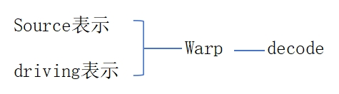
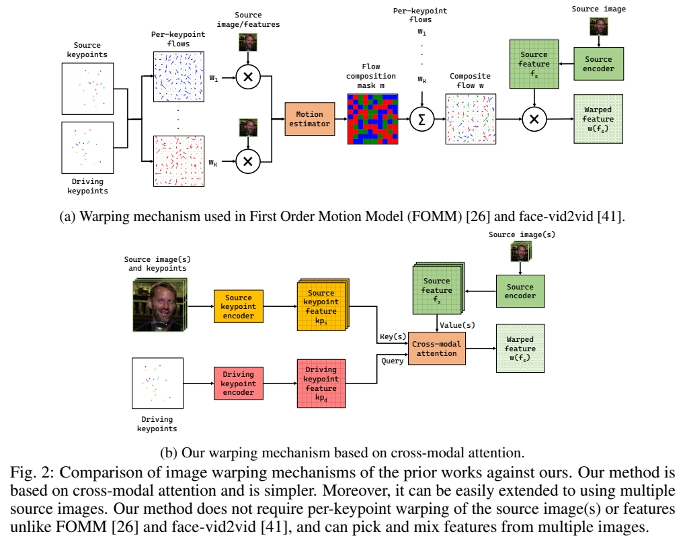
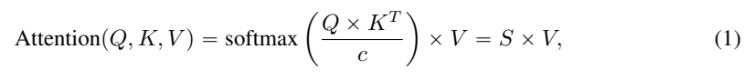
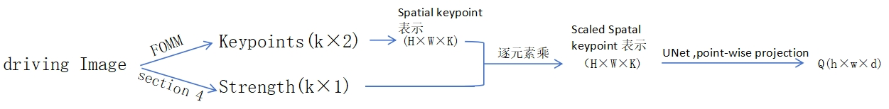
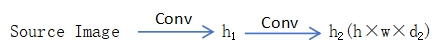
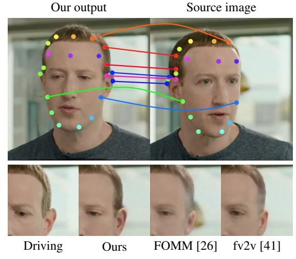
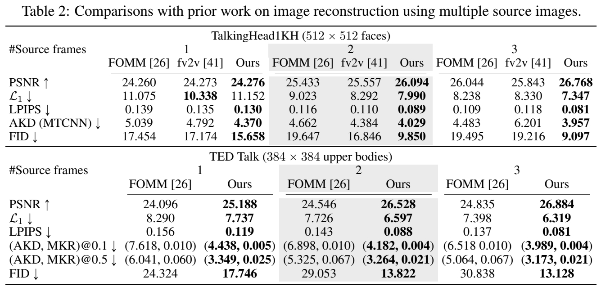

# Implicit Warping for Animation with Image Sets

NVIDIA   

## 核心问题是什么?

摘要     
这与现有方法不同，我们的框架的挑选能力有助于它在多个数据集上实现最先进的结果，这些数据集使用单个和多源图像进行图像动画。     
https://deepimagination.cc/implicit-warping/

### 目的

用 driving 视频中的动作来 warp reference 图像中的角色，以实现视频驱动图像的视频生成任务。     

现有方法：    

要实现大幅度的运动，就需要借助大的光流，才能获得远处的特征。    

.    
.    
.    
.    

### 现有方法及局限性

现有方法使用显式基于光流的方法进行动画，该方法设计用于使用单个源，不能很好地扩展到多个源。   
.    
.    
.    
.    

### 本文方法

我们提出了一种新的隐式图像动画框架，使用一组源图像通过驱动视频的运动进行传输。使用单个跨模态注意力层在源图像和驱动图像之间找到对应关系，从不同的源图像中选择最合适的特征，并扭曲所选特征。    
.    
.    
.    
.    

### 效果

在单 reference 和多 reference 场景中都达到了 SOTA.        
.    
.    
.    
.    

## 核心贡献是什么？

.    
.    
.    
.    
.    
.    
.    
.    
.    
.    
.    
.    
.    
.    
.    
.    
.    
.    
.    
.    

## 大致方法是什么？

 

1. 找出 source和driving 的 dense correspondence     
2. 基于 dense corresponence 的 warp.          
作者认为一个CA可以完成 1 和 2. 称其为 impicit warping     

 

不需要显式地提取光流，Q 和 K 的相似度描述了隐式的光流。  

 

### 构造 Q. K .V    

**K**: Source keypoint feature     
**Q**: driving keypoint feature   
**V**: Source image feature   

Q 的构造：    

 

spatial keypoint 表示，[:,:,i] 为以第i个 keypoint 位置为中心，特定均值和方差的二维一通道高斯。        
Strength: 描述关键点的可见性。    

K 的构造：    
K 和 Q 和构造过程相同，区别在于UNet 的输入，concat (scaled spatial keypoint 表示，source Image)     
优势：把所有 keypoints 表示到一张图像上，后面的模块与 keypoint 的个数无关。     

V 的构造：    
 

Q、K、V 在空间上是对应的。     

CA 存在的问题：所有的 key 与 query 都相似度不高时，也会从 key 中选择一个 Score 最高的 key 对应的 value，但这个 value 可能并不合适，或者选择任何一个 value 都不合适。例如张嘴时要生成牙齿。        
  
解决方法：   
1. 增加额外的 KV 
2. 使用 dropout 随机丢弃 KV 来鼓励使用额外的 KV      

这个方法对 “warp 方法缺少生成能力”的问题有一定弥补作用     

[&#x2753;] 怎么制作额外的 KV？ 每一对 KV 代表一个 Source Image 上的一个 Keypoints.   

此处能对 KV 做 drop out，是因为 CA 把所有的 KV 看作是集合，不能应用于 Conv. 因为conv 是有位置关系的。    

### crsss - modal attention   

 

**Q**: q\\(\times \\)d, **K**: k\\(\times \\)d,**V**: k\\(\times \\)d'    

$$
\begin{align*}
q& =kps-num\\\\
 K& =kps-num\cdot ref-num+add-num
\end{align*}
$$

$$
\begin{matrix}
 Q=Q+PE, &\\\\
 K=K+PE &\\\\
  A=\text{Softmax} (\frac{Q\cdot  K^\top }{C}), & q\times k \\\\
\text{output feature}  =A\cdot V,& q\times d{}'  &
\end{matrix}
$$

$$
\text{residual feature} = MLP(\text{concat}(A \cdot \text{concat(pixel} , K),Q))
$$ 

$$
\text{warped feature = output feature + residual feature}
$$

目的：除了用 A warp 了 V，还 warp 了原图和 key，用于提取 skew, rotation 等“对 V 做加权平均”难以学到的信息，可提升生成质量和颜色一致性。    

效率提升：1- D attention layer ， spatial-reduction attention        

.  
.  
.  
.  
.  
.  
.  

## 训练

.  
.  
.  
.  
.  
.  
.  
.  
.  
.  
.  
.  
.  
.  
.  
.  
.  
.  
.  
.  

### 数据集

TalkingHead-1kH      
VoxCeleb2        
TED Talk      

### 评价指标   

生成图像质量：PSNR，L1，LPIPS,FID    
运动相似度：AKD (average keypoint distance)    
MKR(missing keypoint ratio)    
 
.  
.  
.  
.  
.  
.  

### loss

1. GAN Loss(参考face-vidzvid)    
2. perceptual loss (参考 VCG-19)     
3. equivariance loss (参考 FoMM)        
.  
.  
.  
.  
.  
.  
.  
.  
.  
.  
.  
.  
.  
.  
.  
.  
.  
.  
.  

### 训练策略

  
.  
.  
.  
.  
.  
.  
.  
.  
.  
.  
.  
.  
.  
.  
.  
.  
.  
.  
.  

## 实验与结论

**实验1:** 横向对比，单 reference        
.      
.       
.     
.      
.       
.     
.      
.       
.     

**效果1：**     

 

**结论1：** 3 的生成质量更高且与动作一致性更好。    

**效果2：**    

 

**结论2：**    
3 所使用的 attention 是 global 的，因此可以从空间上距离较远的位置提取特征，但显式光流的方法，需要借助较大的光流才能获得远处的特征。    

**实验2:** 横向对比，多 reference    

1. FOMM (face,upper body)   
2. AA- PCA (upper body)   
3. 本文方法     
4. fv2v(face)     

1,2,4 不支持多 source Image 因此分别用每个 source Image 做 warping, 并在 Warp feature map 上做平均。    

**效果：**     

 

Source Image 为少于 180 帧的连续帧序列。    

**结论：** 随着 Source image 数量的增加，3 的效果会更好，而1、2、4 的效果会更差。    

**分析：** 用同一 pose warp 不同的 image，得到的结果之间会有 misalignment. 但 1、2 不知道该选取哪个 warp 结果。而 3 使用 global attention 从所有 source 中提取信息。   

**实验3：** Ablation    
1. 无 residual 分支，无 Extra KV   
2. 引入 residual 分支     
3. 引入 Extra KV      

**效果：**   
 
 

**结论：** 残差结构与额外的 K／V 对结果都有提升。   

**实验4：** 可视化 strength    
**效果：**    

 

[&#x2753;] 怎样预测 Strength?    

 

.  
.  
.  
.  
.  
.  
.  
.  
.  
.  
.  
.  
.  
.  
.  
.  
.  
.  
.  
.  
.  
.  
.  
.  
.  
.  
.  
.  
.  
.  
.  
.  
.  
.  
.  
.  
.  
.  
.  
.  
.  
.  
.  
.  
.  
.  
.  
.  

## 有效

.  
.  
.  
.  
.  
.  
.  
.  
.  
.  
.  
.  

## 局限性

缺少生成能力，例如给背面生成正面，生成极端表情等。      
.  
.  
.  
.  
.  
.  
.  
.  
.  
.  
.  
.  
.  
.  

## 启发

.  
.  
.  
.  
.  
.  
.  
.  
.  
.  
.  
.  
.  
.  
.  
.  
.  
.  
.  
.  

## 遗留问题

1. 如何预测 Strength?    
2. 如何构造 extra KV?        
.  
.  
.  
.  
.  
.  
.  
.  
.  
.  
.  
.  
.  
.  
.  
.  
.  
## 相关工作

 

source／target 表示为：2D keypoints, Jacobian Matrics     
Warp 的过程：每个 source／target keypoint 对生成
一个对 source Image Warp 的光流。再用 motion estimator 模块把这些光流合并成 Composite flow. 用 Composite flow warp reference Image     

以上方法存在的问题：     
1. 每个 keypoint 求个光流，时间复杂度与 keypont 的个数成正比    
2. 当有多个 reference Image 时，每个 reference 会生成一个对应的 composite flow 和 output Image，如何将结果合并？average 会导致 blurry，heuristic to choose 会导致flicker.      

## 参考材料

https://deepimagination.cc/implicit-warping/