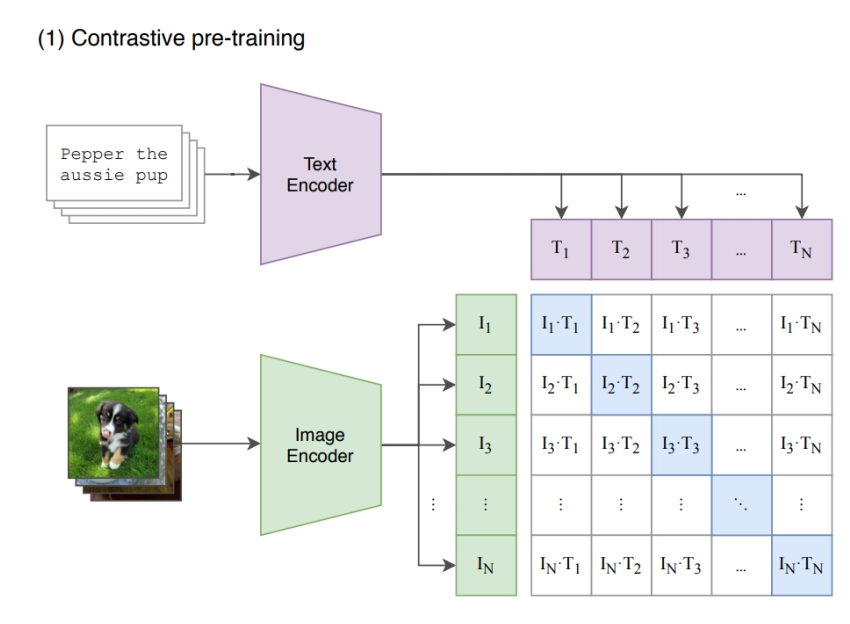
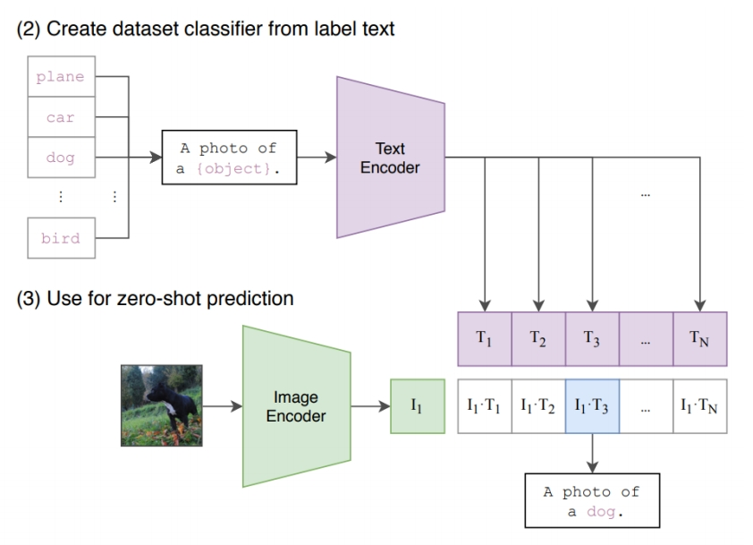

# Learning Transferable Visual Models From Natural Language Supervision

CLIP：Encoders bridge vision and language

 - CLIP text-/image-embeddings are commonly used in diffusion models for conditional generation

  

> &#x2753; 文本条件怎么输入到 denoiser？   
> &#x2705; CLIP embedding：202 openai，图文配对训练用 CLIP 把文本转为 feature.   

