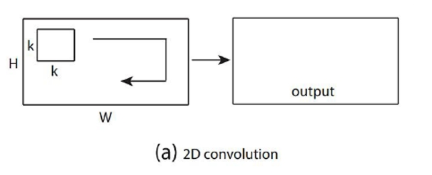
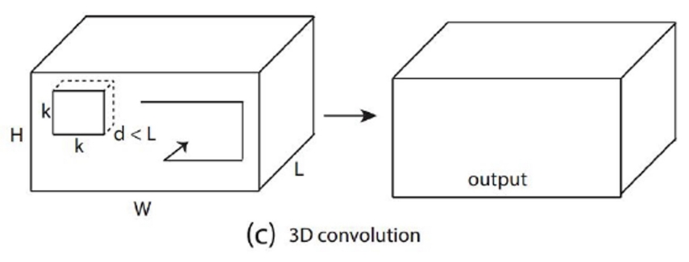
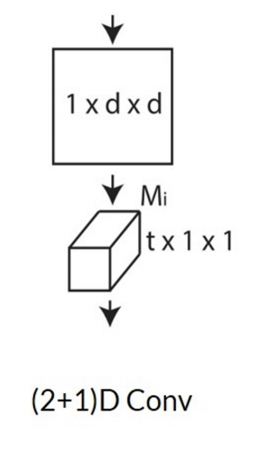
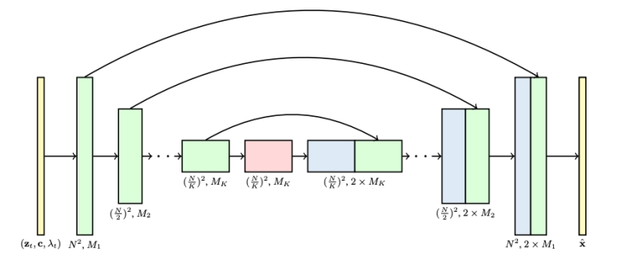
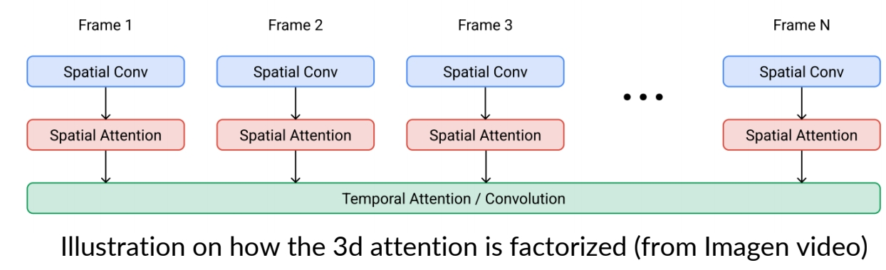

# Video Diffusion Models  

## 2D -> 3D

VDM的一般思路是，在T2I基模型的基础上，引入时序模块并使用视频数据进行训练。  

引入时间模型的方法有卷积方法（Conv3D、Conv(2+1)D）、注意力机制(Cross Attention、Transformer)

|||
|---|---|
|Conv2D||
|Conv3D||
|Conv(2+1)D||

> &#x2705; \\(t\times d\times d\\) 卷积 kenal 数量非常大，可以对 kernel 做分解，先在 spatial 上做卷积，然后在 temporal 上做卷积。   
> &#x2705; 特点：效果还不错，效率也高。   

P39   
## 3D U-Net factorized over space and time

> &#x2705; 2D U-Net 变为 3D U-Net，需要让其内部的 conv 操作和 attention 操作适配 3D.   

- Image 2D conv inflated as → space-only 3D conv, i.e., 2 in (2+1)D Conv   

> &#x2705; (1) 2D conv 适配 3D，实际上只是扩充一个维度变成伪 3D，没有对时序信息做抽象。  

   - Kernel size: (3×3) → (<u>1</u>×3×3)   
   - Feature vectors: (height × weight × channel) → (<u>frame</u> × height × width × channel)   
- Spatial attention: remain the same   

> &#x2705; (2) attention 操作同样没有考虑时序。   

- Insert temporal attention layer: attend across the temporal dimension (spatial axes as batch)   

> &#x2705; (3) 时序上的抽象体现在 temporal attention layer 上。   

## 3D UNet from a 2D UNet  
 - 3x3 2d conv to 1x3x3 3d conv.   
 - Factorized spatial and temporal attentions.   

     
     

Ho et al., <u>"Video Diffusion Models",</u> NeurIPS 2022   

> &#x2705; 利用 2D 做 3D，因为 3D 难训且数据少。  
> &#x2705; 通到添加时序信息，把图像变成视频。此处的 3D 是 2D＋时间，而不是立体。    
> &#x2705; 对向量增加一个维度，并在新的维度上做 attention.   
