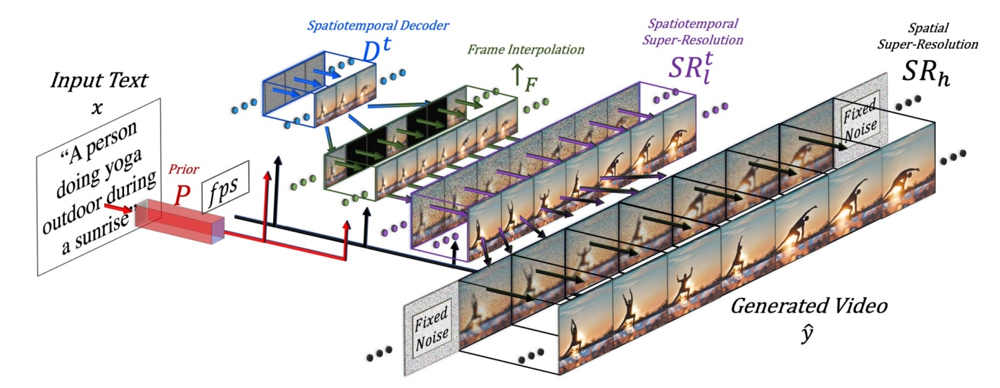
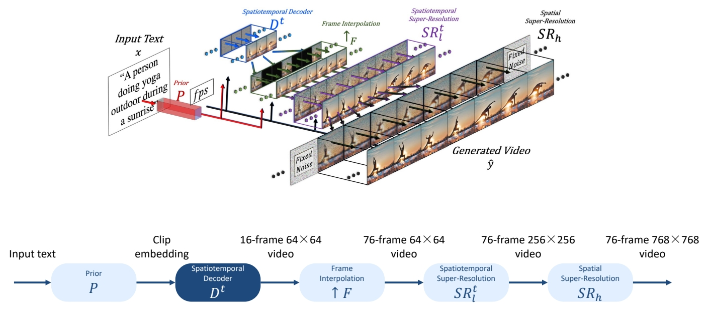
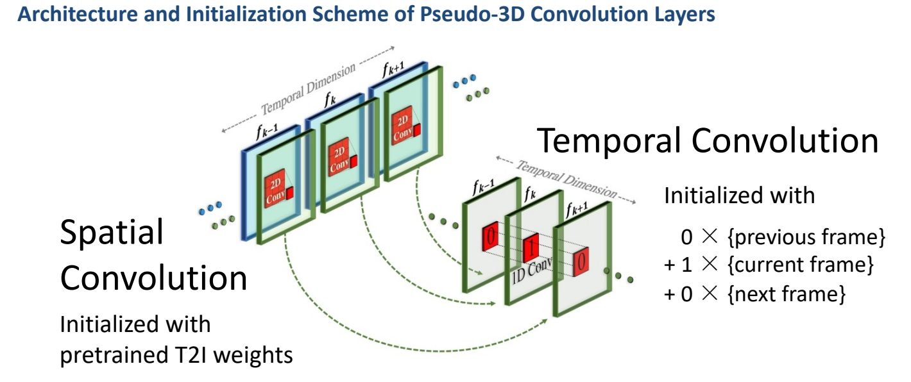
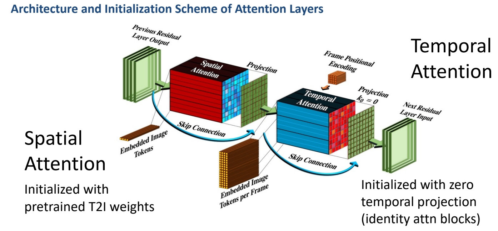
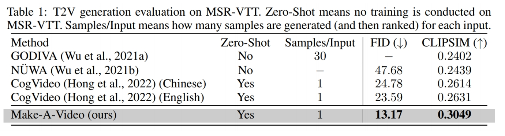
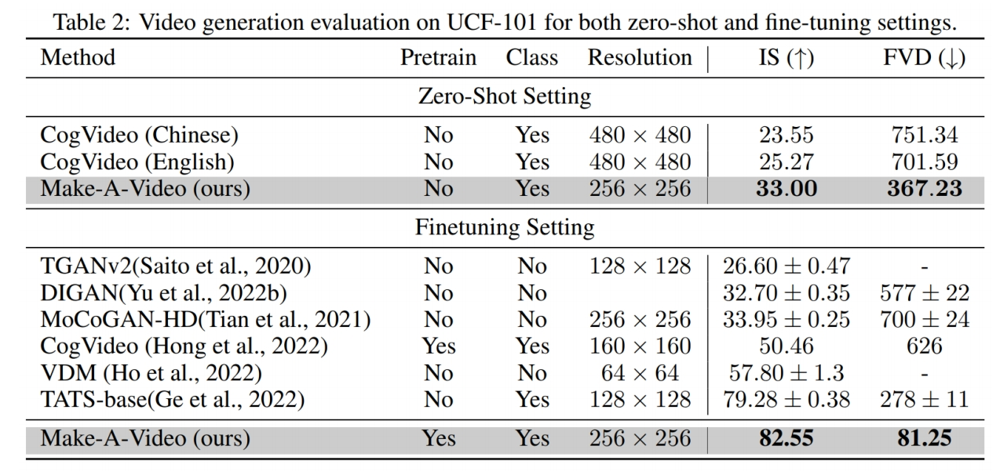
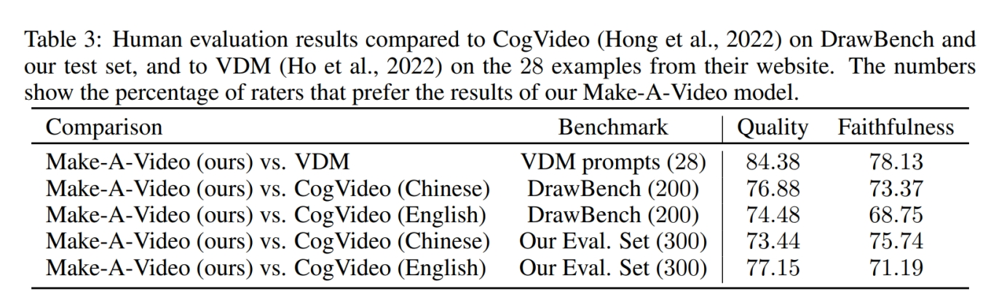
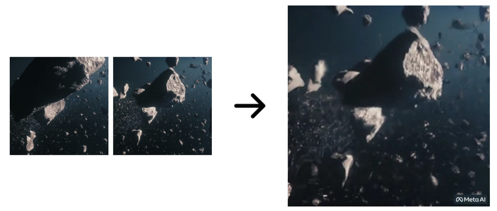

# Make-A-Video

> &#x2705; 把 text 2 image model 变成 text to video model，但不需要 text-video 的 pair data.    

## Cascaded generation

 

> &#x2705; 效果更好，框架在当下更主流。   
> &#x2705; (1) SD：decoder 出关键帧的大概影像。  
> &#x2705; (2) FI：补上中间帧。   
> &#x2705; (3) SSR：时空上的超分。   
> &#x2705; 时序上先生成关键帧再插帧，空间上先生成低质量图像再超分。   
> &#x2705; 这种时序方法不能做流式输出。   

P41   

    

> &#x2753; 第 3 步时间上的超分为什么没有增加帧数？   

P42  

## 2D->3D

  

> &#x2705; 此处的伪 3D 是指 (2＋1)D，它有时序上的抽像，与 VDM 不同。   
> &#x2705; 空间卷积使用预训练好的图像模型。   

P43   

> &#x2705; attention 操作也是 (2＋1)D．     

> &#x2705; 与 Imagen 的相同点：(1) 使用 cascade 提升分辨率， (2) 分为时间 attention 和空间 attention.    
> &#x2705; 不同点：(1) 时间 conv＋空间 conv. (2)only the image prior takes text as input!   

P44  

## **Training**
 - 4 main networks (decoder + interpolation + 2 super-res)   
    - First trained on images alone    
    - Insert and finetune temporal layers on videos   
 - Train on WebVid-10M and 10M subset from HD-VILA-100M   

> &#x2705; 先在图片上训练，再把 temporal layer 加上去。    

P58  
## Evaluate

 

P59  

   

> &#x2705; 早期都在 UCF 数据上比较，但 UCF 本身质量比较低，新的生成方法生成的质量更高，因此不常用 UCF 了。  

P60  

 

P62   

## 应用：**From static to magic**   

Add motion to a single image or fill-in the in-betw    

 
