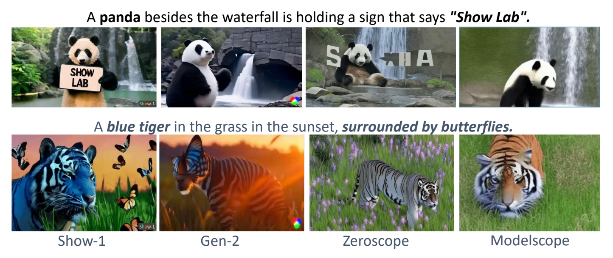
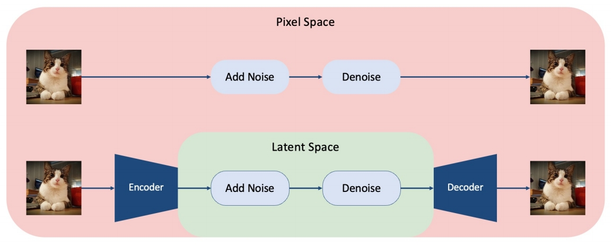
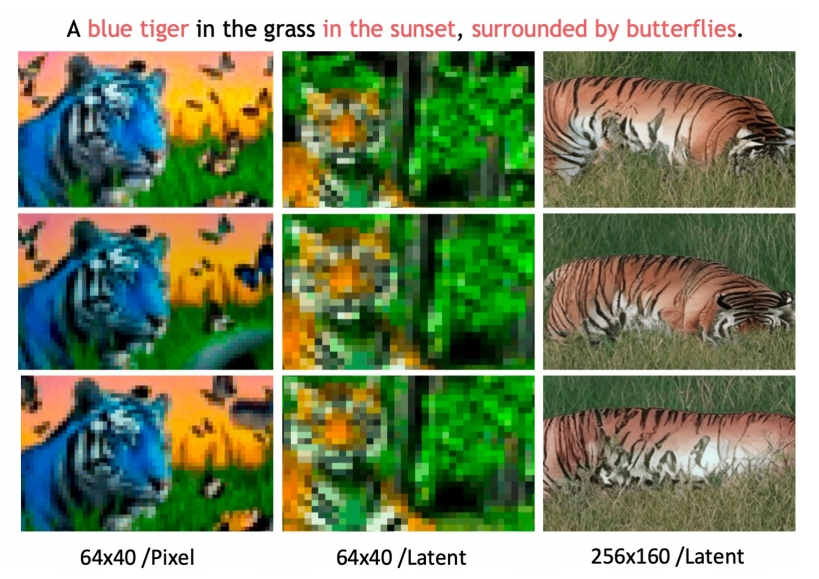
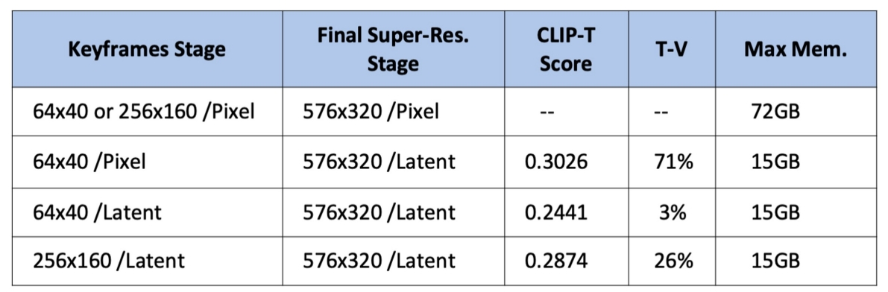
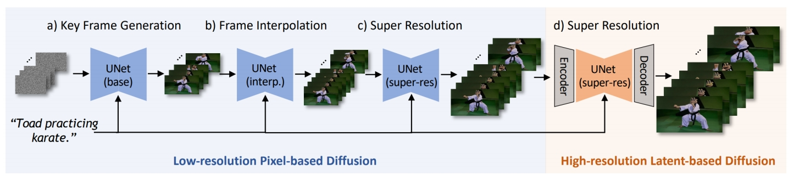

# Show-1

Better text-video alignment? Generation in both pixel- and latent-domain

 

> &#x2705; Stable Diffusion Model存在的问题：当文本变复杂时，文本和内容的 align 不好。  
> &#x2705; show-1 在 alignment 上做了改进。   

P76   
## **Motivation**

### pixel VS latent: 一致性
 - Pixel-based VDM achieves better text-video alignment than latent-based VDM   

|||
|--|--|
|  |  |

> &#x2705; 实验发现：pixel spase 比 latent space 更擅长 align ment.   
> &#x2705; 原因：在 latent space，文本对 pixel 的控制比较差。   

P77   
### pixel VS latent: memory

 - Pixel-based VDM achieves better text-video alignment than latent-based VDM   
 - Pixel-based VDM takes much larger memory than latent-based VDM    

  

P78   
## 本文方法 

 - Use Pixel-based VDM in low-res stage   
 - Use latent-based VDM in high-res stage   

 

P79   
## Result

<https://github.com/showlab/Show-1>

 - Better text-video alignment   
 - Can synthesize large motion   
 - Memory-efficient   
