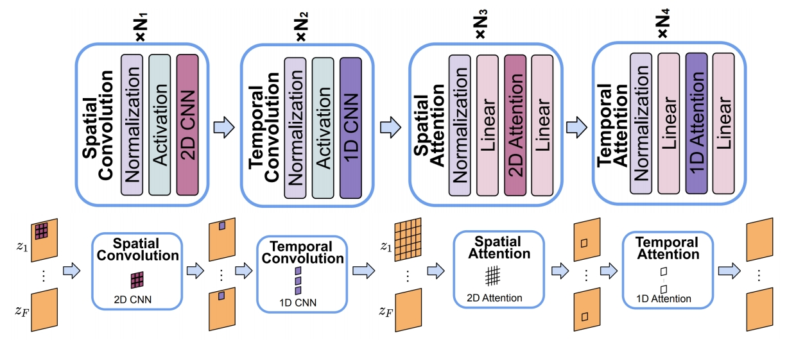

P68   
# ModelScopeT2V

Leverage pretrained T2I models for video generation

 - Inflate Stable Diffusion to a 3D model, preserving pretrained weights   
 - Insert spatio-temporal blocks, **can handle varying number of frames**   

> &#x2705; 基本思路：(1) 以 Stable Diffusion 为基础，在 latent space 工作。 (2) 把 SD 中的 2D 操作扩展为 3D.   

|||
|--|--|
|   |   |

P69     
 

> &#x2705; 扩展方法为 (2＋1)D，因此在 2D spatial 的卷积操作和 Attention 操作之后分别增加了 temporal 的卷积和 Attention.   

P70   

 

P71   

Length = 1   
Model generate images   

> &#x2705; 时域卷积操作能指定 frame 数，因此可以“生成视频”与“生成图像”联合训练。   
> &#x2753; 时序卷积不能做流式，能不能用 transformer.   

P72   

 

