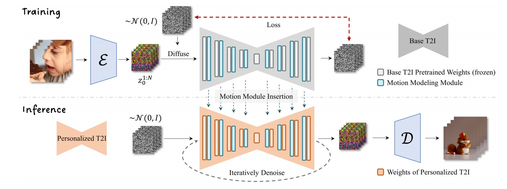
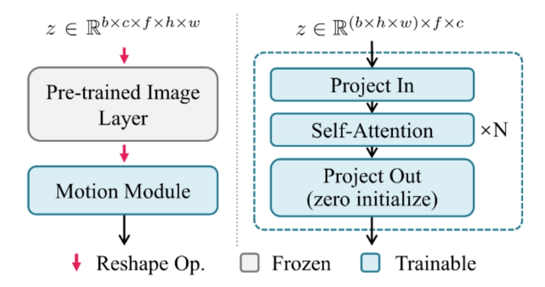

# AnimateDiff: Animate Your Personalized Text-to-Image Diffusion Models without Specific Tuning

## 研究背景与问题
### 目的

1. T2I -> T2V。  
本框架核心是一个即插即用的运动模块，该模块只需训练一次即可**无缝集成于**同源基础T2I模型衍生的任何个性化模型中。

2. MotionLoRA，这是AnimateDiff的轻量级微调技术，可使预训练运动模块以较低训练和数据收集成本适应新运动模式（如不同镜头类型）。

> &#x2705; (1) 用同一个 patten 生成 noise，得到的 image 可能更有一致性。   
> &#x2705; (2) 中间帧的特征保持一致。    

P99  
## 主要方法

方法核心在于从视频数据中学习可迁移的运动先验，这些先验无需特定调优即可应用于个性化T2I模型。

### 推断

[TODO] 图2

在推理阶段，运动模块（蓝色）及可选的MotionLoRA（绿色）可直接插入个性化T2I构成动画生成器，通过迭代去噪过程生成动画。

### 训练

[TODO] 图3

1. 领域适配器（4.1节）：仅在训练中使用，用于缓解基础T2I预训练数据与视频训练数据间的视觉分布差异；
2. 运动模块（4.2节）：学习通用运动先验；
3. MotionLoRA（4.3节，通用动画场景可选）：将预训练运动模块适配至新运动模式。

#### 领域适配器（Domain Adapter）

由于公开视频训练数据集（如WebVid）的视觉质量远低于图像数据集（如LAION-Aesthetic），导致基础T2I的高质量图像域与视频训练域存在显著差异。  
为消除域差异对运动模块学习的干扰，在基础T2I中加入领域适配器（LoRA层）。

[?]为什么仅在训练阶段使用？

 

   

> &#x2705; 在 noise 上对内容进行编辑，即定义第一帧的 noise，以及后面帧的 noise 运动趋势。   

P100 

## Training

 - Train on WebVid-10M, resized at 256x256 (experiments show can generalize to higher res.)   

> &#x2705; 在低分辨率数据上训练，但结果可以泛化到高分辨率。   

> &#x2705; 保证中间帧尽量相似。   

P101   
> &#x2705; 扣出背景并 smooth.    
