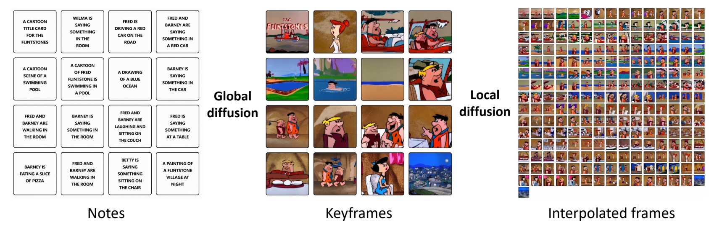
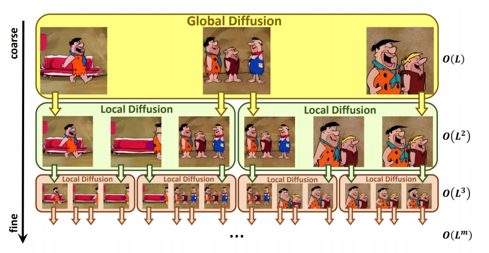
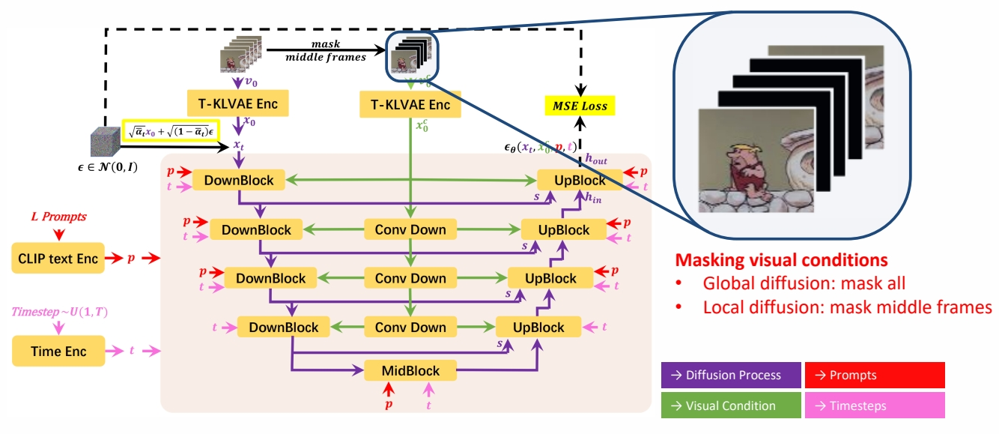

P128  
# NUWA-XL  

Recursive interpolations for generating very long videos

> &#x2705; 两层 diffusion    
> &#x2705; 通过 recursive 的插帧生成非常长的视频。   

## Method Proposed

 - A “diffusion over diffusion” architecture for very long video generation

## **Key Idea**

 - Key idea: coarse-to-fine hierarchical generation

## **Other Highlights**

 - Trained on very long videos (3376 frames)
 - Enables parallel inference
 - Built FlintstonesHD: a new dataset for long video generation, contains 166 episodes with an average of 38000 frames of 1440 × 1080 resolution

 

## **Generation Pipeline**

 - Storyboard through multiple text prompts   

    

P130  

 - Global diffusion model: L text prompts → L keyframes
 - Local diffusion model: 2 text prompts + 2 keyframes → L keyframes   

 

> &#x2705; Global：文生图  \\(\quad\\)  Local：图序列补全。   
> &#x2705; Global 和 Local 使用相似的模型，训练方法不同，主要是 MASK 的区别。   

P131  

## **Mask Temporal Diffusion (MTD)**  

 - A basic diffusion model for global & local diffusion models

  

> &#x2705; 递归的 Local Diffusion    
