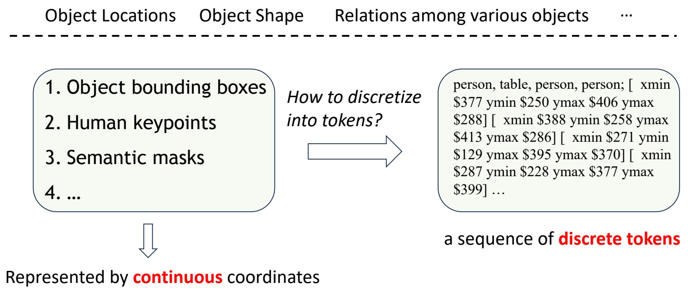
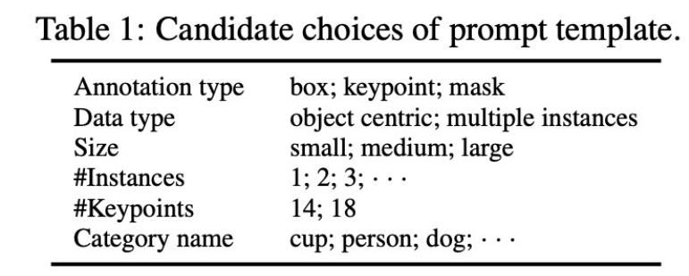
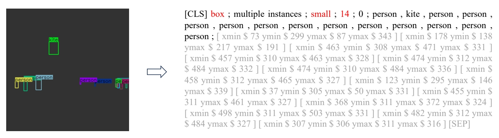
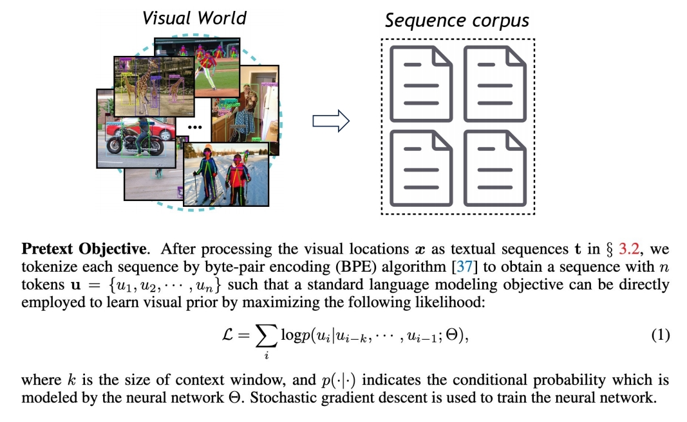
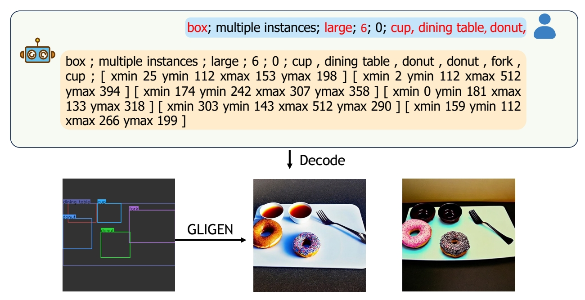
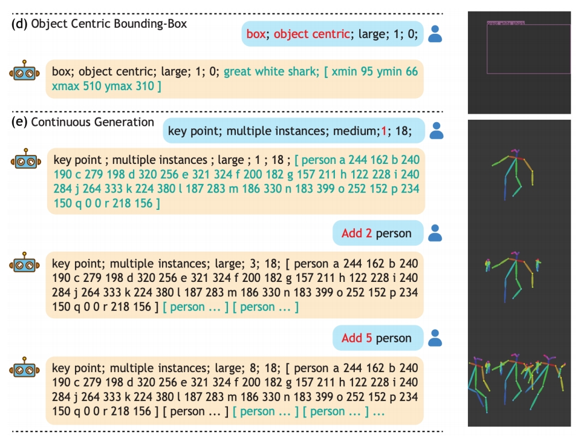

## VisorGPT

Can we model such visual prior with LLM

 

P114   

### Prompt design

 

  

P118  

### Modeling Visual Prior via Generative Pre-Training

  

P119  

### Sample from the LLM which has learned visual prior

 

P120   

 
