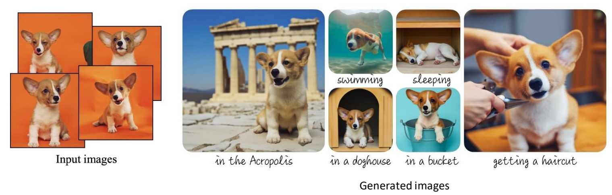
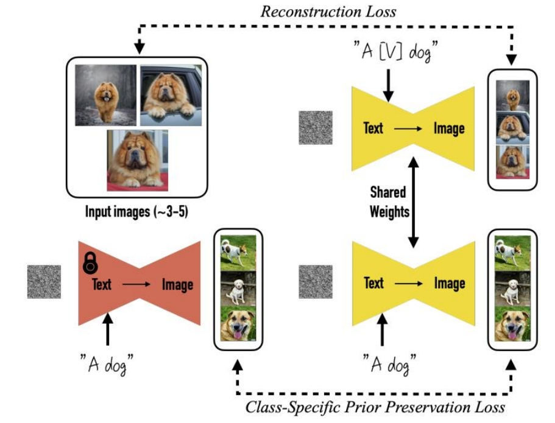
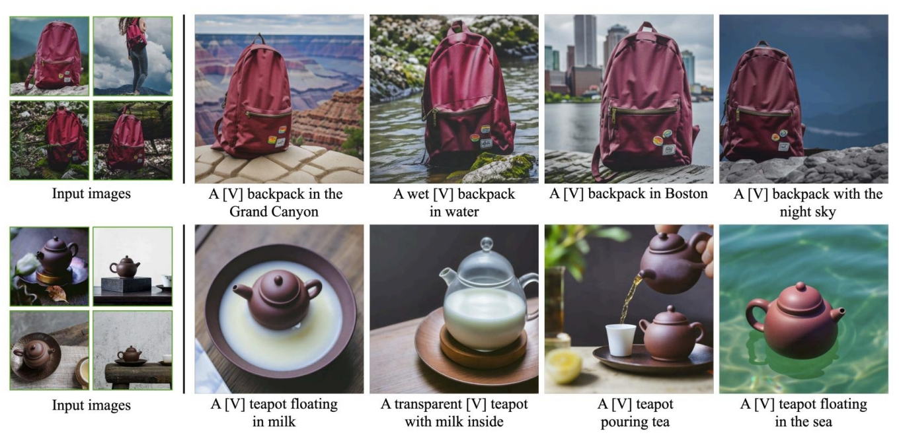

# DreamBooth: Fine Tuning Text-to-Image Diffusion Models for Subject-Driven Generation

### 目标

是一篇关于**个性化文本到图像生成**的论文，提出了一种通过少量图像（3-5张）微调扩散模型，使其能够精准生成特定主体（如个人宠物、独特物品等）的方法。

 

> &#x2705; DreamBooth：输入文本和图像，文本中的［V］指代图像，生成新图像。   
> &#x2705; 特点：对预训练的 diffusion model 的权重改变比较大。   

### **1. 研究背景与核心问题**
- **传统文本到图像的局限性**：通用扩散模型（如Stable Diffusion）难以生成用户指定的**特定主体**（如“我的狗”），因为模型无法从文本描述中捕捉独特细节。
- **现有方法的不足**：
  - **[Textual Inversion](./63.md)**（文本反转）：仅通过嵌入学习主体，生成质量有限。
  - **Fine-tuning整个模型**：容易过拟合，丧失模型原有的多样性。
- **核心目标**：通过少量图像微调模型，实现：
  - **主体保真度**：高精度还原特定主体。
  - **文本可控性**：保留模型根据新文本组合主体的能力（如“我的狗坐在太空飞船里”）。

P34   
### 2. 方法概述  

     
 
DreamBooth的核心创新在于**主体驱动的微调策略**，关键步骤如下：

#### **2.1 主体标识符与类名绑定**
- **唯一标识符（Unique Identifier）**：为每个主体分配一个罕见词（如“sks”），作为其文本标签，避免与预训练词汇冲突。
- **类名（Class Name）**：同时绑定主体类别（如“狗”），防止模型遗忘类别语义。  
  *示例输入文本*：`“a sks dog”`（sks指代特定主体，dog提供先验知识）。

#### **2.2 微调目标**
- **保真度与多样性平衡**：
  - **主体重建损失**：用少量图像（3-5张）微调模型，确保主体细节（如纹理、形状）的精确重建。
  - **类别先验保留**：在训练中混合原始类名文本（如“a dog”），防止模型过拟合到特定主体而丧失生成多样性。

> &#x2705; 输入多张reference image，使用包含特定 identifier 的文本构造 pairdata。目的是对输入图像做 encode。    
> &#x2705; 同时使用用不含 identifer 的图像和文本调练，构造重建 loss 和对抗 loss.目的是生成的多样性及防止过拟合。  

#### **2.3 关键训练技术**
- **低秩适应（LoRA）**：部分微调模型权重，减少计算开销（可选）。
- **扩散模型微调**：基于Stable Diffusion，优化UNet的交叉注意力层，强化标识符与主体特征的关联。

### **3. 实验结果**
- **评估指标**：
  - **用户研究**：对比Textual Inversion、Fine-tuning等方法，DreamBooth在主体保真度和文本对齐性上显著领先。
  - **定性展示**：生成主体在不同场景（如“sks狗戴墨镜”）下的高一致性结果。
- **应用场景**：
  - 个性化艺术创作（如生成个人肖像的油画风格）。
  - 商品展示（同一物品在不同背景下的渲染）。

  

> Input Image的基本特征保持住了，但是细节还是有些丢失。比如书包右下角的三个贴图，在每个生成里面都不一样。  
> 用来生成动作照片还是可以的，因为人对动画的细节差异没有那么敏感。例如这只猫。额头上的花纹，在每张图像上都不一样。如果用来生成人，会发明显的差异。  

---

### **4. 创新点总结**
1. **标识符绑定技术**：通过罕见词+类名解决主体特异性与泛化的矛盾。
2. **高效微调策略**：少量图像即可实现高保真，避免过拟合。
3. **零样本场景组合**：生成未见过的主体-场景组合（如“sks狗在月球上”）。

---

### **5. 局限性与未来方向**
- **多主体生成**：同时绑定多个主体（如“我的狗和猫”）仍需改进。
- **动态场景控制**：复杂动作或交互场景的生成（如“sks狗跳跃”）可能不自然。
- **计算成本**：微调仍需GPU资源，轻量化是未来方向。

---

### **6. 实际意义**
- **个性化内容生成**：为普通用户提供定制化AI创作工具。
- **商业应用**：电商、广告中的产品个性化展示。

---

### **总结**
DreamBooth通过**标识符绑定**和**类别先验保留**，在少量数据下实现了主体驱动的文本到图像生成，推动了扩散模型在个性化任务中的应用。其方法对后续工作（如Custom Diffusion、Perfusion等）有深远影响。
