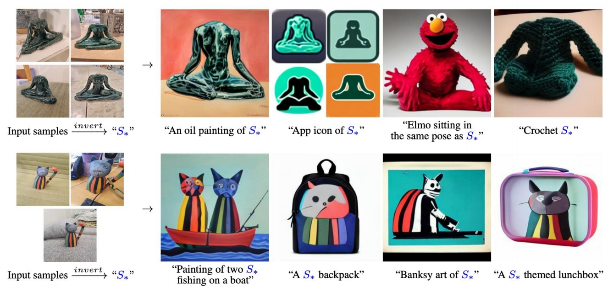
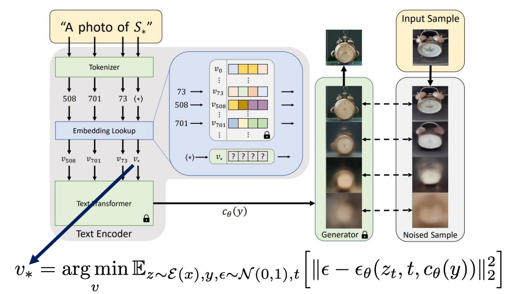
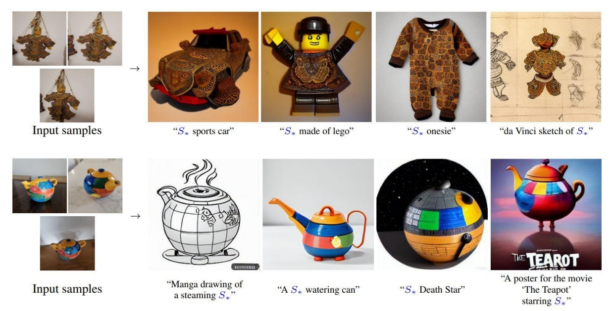
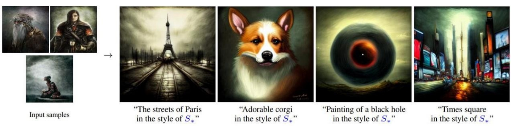

P37    
## Textual Inversion: Optimizing Text Embedding   

 

> &#x2705; 输入3-5张reference iamge。可以把内容、风格、动作等编辑为 \\(S_ {\ast }\\)     
> &#x2705; 用一个 word 来 Encode 源，因此称为 Textual Inversion.    

 

P38   
### Pipeline

 

> &#x2705; 输入带 holder world 的 String，(1) 转为 token (2) token 转为“连续的表示”，即 embedding. (3) embedding 转为 conditional code，用于引导生成模型。    
> &#x2705; 通过生成的结果与GT比较，构造重建loss来优化 embedding.    

P39   
### Textual Inversion Results   

 

P40    
Works well for artistic styles    

 
