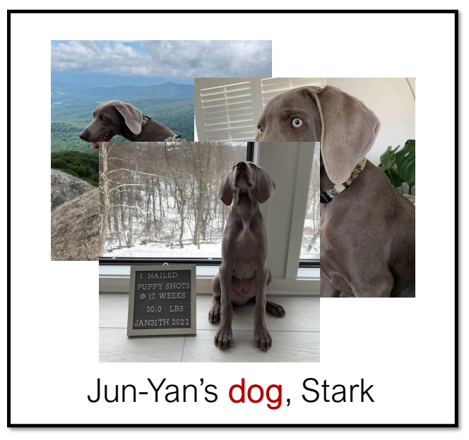
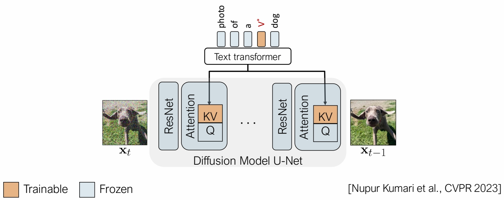
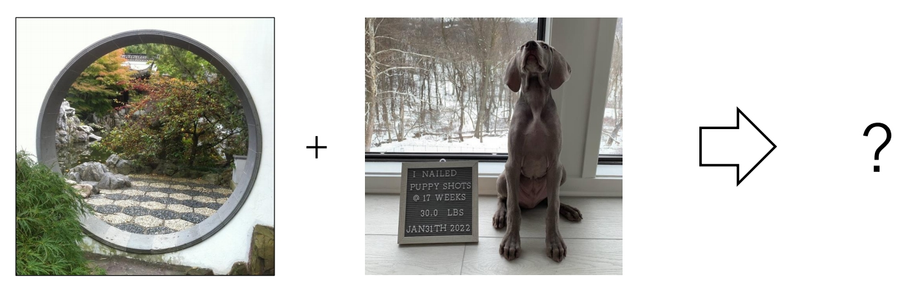
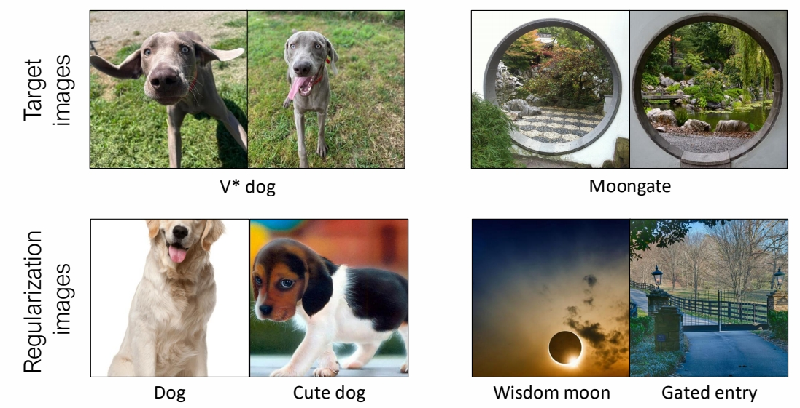

### finetune的性能问题

> 要解决的问题与上一篇相同，即finetune 所需的训练时间、参数存储，Computation 的成本很高。
> 但解决方法有些区别。上一篇通过增加额外的残差模块，而这一篇通过只finetune原始模型的部分参数。  

P45   
#### Analyze change in weights   

> &#x2705; 选择模型的部分参数进行 finetune．问题是怎么选择？    
> 作者通过分析模型各参数的重要性，insights 应该 finetune 哪些参数。   

 

> &#x2705; Cross-Attn 层用于结合图像和文本的特征。     
> &#x2705; Self-Attn 用于图像内部。    
> &#x2705; Other 主要是卷积和 Normalization.    
> &#x2705; 通过比较 pretrained 模型和 finetune 模型，change 主要发生成Cross-Attn 层，说明 Cross-Attn 层在 finetune 过程中更重要！    

P46   
#### Only fine-tune cross-attention layers

     

> &#x2705; 由以上观察结果，finetune 时只更新 K 和 V 的参数。    

P47    
### How to prevent overfitting?    

> 用少量的数据finetune整个模型，容易造成过拟合。    
> &#x2705; 解决方法：通过在训练过程中引入一个正则化项来防止过拟合   

   

> &#x2705; 从large scale image dataset中选择一些所标注文本与左图文本相似度比较高的图像。这些图像与文本的pair data用于计算正则化项。

P48   
### Personalized concepts   

#### 要解决的问题

> &#x2705; 目的：finetune SD 得到这只狗的文生图模型。  

How to describe personalized concepts?    

   

> 但只有少量的关于这只狗的数据。

#### 解决方法

定义 V\\(^\ast \\) 为 modifier token in the text embedding space，例如：

> 解决方法：定义 \\(V^ \ast \\) 为 modifier token，并把它作为一个新的 token.  

V\\(^\ast \\) **dog**   

P49   

#### Pileline

Also fine-tune the modifier token V\\(^\ast \\) that describes the personalized concept   

   

> &#x2705; 把 \\(V^ \ast \\) 代入 caption，并用这只狗的数据做 finetune。同样只更新 K 和 V.    

P50   
#### Single concept results

   

P51   
### Multiple new concepts?    

#### 要解决的问题

   

> 要生成同时包含moongate与这只狗的图像

P52   
#### Joint training

Combine the training dataset of multiple concepts    

   

> &#x2705; 同时使用两个小样本数据 finetune，且使用 modifier token 和正则化图像，可以得到二者结合的效果。    

P53   
#### Two concept results

   

> &#x2705; 也可以同时引入2个 modifier token．    

P54   
### Two concept results   

 
