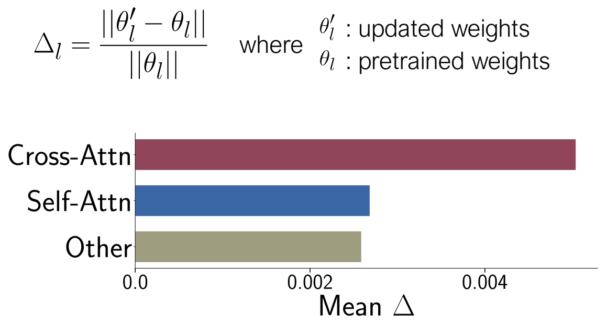
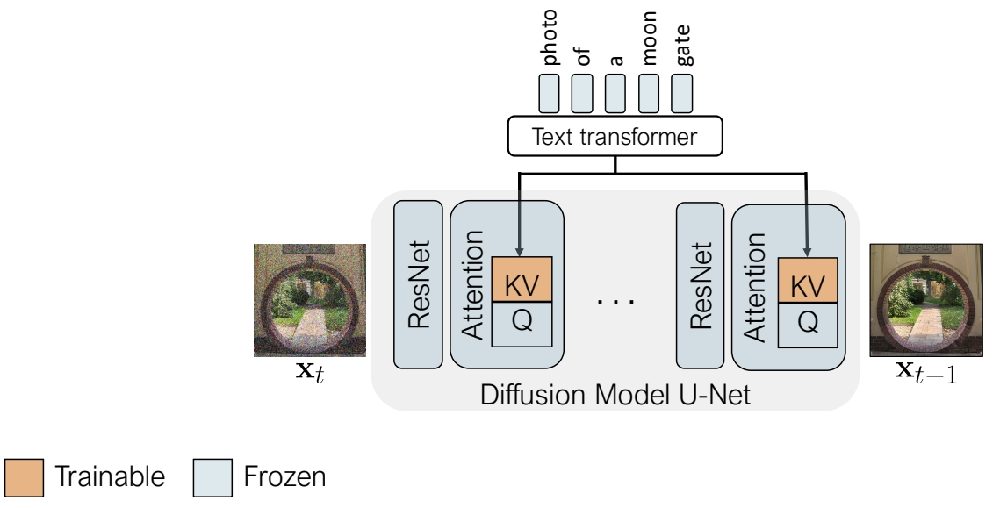
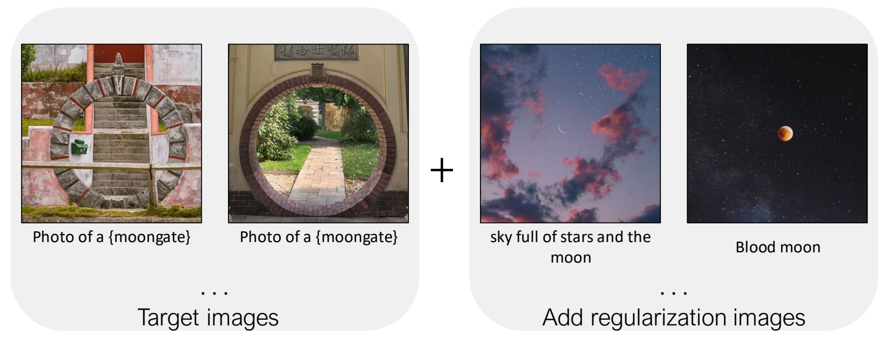
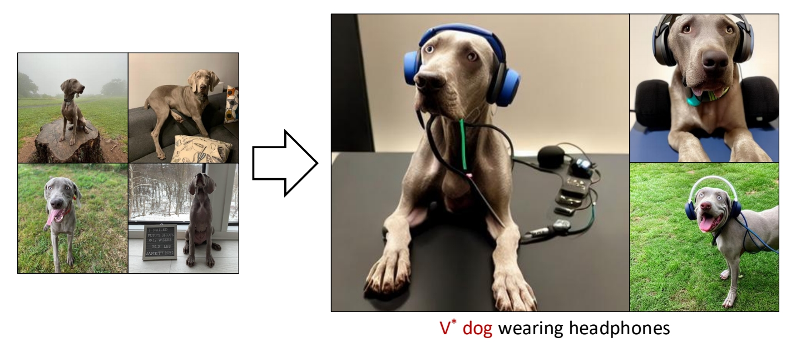
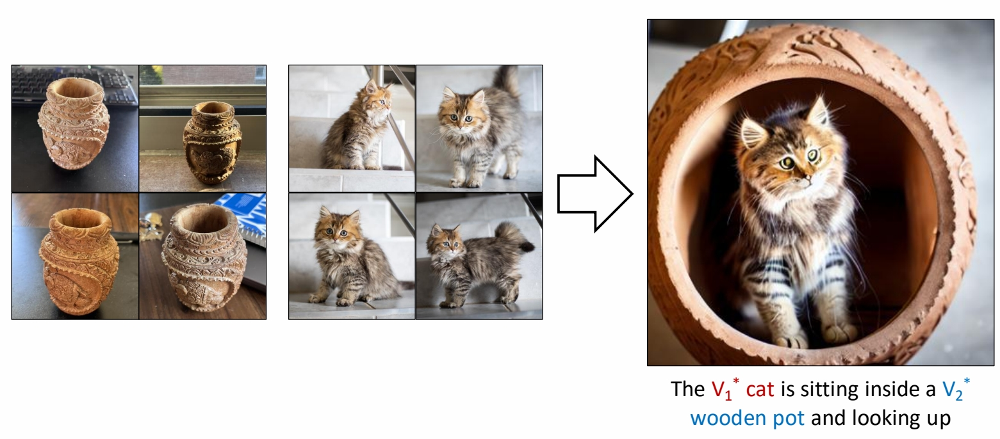
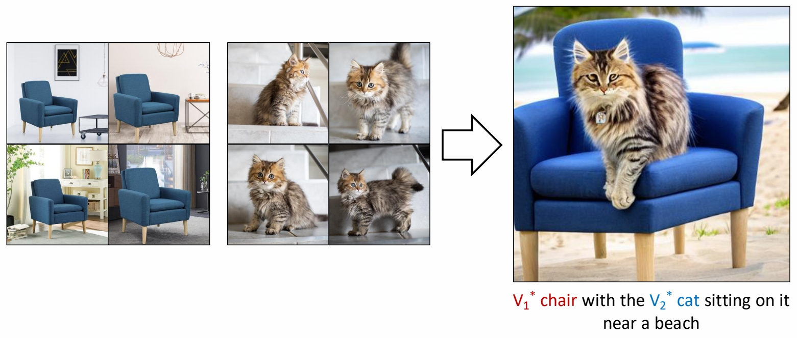

# Multi-Concept Customization of Text-to-Image Diffusion

这篇论文提出了一种针对文本到图像扩散模型（如Stable Diffusion）的**多概念定制化方法**，旨在解决现有技术（如Textual Inversion、DreamBooth、LoRA等）在同时学习多个视觉概念时面临的**概念混淆**、**训练效率低**和**组合泛化性差**的问题。

---

### **1. 核心问题与挑战**
现有单概念定制化方法（如DreamBooth或LoRA）在需要同时学习多个概念（例如“一只特定的狗”+“一种特定的帽子”）时存在以下问题：
1. **概念混淆（Concept Interference）**：多个概念在训练过程中相互干扰，导致生成的图像混合了不同概念的属性（例如狗的脸和帽子的形状结合异常）。
2. **组合泛化性差**：独立训练的单概念模型在组合时无法保证语义一致性（例如“狗戴帽子”可能生成不合理的结构）。
3. **计算成本高**：逐个微调每个概念需要重复训练，效率低下。

---

### **2. 方法设计**
论文提出了一种名为**Custom Diffusion**的框架，通过以下关键技术实现高效多概念定制：

#### **2.1 交叉概念正则化（Cross-Concept Regularization）**
- **目标**：防止多个概念在训练过程中互相干扰。
- **实现**：
  - 对每个概念的图像集分别计算扩散模型的噪声预测损失，但通过共享部分模型参数（如UNet的某些层）强制模型学习概念间的**共享表征**。
  - 引入对比损失（Contrastive Loss），拉近同一概念内样本的嵌入距离，推远不同概念的嵌入距离。

#### **2.2 参数高效微调**
- **可训练参数选择**：
  - 仅微调UNet中的**交叉注意力层（Cross-Attention）**和**文本编码器的最后一层**，冻结其他参数。

> &#x2705; 选择模型的部分参数进行 finetune．问题是怎么选择？    
作者通过分析模型各参数的重要性，insights 应该 finetune 哪些参数。   
>    
> &#x2705; Cross-Attn 层用于结合图像和文本的特征。     
> &#x2705; Self-Attn 用于图像内部。    
> &#x2705; Other 主要是卷积和 Normalization.    
> &#x2705; 通过比较 pretrained 模型和 finetune 模型，change 主要发生成Cross-Attn 层，说明 Cross-Attn 层在 finetune 过程中更重要！    
>      
> &#x2705; 由以上观察结果，finetune 时只更新 K 和 V 的参数。    

  - 每个概念对应一组独立的低秩适配矩阵（类似LoRA），但通过共享基础结构减少参数量。

> [?] 应该不是LoRA，而是微调部分层。需要确认一下。

- **参数量对比**：
  - 全参数微调：约860M参数（Stable Diffusion 1.4）。
  - Custom Diffusion：仅需训练约5M参数（每新增一个概念增加约1M）。

#### **2.3 两阶段训练策略**
1. **单概念初始化**：  
   - 对每个概念单独训练初始嵌入，避免早期概念混淆。
2. **联合微调**：  
   - 将所有概念的参数联合优化，通过正则化保持概念独立性。

> 用少量的数据finetune整个模型，容易造成过拟合。    
> &#x2705; 解决方法：通过在训练过程中引入一个正则化项来防止过拟合   
   
> &#x2705; 从large scale image dataset中选择一些所标注文本与左图文本相似度比较高的图像。这些图像与文本的pair data用于计算正则化项。

---

### **3. 关键优势**
1. **多概念保真度**：  
   - 可同时学习3-5个概念，生成图像中各概念的属性（如形状、纹理）保持高度一致性（见图1对比）。
2. **零样本组合能力**：  
   - 支持训练中未见的组合（例如“狗戴帽子+墨镜”），无需重新训练。
3. **训练效率**：  
   - 相比逐个训练单概念LoRA，训练时间减少50%以上（实验显示5个概念仅需1.5小时，A100 GPU）。

---

### **4. 实验结果**
#### **4.1 任务与数据集**
- **任务**：  
  - 多物体组合（如“玩具狗+卡通帽子”）。  
  - 多风格混合（如“梵高风格+水彩纹理”）。  
  - 属性叠加（如“特定人脸+眼镜+帽子”）。  
- **基线对比**：  
  - 优于DreamBooth（单概念微调后组合）、Textual Inversion（保真度低）、Composable Diffusion（组合能力差）。

#### **4.2 定量指标**
- **CLIP Score**：衡量文本-图像对齐度，比DreamBooth高12%。  
- **用户研究**：85%的用户认为生成的组合概念更合理。

P50   
#### Single concept results

   
   
P53   
#### Two concept results

    

 

---

### **5. 应用场景**
1. **个性化内容创作**：用户上传多个自定义物体/风格，生成组合图像（如“我的宠物+我的背包+莫奈风格”）。
2. **广告设计**：快速合成包含多个品牌元素（如logo、产品）的宣传图。
3. **数据增强**：为多对象交互场景（如“人+家具+宠物”）生成训练数据。

---

### **6. 局限性**
- **概念数量上限**：超过5个概念时性能下降（需更大秩的LoRA或分层训练）。
- **复杂交互**：对需要物理逻辑的组合（如“杯子放在桌子的边缘”）仍需后处理。

---

### **7. 后续影响**
- **扩展工作**：  
  - **Cones**（NeurIPS 2023）：通过概念神经元分解改进多概念解耦。  
  - **UniTune**（ICML 2024）：统一单模型支持任意概念组合。  
- **工业应用**：被Adobe Firefly等工具集成，支持多元素定制生成。

---

### **总结**
该论文通过**交叉概念正则化**和**参数高效微调**，解决了扩散模型多概念定制中的核心挑战，在保真度、组合能力和效率之间实现了平衡，为个性化生成提供了实用化的解决方案。其方法设计简洁，已成为后续多概念生成研究的基准框架。