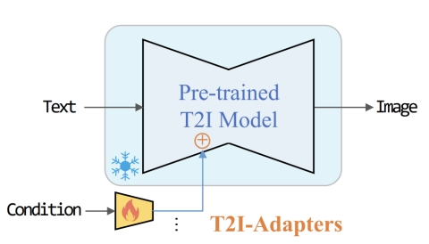
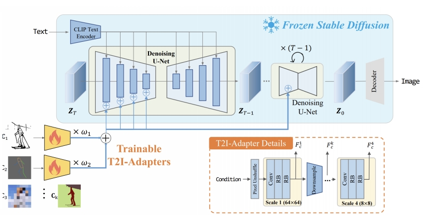
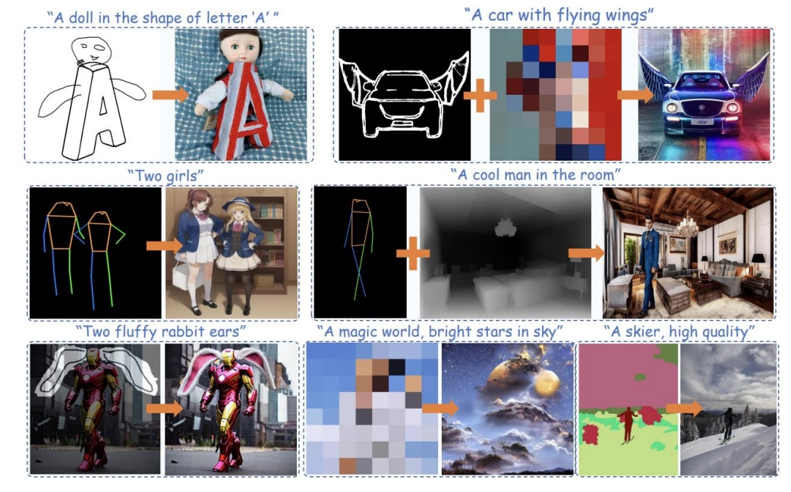

# T2I-Adapter: Learning Adapters to Dig out More Controllable Ability for Text-to-Image Diffusion Models

### **1. 研究背景与动机**
- **问题定义**：  
  大规模文本到图像（T2I）模型（如Stable Diffusion）虽然能生成高质量图像，但仅依赖文本提示难以实现**精细化控制**（如结构、颜色分布）。例如，生成“带翅膀的汽车”时，文本无法提供准确的结构指导，导致生成结果不符合预期。
- **核心目标**：  
  通过轻量级适配器（Adapter）挖掘预训练T2I模型**隐式学习的能力**，将外部控制信号（如草图、深度图）与模型内部知识对齐，实现更精准的生成控制。

---  

### **2. 方法设计**
#### **2.1 总体架构**

    

> 通过引入一个额外的adapter来增加对已有文生图模型的控制方法。  

- **即插即用**：保持预训练T2I模型（如Stable Diffusion）的权重固定，仅训练适配器模块。
- **轻量化设计**：  
  - 参数量约77M，存储空间约300MB，仅为ControlNet的1/3。
  - 适配器由**4个特征提取块**和**3个下采样块**组成，输入条件图（如草图）通过`pixel unshuffle`下采样至64×64分辨率，提取多尺度特征并与UNet编码器特征相加。

#### **2.2 控制条件支持**

    

- **结构控制**：支持草图（Sketch）、深度图（Depth Map）、语义分割图（Semantic Map）、姿态图（Pose）等。
- **颜色控制**：通过空间调色板（Spatial Color Palette）控制色调和颜色分布，采用双三次下采样保留颜色信息，上采样后形成色块特征。
- **多条件组合**：多个适配器的特征可线性加权融合，无需额外训练即可实现多条件控制（如“草图+颜色”）。

> &#x2705; Adapter 包含4个 feature extraction blocks 和3个 down sample blocks. 其中4个feature extraction block对应4个新增加的控制方法。3次降采样，对应于 UNET 的不同 Level.    

#### **2.3 训练策略**
- **非均匀时间步采样**：  
  在扩散过程的早期阶段（图像结构形成期）增加采样概率，提升控制信号的有效性。例如，通过三次函数调整时间步分布，增强早期控制。
- **损失函数**：沿用扩散模型的噪声预测损失，仅优化适配器参数。

---

### **3. 关键创新点**
1. **参数高效性**：  
   - 仅需微调0.3%的参数量（对比ControlNet的完整UNet复制），推理速度更快。
2. **灵活性与可组合性**：  
   - 支持多种控制条件**独立或组合使用**，适配器可独立训练、灵活加载。
3. **泛化能力**：  
   - 适配器**可迁移**至基于同一基础模型（如SD 1.4或SDXL）的微调版本，无需重新训练。  

---

### **4. 实验结果**
#### **4.1 生成质量**
- **单条件控制**：在草图、深度图等任务中，生成图像的结构保真度优于Textual Inversion，与ControlNet相当。
- **多条件组合**：例如“草图+颜色”控制下，生成结果同时满足结构和色彩要求，组合效果稳定。

    

#### **4.2 效率对比**
- **训练成本**：在4块V100 GPU上训练3天即可完成，远低于全参数微调。
- **推理速度**：适配器仅需在扩散过程运行一次，而ControlNet需在每一步迭代中计算，速度提升显著。

---

### **5. 应用场景**
1. **艺术创作**：通过草图控制生成结构，结合颜色调色板调整整体色调。
2. **广告设计**：快速生成符合品牌元素（如LOGO位置、配色）的宣传图。
3. **数据增强**：为计算机视觉任务（如自动驾驶）生成结构可控的合成数据。

---

### **6. 局限性**
- **复杂交互限制**：对需要物理逻辑的场景（如物体遮挡关系）支持有限，需后处理。
- **时间步依赖性**：非均匀采样策略虽提升控制效果，但仍依赖早期阶段的强引导，后期细节调整能力较弱。

---

### **7. 后续影响**
- **技术扩展**：启发了IP-Adapter（多模态控制）、Video-Adapter（视频生成控制）等衍生工作。
- **工业应用**：被集成至Hugging Face Diffusers库，支持SDXL等最新模型，推动可控生成技术的普及。

---

### **总结**
T2I-Adapter通过**轻量化适配器**和**多条件融合机制**，在文本到图像生成中实现了高效可控性。其核心贡献在于平衡了生成质量与计算效率，为精细化内容创作提供了实用工具。未来方向可能包括提升复杂逻辑控制能力及扩展至视频生成领域。