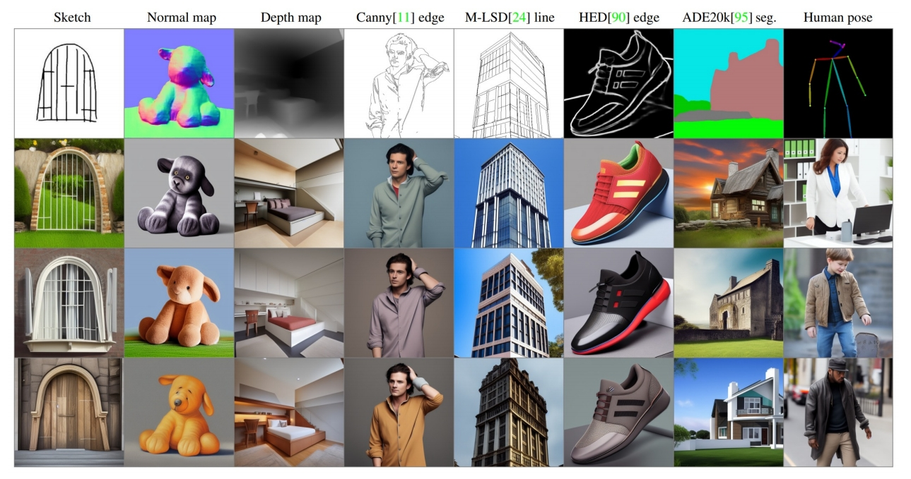
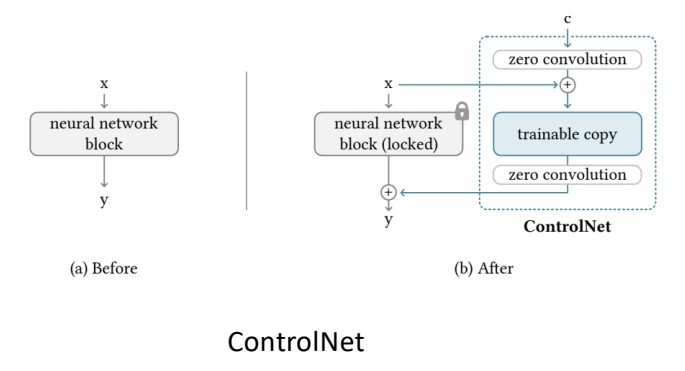
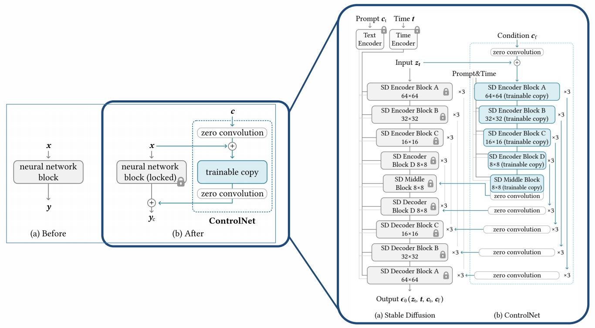

# Adding Conditional Control to Text-to-Image Diffusion Models

> &#x2705; Control Net 是一种通过引入额外条件来控制 Diffusion Model 的网络架构。 

### 1. **背景与核心问题**
现有的文本到图像扩散模型（如Stable Diffusion）虽然能生成高质量图像，但仅依赖文本提示难以精确控制生成图像的空间布局、姿态、形状等细节。用户需反复调整提示词才能接近预期结果，效率较低。因此，如何通过引入额外的空间条件（如边缘图、深度图、人体姿势骨架等）实现更细粒度的控制成为关键问题。

### 2. **方法：ControlNet架构**
ControlNet的核心思想是通过克隆预训练模型的网络块，并引入“零卷积”连接，实现在不破坏原模型能力的前提下学习条件控制。具体设计包括：

 

- **锁定与克隆**：将预训练模型的参数冻结（锁定），并克隆其网络块作为可训练副本，以复用其大规模预训练的特征提取能力。
- **零卷积连接**：在克隆块与原模型之间插入零初始化的1×1卷积层（权重和偏置初始化为0）。这种设计确保训练初期不会引入噪声，逐渐从零增长参数，保护预训练模型的稳定性。

> &#x2705; Zero Convolution：1-1 卷积层，初始的 \\(w\\) 和 \\(b\\) 都为 0．   

- **条件编码**：外部条件（如边缘图）通过4层卷积网络（通道数16→32→64→128）编码为特征向量，与扩散模型输入融合。

> &#x2705; 方法：(1) 预训练好 Diffusion Model (2) 参数复制一份，原始网络 fix (3) 用各种 condition finetune 复制出来的网络参数。 (4) 两个网络结合到一起。   

#### 以Stable Diffusion为例来说明ControlNet的用法。

$$
\mathcal{L} =\mathbb{E} _ {\mathbb{z}_0,t,\mathbf{c} _ t,\mathbf{c} _ f,\epsilon \sim \mathcal{N} (0,1)}[||\epsilon -\epsilon _\theta (\mathbf{z} _ t,t,\mathbf{c} _ t,\mathbf{c}_f)||^2_2] 
$$

where t is the time step, \\(\mathbf{c} _t\\) is the text prompts, \\(\mathbf{c} _ f\\) is the task-specific conditions    

> 需要（x, cf, ct）的pair data。  

### 3. **训练策略**
- **随机提示替换**：训练时，50%的文本提示被替换为空字符串，迫使模型从条件图像中学习语义信息，而非依赖文本提示。
- **突然收敛现象**：在约10,000步训练后，模型会突然学会根据条件生成图像，而非渐进式学习。例如，在6,133步时，模型可能突然拟合苹果轮廓。
- **计算效率**：仅需增加约23%的GPU内存和34%的训练时间（基于NVIDIA A100测试），因冻结原模型参数可节省梯度计算。

### 4. **实验与结果**
- **支持的条件类型**：包括Canny边缘、Hough线、用户涂鸦、人体关键点、分割图、深度图等，且支持多条件组合（如同时使用姿势和边缘）。
- **定量评估**：
  - **FID与CLIP分数**：ControlNet在生成图像与真实图像分布接近度（FID）、文本-图像语义一致性（CLIP-score）上优于基线模型。
  - **消融实验**：若替换零卷积为普通卷积，性能显著下降，表明预训练模型知识在微调时易被破坏。
- **鲁棒性**：无论数据集规模（小至50k或大至1m）如何，训练均稳定有效。

### 5. **创新与意义**
- **高效微调机制**：通过锁定原模型参数和零卷积设计，避免灾难性遗忘，同时实现高效参数更新。
- **多模态控制**：为图像生成引入结构化输入，扩展了扩散模型在工业设计、游戏开发等需精确控制场景的应用潜力。
- **开源与可扩展性**：官方代码已开源，支持社区进一步探索新条件类型（如3D法线图）及与其他模型（如LLM）的适配。

### 6. **局限与未来方向**
- **计算资源需求**：尽管训练效率较高，但大规模联合训练（如解锁原模型参数）仍需高性能计算集群。
- **条件泛化性**：当前条件类型有限，未来可能需探索动态条件生成或更复杂的多模态融合方法。

ControlNet的提出标志着文本到图像生成从“随机创作”迈向“可控设计”的重要一步，为AI绘画的商用落地提供了技术基础。