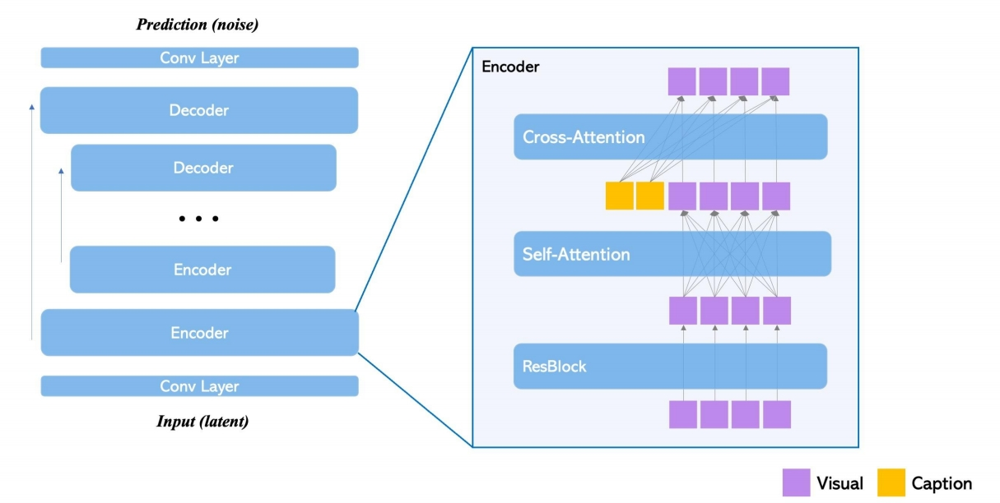
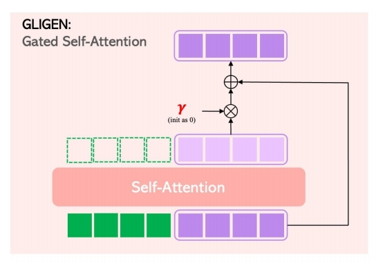
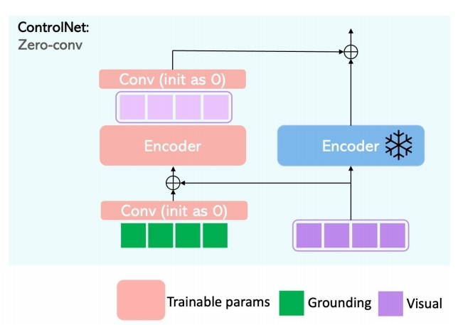
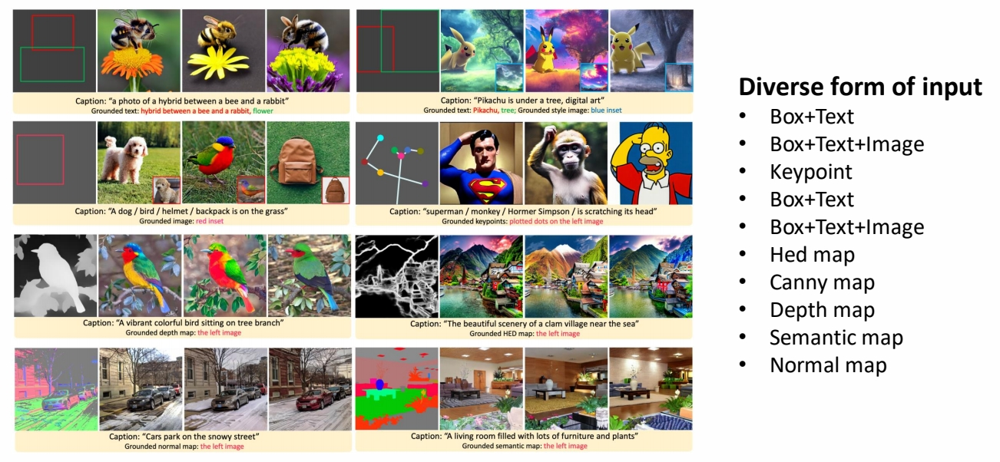

## GLIGEN: Open-Set Grounded Text-to-Image Generation    

 

     

> &#x2705; GLIGEN 是另一种网络架构。    

P65   

### Pipeline

GLIGEN对比ControlNet：

|GLIGEN|ControlNet|
|---|---|
|||    
| &#x2705; 新增 Gated Self-Attention 层，加在 Attention 和 Cross Attention 之间。  &#x2705; GLIGEN 把 Condition 和 init feature 作 Concat  |&#x2705; Control Net 分别处理 feature 和 Control 并把结果叠加。    |

P66   
### GLIGEN Result

  
