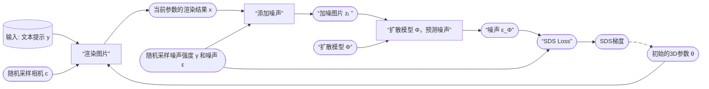

# DreamFusion: Text-to-3D using 2D Diffusion

近期文本到图像生成领域的突破主要得益于基于数十亿图像-文本对训练的扩散模型。若将这种方法应用于三维合成，将需要大规模标注三维数据集及高效的三维去噪架构，而这两者目前均属空白。本研究通过使用预训练的二维文本到图像扩散模型，成功规避了这些限制，实现了文本到三维的合成。我们提出了一种基于概率密度蒸馏的损失函数，使得二维扩散模型能够作为参数化图像生成器的优化先验。通过将这种损失应用于类DeepDream优化流程，我们对随机初始化的三维模型（神经辐射场，NeRF）进行梯度下降优化，使其从任意角度渲染的二维图像均能获得较低的损失值。最终生成的文本对应三维模型支持多视角观看、任意光照重打光，并可合成到任何三维环境中。该方法无需三维训练数据，也无需修改图像扩散模型，证明了预训练图像扩散模型作为先验的有效性。更多三维成果的沉浸式展示请参见dreamfusion3d.github.io。

**这是一篇开创性的论文，提出了一种无需3D训练数据、仅依赖预训练2D文本-图像扩散模型（如Imagen）生成高质量3D内容的方法。**

## 研究背景与问题

### 任务

输入：文本
输出：Nerf参数

### 本文方法及优势

|要解决的问题|当前方法及存在的问题|本文方法及优势|
|---|---|---|
|3D生成|传统3D生成依赖大规模标注的3D数据集，而这类数据稀缺且获取成本高|利用2D扩散模型的先验知识 绕过3D数据限制，实现开放域文本到3D的高效生成，同时支持多视角一致性和几何细节。|

## **方法创新**

### **Score Distillation Sampling（SDS）** 

SDS是论文的核心贡献，解决了如何通过2D扩散模型指导3D参数优化的难题：
- **原理**：利用强大的2D图像生成模型作为“老师”或“裁判”，来指导一个3D模型的优化过程。具体来说，如果这个3D模型从任何角度渲染出的2D图片，都能被这个“裁判”判定为“高质量且符合文本描述”，那么这个3D模型本身就是一个好模型。
- **方法**：将3D模型（如NeRF）的渲染图像视为扩散模型中的噪声样本，通过预测噪声残差计算梯度，反向传播优化3D参数。公式上省略U-Net的雅可比矩阵项，简化梯度计算：

#### 流程

> &#x2705; 参数不在 2D 空间而是在 Nerf 空间，构成优化问题，通过更新 Nerf 参数来满足 loss.    
  

如果 ε_Φ 和我们最初加入的噪声 ε 完全一样，说明渲染的图片 x 在扩散模型看来，已经非常像一张在 t 时刻的、关于 y 的“干净”图片了。这意味着3D模型已经学得很好，无需大改。

如果 ε_Φ 和 ε 不一样，那么这个差异 (ε_Φ - ε) 就构成了一个指导信号，它指出了“渲染图 x 应该朝哪个方向改变，才能更符合文本描述 y”。

#### 计算梯度

**SDS损失函数的梯度计算方式是整个方法最精妙的地方**：

$$
  \nabla_ \theta \mathcal{L}_ {\mathrm{SDS}} \propto \mathbb{E}_ {t, \epsilon} \left[ w(t)(\hat{\epsilon}_ \phi(\mathbf{z}_ t; y, t) - \epsilon) \frac{\partial \mathbf{x}}{\partial \theta} \right]
$$

- (ε_Φ - ε)： 上文提到的指导信号，它是一个在图像空间（2D）的向量场。
- ∂x/∂θ： 渲染图片 x 对3D参数 θ 的梯度。这告诉我们，如果想让图片 x 发生微小改变，3D参数 θ 应该如何调整。
- w(t)： 一个依赖于时间步 t 的权重函数，用于平衡不同噪声水平下的指导强度。DreamFusion中发现，给中等 t 较高的权重效果更好，因为这些时间步包含了更多关于结构和语义的信息。

#### 更新3D模型

 **我们不直接计算一个关于 (ε_Φ - ε) 的L2损失再求导，而是直接将这个差异通过渲染过程的梯度 ∂x/∂θ 反向传播到3D参数 θ 上。这相当于用扩散模型的预测来“拉动”3D模型，使其渲染的图片落入扩散模型认为的高概率区域。**

     
   

$$
θ ← θ - η * \nabla_ \theta \mathcal{L}_ {\mathrm{SDS}}
$$
  

#### SDS梯度的推导过程 

&#x2705; 由 (ε_Φ - ε) 的L2损失出发，得到公式1：
     

&#x2705; 由公式1对θ求导并省掉常系数，得到公式2：

     

> 由于\\(x =g(\theta )\\)，\\(\frac{\partial L}{\partial \theta } =\frac{\partial L}{\partial x } \cdot \frac{\partial x }{\partial \theta } \\)，其中 \\(\frac{\partial L}{\partial x }\\) 又分为第一项和第二项。  
第二项：\\( \partial \\) Output／ \\( \partial \\) Input．这一项要计算 diffusion model 的梯度，成本非常高。    
第三项：\\( \partial \\) Input Image／ \\( \partial \\)  Nerf Angle    

&#x2705; 作者直接把公式 2 中的第二项去掉了，得到公式3，即为本文最终使用的 loss.  

     

#### SDS 为什么有效？其优势与内涵

利用先验，绕过数据： 它完美地利用了在海量2D数据上预训练的扩散模型作为强大的视觉知识库，无需任何3D训练数据。

概率密度梯度： 从数学上看，SDS梯度实际上近似于渲染图像分布与扩散模型先验分布之间的KL散度的梯度。它是在最小化两个分布之间的差异。

解决Janus（多面）问题： 通过随机采样相机视角，SDS自然地从不同角度优化3D模型，鼓励其生成一个所有视角都一致的3D资产，从而缓解了“多脸问题”（一个头的前后左右都是脸）。

优化方式优于微调： 它不微调扩散模型本身，只是将其作为一个静态的“损失函数”。这避免了直接让扩散模型在陌生（如3D渲染的）图片上过拟合，保持了其强大的先验知识。

#### SDS 的局限性

颜色过饱和与细节缺失： SDS倾向于生成颜色鲜艳、平滑但缺乏高频细节的表面。这是因为损失函数在较高的噪声水平下平均化了细节。

“平均脸”问题： SDS优化的是分布的期望，这可能导致生成结果过于中庸，缺乏创造性的细节或风格。

收敛速度慢： 由于梯度方差较大，需要大量迭代才能得到高质量结果。

#### 损失函数

Consider the KL term to minimize (given t):   

$$
\mathbf{KL} (q(\mathbf{z} _ t|g(\theta );y,t)||p\phi (\mathbf{z} _ t;y,t))
$$

KL between noisy real image distribution and generated image distributions, conditioned on y!     

KL and its gradient is defined as:    

  

(B) can be derived from chain rule    

$$
\nabla _ \theta \log p _ \phi (\mathbf{z} _ t|y)=s _ \phi (\mathbf{z} _ t|y)\frac{\partial \mathbf{z} _ t}{\partial \theta }=\alpha _ ts _ \phi (\mathbf{z} _ t|y)\frac{\partial \mathbf{x} }{\partial \theta } =-\frac{\alpha _ t}{\sigma _ t}\hat{\epsilon }_ \phi (\mathbf{z} _ t|y)\frac{\partial \mathbf{x} }{\partial \theta }   
$$

(A) is the gradient of the entropy of the forward process with fixed variance = 0.    

> &#x2705; A: the gradient of the entropy of the forward process。由于前向只是加噪，因此 A 是固定值，即 0.    
> &#x2705; P27 和 P28 证明 P26 中的第二项可以不需要。  
> &#x2753; KL 散度用来做什么？LOSS 里没有这一项。    
> &#x2705; KL 用于度量 \\(P(\mathbf{Z}_t｜t)\\) 和 \\(q(\mathbf{Z}_t｜t)\\)．  
> &#x2705; KL 第一项为 Nerf 的渲染结果加噪，KL 第二项为真实数据加噪。    

$$
(A)+(B)= \frac{\alpha _ t}{\sigma _ t} \hat{\epsilon } _ \phi (\mathbf{z} _ t|y) \frac{\partial \mathbf{x} }{\partial \theta }
$$

However, this objective can be quite noisy.     
Alternatively, we can consider a “baseline” approach in reinforcement learning: add a component that has zero mean but reduces variance. Writing out (A) again:     

  

Thus, we have:

  

This has the same mean, but **reduced variance**, as we train \\(\hat{\epsilon } _ \phi\\) to predict \\(\epsilon\\)    

### **NeRF的改进与渲染策略** 
- **神经辐射场（NeRF）**：采用mip-NeRF 360表示3D场景，参数化体积密度和反照率（颜色），支持光线追踪和视角一致性。
- **着色与几何增强**：
  - **法线计算**：通过密度梯度估计表面法线，结合随机光照增强几何细节。
  - **反照率随机替换**：以一定概率将材质颜色替换为白色，防止模型退化为平面纹理（如将3D结构简化为2D贴图）。
  - **背景合成**：通过alpha混合避免相机近端密度堆积，提升场景合理性。

---

P29   
## DreamFusion in Text-to-3D    

 - SDS can be used to optimize a 3D representation, like NeRF.   

  

> &#x2705; 左下：以相机视角为参数，推断出每个点的 Nerf 参数。   
> &#x2705; 左上：从相机视角，生成 object 的投影。   
> &#x2705; 左中：左上和左下结合，得到渲染图像。    
> &#x2705; 生成随机噪声，对渲染图像加噪。   
> &#x2705; 右上：使用 diffusion model 从加噪图像中恢复出原始图像。（包含多个 step）   
> &#x2705; 右下：得到噪声，并与原始噪声求 loss.    
> &#x2705; 根据 loss 反传梯度优化左下的 MLP.    

### 3. **实验结果与贡献**
- **高质量生成**：能够生成多视角一致、支持任意光照和合成的3D模型，例如“冲浪板上的孔雀”等复杂场景。
- **零样本泛化**：无需3D数据，仅依赖文本提示即可生成开放域3D内容，显著降低创作门槛。
- **与基线对比**：相比基于CLIP的方法（如DreamFields），DreamFusion在几何准确性和视觉保真度上表现更优。

---

### 4. **局限性与改进方向** 
- **生成质量缺陷**：SDS生成的3D模型存在过饱和、过平滑问题，且多样性受限（不同随机种子生成结果差异小）。
- **分辨率限制**：依赖64×64的Imagen基础模型，细节层次不足（后续工作如[Magic3D](./82.md)通过提升分辨率改进）。
- **效率问题**：NeRF优化耗时较长，后续研究采用Instant-NGP等加速方案。

---

### 5. **后续影响与扩展**
- **领域推动**：DreamFusion成为文本到3D生成的基准方法，启发了SJC、VSD等改进算法。
- **ProlificDreamer的突破**：清华大学团队提出变分得分蒸馏（VSD），将3D参数建模为概率分布，解决了SDS的过平滑问题，并支持更高分辨率和多样性。
- **应用前景**：在游戏、虚拟现实、数字孪生等领域具有潜力，推动AIGC从2D向3D扩展。

---

### 总结
DreamFusion通过结合2D扩散模型与NeRF，开创了无3D数据依赖的文本到3D生成范式。其核心创新SDS为后续研究奠定了基础，尽管存在生成质量限制，但通过算法优化（如VSD）和工程改进（如高效NeRF变体），这一方向正逐步走向实用化。
