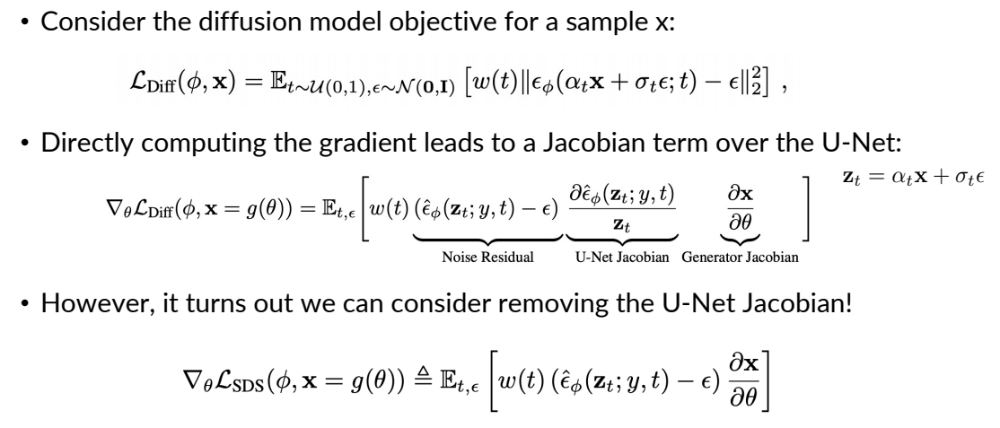

P25    
# DreamFusion

## Setup    

 - Suppose there is a text-to-image diffusion model.    
 -  Goal: optimize NeRF parameter such that each angle “looks 
good” from the text-to-image model.    
 - Unlike ancestral sampling (e.g., DDIM), the underlying 
parameters are being optimized over some loss function.    

     
     

 

> &#x2705; 参数不在 2D 空间而是在 Nerf 空间，构成优化问题，通过更新 Nerf 参数来满足 loss.    
  

P26   
## Score Distillation Sampling   

     

Poole et al., <u>"DreamFusion: Text-to-3D using 2D Diffusion",</u> ICLR 2023     

> &#x2705; 第二项：\\( \partial \\) Output／ \\( \partial \\) Input．   
> &#x2705; 第三项：\\( \partial \\) Input Image／ \\( \partial \\)  Nerf Angle    
> &#x2705; 第二项要计算 diffusion model 的梯度，成本非常高。    
> &#x2705; 第二项要求反向传播 through the diffuson model，很慢，且费内存。   
> &#x2705; 这一页描述 Image → Loss 的过程。    
> &#x2705; 公式 1 为 diffusion model objective fanction.    
> &#x2705; 公式 2 为算法中使用的 loss，由于\\(x =g(\theta )\\)，\\(\frac{\partial L}{\partial \theta } =\frac{\partial L}{\partial x } \cdot \frac{\partial x }{\partial \theta } \\)，其中 \\(\frac{\partial L}{\partial x }\\) 又分为第一项和第二项。    
> &#x2705; 公式 2 中的常系数都省掉了。    
> &#x2705; 公式 3 把公式 2 中的第二项去掉了，为本文最终使用的 loss.   

P27   
## Score Distillation Sampling

Consider the KL term to minimize (given t):   

$$
\mathbf{KL} (q(\mathbf{z} _ t|g(\theta );y,t)||p\phi (\mathbf{z} _ t;y,t))
$$

KL between noisy real image distribution and generated image 
distributions, conditioned on y!     

KL and its gradient is defined as:    

  

(B) can be derived from chain rule    

$$
\nabla _ \theta \log p _ \phi (\mathbf{z} _ t|y)=s _ \phi (\mathbf{z} _ t|y)\frac{\partial \mathbf{z} _ t}{\partial \theta }=\alpha _ ts _ \phi (\mathbf{z} _ t|y)\frac{\partial \mathbf{x} }{\partial \theta } =-\frac{\alpha _ t}{\sigma _ t}\hat{\epsilon }_ \phi (\mathbf{z} _ t|y)\frac{\partial \mathbf{x} }{\partial \theta }   
$$

(A) is the gradient of the entropy of the forward process with fixed variance = 0.    

Poole et al., <u>"DreamFusion: Text-to-3D using 2D Diffusion",</u> ICLR 2023   

> &#x2705; A: the gradient of the entropy of the forward process。由于前向只是加噪，因此 A 是固定值，即 0.    
> &#x2705; P27 和 P28 证明 P26 中的第二项可以不需要。  
> &#x2753; KL 散度用来做什么？LOSS 里没有这一项。    
> &#x2705; KL 用于度量 \\(P(\mathbf{Z}_t｜t)\\) 和 \\(q(\mathbf{Z}_t｜t)\\)．  
> &#x2705; KL 第一项为 Nerf 的渲染结果加噪，KL 第二项为真实数据加噪。    

P28    
## Score Distillation Sampling  

$$
(A)+(B)=\frac{\alpha _ t}{\sigma _ t}\hat{\epsilon } _ \phi (\mathbf{z} _ t|y)\frac{\partial \mathbf{x} }{\partial \theta }
$$

However, this objective can be quite noisy.     
Alternatively, we can consider a “baseline” approach in reinforcement learning: add a component that has zero mean but reduces variance. Writing out (A) again:     

  

Thus, we have:

  

This has the same mean, but **reduced variance**, as we train \\(\hat{\epsilon } _ \phi\\) to predict \\(\epsilon\\)    

Poole et al., <u>"DreamFusion: Text-to-3D using 2D Diffusion",</u> ICLR 2023    

P29   
## DreamFusion in Text-to-3D    

 - SDS can be used to optimize a 3D representation, like NeRF.   

  

Poole et al., <u>"DreamFusion: Text-to-3D using 2D Diffusion",</u> ICLR 2023    

> &#x2705; (1) 生成 Nerf (2) Nerf 投影 (3) 投影图加噪再去噪 (4) 对生成结果求 loss    
> &#x2705; entire pipeline.    
> &#x2705; 左上：从相机视角，生成 object 的投影。   
> &#x2705; 左下：以相机视角为参数，推断出每个点的 Nerf 参数。   
> &#x2705; 左中：左上和左下结合，得到渲染图像。    
> &#x2705; 生成随机噪声，对渲染图像加噪。   
> &#x2705; 右上：使用 diffusion model 从加噪图像中恢复出原始图像。（包含多个 step）   
> &#x2705; 右下：得到噪声，并与原始噪声求 loss.    
> &#x2705; 根据 loss 反传梯度优化左下的 MLP.    
