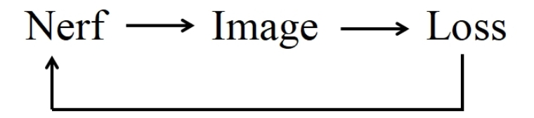
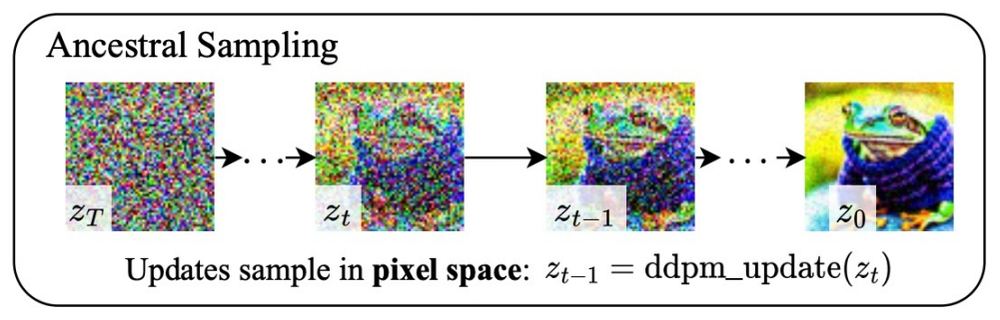
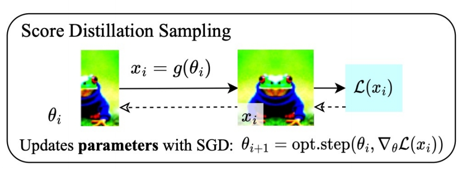
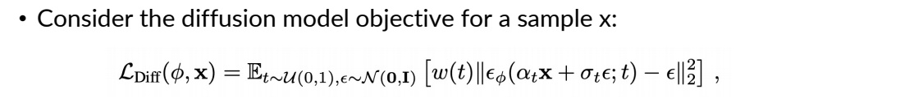
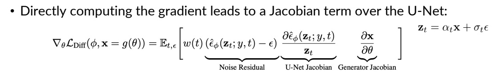
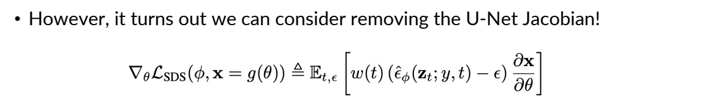
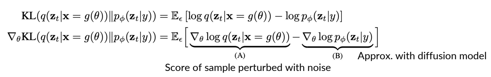
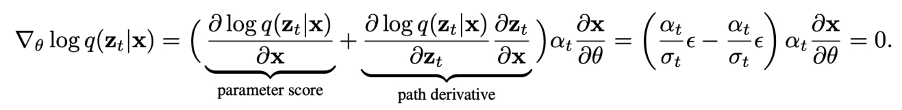
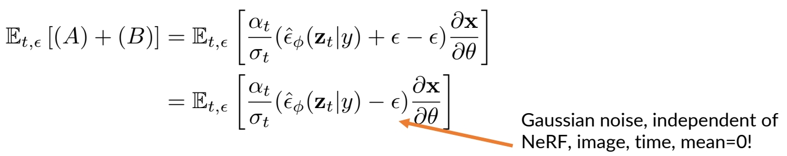
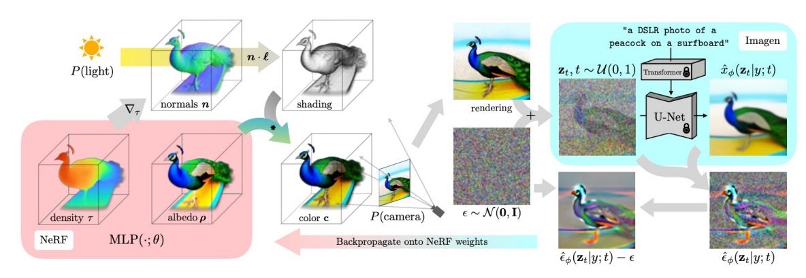

# DreamFusion: Text-to-3D using 2D Diffusion

这是一篇开创性的论文，提出了一种无需3D训练数据、仅依赖预训练2D文本-图像扩散模型（如Imagen）生成高质量3D内容的方法。以下从背景、方法、贡献与局限性等方面进行解读：

---

## 1. **背景与动机** 
- **问题挑战**：传统3D生成依赖大规模标注的3D数据集，而这类数据稀缺且获取成本高。此外，2D扩散模型在图像生成上表现优异，但直接迁移到3D面临模态差异和计算复杂度问题。
- **核心目标**：利用2D扩散模型的先验知识，绕过3D数据限制，实现开放域文本到3D的高效生成，同时支持多视角一致性和几何细节。

> Suppose there is a text-to-image diffusion model.    
Goal: optimize NeRF parameter such that each angle “looks good” from the text-to-image model.    

---

## 2. **方法创新**：Score Distillation Sampling（SDS）与NeRF优化
### **Score Distillation Sampling（SDS）** 

#### 方法

SDS是论文的核心贡献，解决了如何通过2D扩散模型指导3D参数优化的难题：
- **原理**：将3D模型（如NeRF）的渲染图像视为扩散模型中的噪声样本，通过预测噪声残差计算梯度，反向传播优化3D参数。公式上省略U-Net的雅可比矩阵项，简化梯度计算：

$$
  \nabla_ \theta \mathcal{L}_ {\mathrm{SDS}} \propto \mathbb{E}_ {t, \epsilon} \left[ w(t)(\hat{\epsilon}_ \phi(\mathbf{z}_ t; y, t) - \epsilon) \frac{\partial \mathbf{x}}{\partial \theta} \right]
$$

> &#x2705; 参数不在 2D 空间而是在 Nerf 空间，构成优化问题，通过更新 Nerf 参数来满足 loss.    
  

> Unlike ancestral sampling (e.g., DDIM), the underlying parameters are being optimized over some loss function.  
     
     

#### 优化

无需对扩散模型反向传播，仅需冻结模型作为“评论家”，通过多视角渲染迭代优化3D模型。

     

     

     

[TODO] 把上图分成三个图，保留TODO.  
> &#x2705; 第二项：\\( \partial \\) Output／ \\( \partial \\) Input．   
> &#x2705; 第三项：\\( \partial \\) Input Image／ \\( \partial \\)  Nerf Angle    
> &#x2705; 第二项要计算 diffusion model 的梯度，成本非常高。    
> &#x2705; 第二项要求反向传播 through the diffuson model，很慢，且费内存。   
> &#x2705; 这一页描述 Image → Loss 的过程。    
> &#x2705; 公式 1 为 diffusion model objective fanction.    
> &#x2705; 公式 2 为算法中使用的 loss，由于\\(x =g(\theta )\\)，\\(\frac{\partial L}{\partial \theta } =\frac{\partial L}{\partial x } \cdot \frac{\partial x }{\partial \theta } \\)，其中 \\(\frac{\partial L}{\partial x }\\) 又分为第一项和第二项。    
> &#x2705; 公式 2 中的常系数都省掉了。    
> &#x2705; 公式 3 把公式 2 中的第二项去掉了，为本文最终使用的 loss.  

#### 损失函数

Consider the KL term to minimize (given t):   

$$
\mathbf{KL} (q(\mathbf{z} _ t|g(\theta );y,t)||p\phi (\mathbf{z} _ t;y,t))
$$

KL between noisy real image distribution and generated image distributions, conditioned on y!     

KL and its gradient is defined as:    

  

(B) can be derived from chain rule    

$$
\nabla _ \theta \log p _ \phi (\mathbf{z} _ t|y)=s _ \phi (\mathbf{z} _ t|y)\frac{\partial \mathbf{z} _ t}{\partial \theta }=\alpha _ ts _ \phi (\mathbf{z} _ t|y)\frac{\partial \mathbf{x} }{\partial \theta } =-\frac{\alpha _ t}{\sigma _ t}\hat{\epsilon }_ \phi (\mathbf{z} _ t|y)\frac{\partial \mathbf{x} }{\partial \theta }   
$$

(A) is the gradient of the entropy of the forward process with fixed variance = 0.    

> &#x2705; A: the gradient of the entropy of the forward process。由于前向只是加噪，因此 A 是固定值，即 0.    
> &#x2705; P27 和 P28 证明 P26 中的第二项可以不需要。  
> &#x2753; KL 散度用来做什么？LOSS 里没有这一项。    
> &#x2705; KL 用于度量 \\(P(\mathbf{Z}_t｜t)\\) 和 \\(q(\mathbf{Z}_t｜t)\\)．  
> &#x2705; KL 第一项为 Nerf 的渲染结果加噪，KL 第二项为真实数据加噪。    

$$
(A)+(B)= \frac{\alpha _ t}{\sigma _ t} \hat{\epsilon } _ \phi (\mathbf{z} _ t|y) \frac{\partial \mathbf{x} }{\partial \theta }
$$

However, this objective can be quite noisy.     
Alternatively, we can consider a “baseline” approach in reinforcement learning: add a component that has zero mean but reduces variance. Writing out (A) again:     

  

Thus, we have:

  

This has the same mean, but **reduced variance**, as we train \\(\hat{\epsilon } _ \phi\\) to predict \\(\epsilon\\)    

### **NeRF的改进与渲染策略** 
- **神经辐射场（NeRF）**：采用mip-NeRF 360表示3D场景，参数化体积密度和反照率（颜色），支持光线追踪和视角一致性。
- **着色与几何增强**：
  - **法线计算**：通过密度梯度估计表面法线，结合随机光照增强几何细节。
  - **反照率随机替换**：以一定概率将材质颜色替换为白色，防止模型退化为平面纹理（如将3D结构简化为2D贴图）。
  - **背景合成**：通过alpha混合避免相机近端密度堆积，提升场景合理性。

---

P29   
## DreamFusion in Text-to-3D    

 - SDS can be used to optimize a 3D representation, like NeRF.   

  

> &#x2705; 左下：以相机视角为参数，推断出每个点的 Nerf 参数。   
> &#x2705; 左上：从相机视角，生成 object 的投影。   
> &#x2705; 左中：左上和左下结合，得到渲染图像。    
> &#x2705; 生成随机噪声，对渲染图像加噪。   
> &#x2705; 右上：使用 diffusion model 从加噪图像中恢复出原始图像。（包含多个 step）   
> &#x2705; 右下：得到噪声，并与原始噪声求 loss.    
> &#x2705; 根据 loss 反传梯度优化左下的 MLP.    

### 3. **实验结果与贡献**
- **高质量生成**：能够生成多视角一致、支持任意光照和合成的3D模型，例如“冲浪板上的孔雀”等复杂场景。
- **零样本泛化**：无需3D数据，仅依赖文本提示即可生成开放域3D内容，显著降低创作门槛。
- **与基线对比**：相比基于CLIP的方法（如DreamFields），DreamFusion在几何准确性和视觉保真度上表现更优。

---

### 4. **局限性与改进方向** 
- **生成质量缺陷**：SDS生成的3D模型存在过饱和、过平滑问题，且多样性受限（不同随机种子生成结果差异小）。
- **分辨率限制**：依赖64×64的Imagen基础模型，细节层次不足（后续工作如[Magic3D](./82.md)通过提升分辨率改进）。
- **效率问题**：NeRF优化耗时较长，后续研究采用Instant-NGP等加速方案。

---

### 5. **后续影响与扩展**
- **领域推动**：DreamFusion成为文本到3D生成的基准方法，启发了SJC、VSD等改进算法。
- **ProlificDreamer的突破**：清华大学团队提出变分得分蒸馏（VSD），将3D参数建模为概率分布，解决了SDS的过平滑问题，并支持更高分辨率和多样性。
- **应用前景**：在游戏、虚拟现实、数字孪生等领域具有潜力，推动AIGC从2D向3D扩展。

---

### 总结
DreamFusion通过结合2D扩散模型与NeRF，开创了无3D数据依赖的文本到3D生成范式。其核心创新SDS为后续研究奠定了基础，尽管存在生成质量限制，但通过算法优化（如VSD）和工程改进（如高效NeRF变体），这一方向正逐步走向实用化。