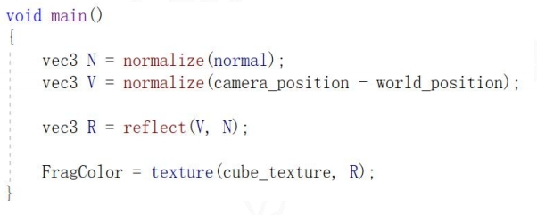
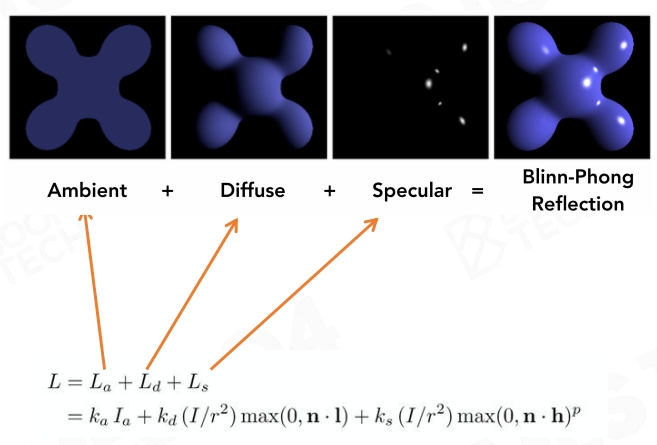
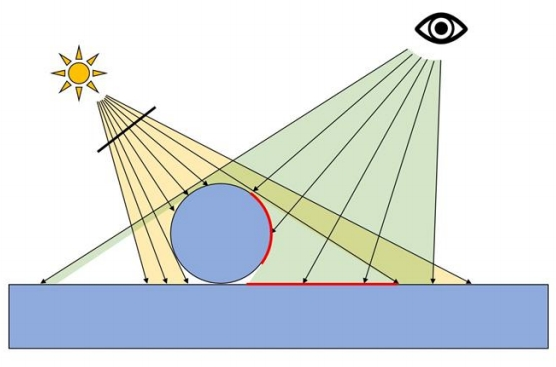
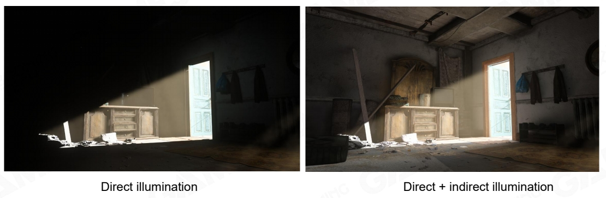
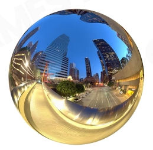
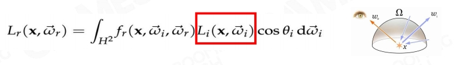

# Simple Light Solution

P12    
## Simple Light Solution

- Using simple light source as main light    
- Directional light in most cases    
- Point and spot light in special case    
- Using ambient light to hack others    
- A constant to represent mean of complex hemisphere irradiance    

     

P13     
## Environment Map Reflection

- Using environment map to enhance glossary surface reflection    
- Using environment mipmap to represent roughness of surface     

     

**Early stage exploration of image- based lighting**    
   
      

P14    
## Math Behind Light Combo 

- Main Light    
  - Dominant Light    
- Ambient Light    
  - Low-frequency of irradiance sphere distribution    
- Environment Map    
  - High-frequency of irradiance sphere distribution    

P15   
## Blinn-Phong Materials

   

P16   
## Problem of Blinn-Phong

- Not energy conservative   
  - Unstable in ray-tracing   

   

- Hard to model complex realistic material    

   

P17    
## Shadow    

- Shadow is nothing but space when the light is blocked by an opaque object   
- Already obsolete method   
  - planar shadow   
  - shadow volume   
  - projective texture   

   

P19    
## Problem of Shadow Map

   

P20    
## Basic Shading Solution

- Simple light + Ambient   
  - dominent light solves No.1b   
  - ambient and EnvMap solves No.3 challanges   
- Blinn-Phong material       
  - solve No.2 challange   
- Shadow map   
  - solve No.1a challange   

P21    
## Cheap, Robust and Easy Modification

P26    
# Pre-computed Global Illumination

P27  
## Why Global Illumination is Important

   

P28   
## How to Represent Indirect Light

- Good compression rate   
  - We need to store millions of radiance probes in a level   
- Easy to do integration with material function   
  - Use polynomial calculation to convolute with material BRDF   

   

   

P31    
## Spherical Harmonics

$$
Y_{lm}(\theta ,\phi )=N_{lm}P_{lm}(\cos \theta )e^{Im\phi }
$$

