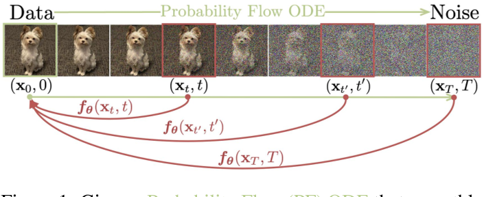
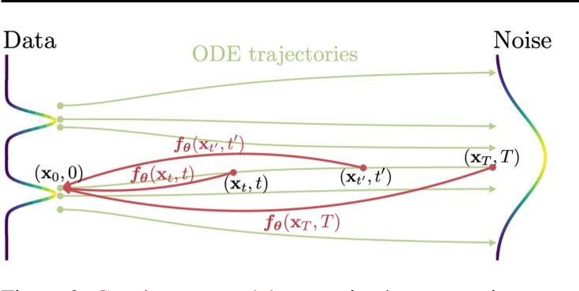
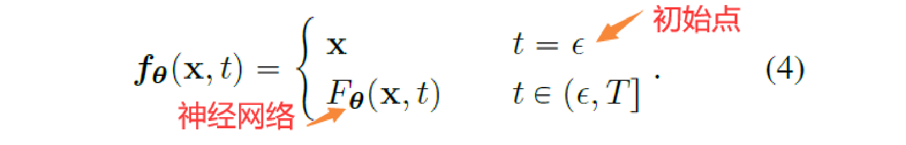
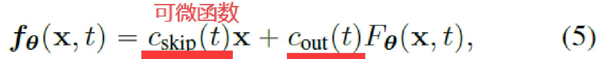
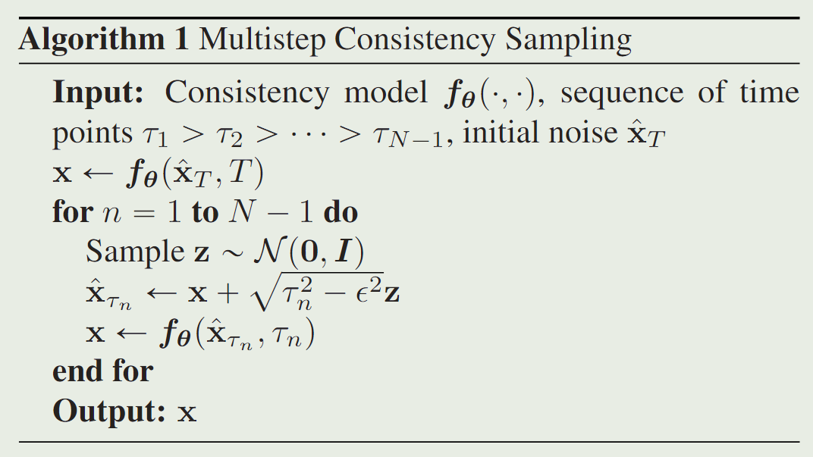
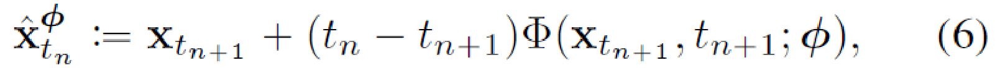
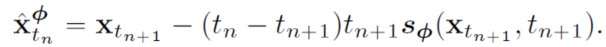
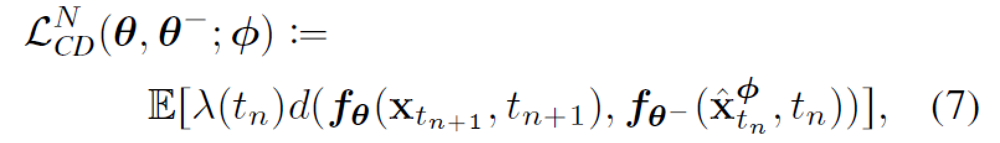
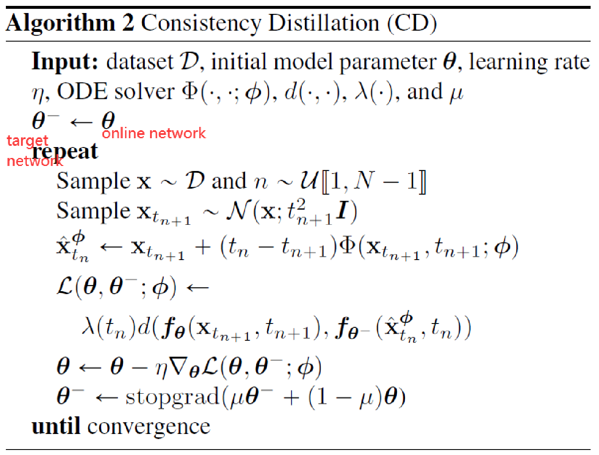

# Consistency Models

https://arxiv.org/pdf/2303.01469.pdf

https://github.com/openai/consistency_models 

https://readpaper.com/pdf-annotate/note?pdfId=4761865581863370753&noteId=2187834810264506624

## 核心问题是什么?

扩散模型在图像、音频和视频生成方面取得了重大突破，但它们依赖于迭代生成过程，导致采样速度较慢，限制了其实时应用的潜力。  
现有的快速采样方法包括更快的数值ODE求解器和蒸馏技术。ODE求解器仍然需要超过10个评估步骤来生成有竞争力的样本。大多数蒸馏方法，依赖于在蒸馏之前从扩散模型中收集大量的样本数据集，这本身就是计算成本很高的。据我们所知，唯一不受这一缺点影响的蒸馏方法是渐进蒸馏(PD)。  

## 核心贡献是什么？

1. 一致性模型在设计上支持快速的一步生成，同时仍然允许少步采样以换取样本质量的计算。
2. 一种新的生成模型家族，可以在没有对抗性训练的情况下实现高样本质量
3. 支持zero-shot数据编辑，如图像修补、着色和超分辨率，而不需要对这些任务进行明确的训练。
4. 一致性模型既可以作为提取预训练扩散模型的一种方式训练，也可以作为独立的生成模型训练。

## 大致方法是什么？

我们建立在连续时间扩散模型中的概率流(PF)常微分方程(ODE)之上（简单来说，就是图像前向传播的无参加噪过程），其轨迹平滑地将数据分布转换为可处理的噪声分布。而CM可将任何时间步骤的任何分布点映射到轨迹的起点。CM模型的一个显著特性是自一致性:同一轨迹上的点映射到相同的起始点。因此，我们把这样的模型称为一致性模型。

### 一致性模型的定义

假设存在一个函数f，对于同一条PF ODE轨迹上的任意点都有相同的输出:  

$$
\boldsymbol{f} ( x_t , t ) = \boldsymbol{f} ( x_{t^{\prime}} , t^{\prime} )  \text { for all }  t , t ^{\prime} \in [ \epsilon , T ]
$$

consistency model的目标是从数据中估计一致性函数f，来迫使self-consistency性质

### 一致性模型参数化

要拟合的一致性函数 \\( f(\cdot, \cdot) \\)要满足两个条件：①同一个轨迹上的点输出一致；②在起始点f为一个对于x的恒等函数

第一种做法简单地参数化consistency models

第二种做法使用跳跃连接（作者和许多其他的都用这个）

其中 \\(c_{skip}\\)和 \\(c_{out}\\)为可微函数，满足 \\(c_{skip}(\epsilon) = 1, c_{out}(\epsilon) = 0\\). \\(F_{\theta}\\)为深度神经网络，可使用一致性损失来学习，输出维度同 x.

### 一致性模型采样

观察 f 的性质，显然， \\(f(x_T,T) = x_{\epsilon}\\)可以得到我们想要的生成结果。但一般认为，这样的生成误差会比较大。所以我们每次从\\(x_{\tau_n}\\) 预测出初始的 \\(x_\\)后，回退一步来预测\\(x_{\tau_{n-1}}\\) 来减小误差。因此有如下多步采样的算法。

实际中，采用贪心算法来寻找时间点，通过三值搜索每次确定一个时间点。  

### Consistency Models 的训练方式

考虑到 Consistency Models 的性质，对采样轨迹上的不同点，f应该有一个相同的输出，自然我们需要找到采样的轨迹。

####  Training Consistency Models via Distillation

如果我们有预训练的diffusion model，自然可以构建轨迹。

假设采样轨迹的时间序列为

$$
t_{1}=\epsilon<t_{2}<\cdots<t_{N}=T
$$

通过运行数值ODE求解器的一个离散化步骤从 \\(\mathbf{x}_{t_{n+1}}\\) ​​得到 \\( \mathbf{x}_{t_{n}}\\)

其中Φ(...;ϕ)为ODE solver，可以是任意ODE Solver，一般来说阶数越高的 Solver 求解精度越高。​​

例如使用Euler solver 

$$
\frac{\mathrm{dx}}{\mathrm{d} t}=-t s_{\phi}\left(\mathrm{x}_{t}, t\right)\\\\
\Phi(\mathrm{x}, t ; \phi)=-t s _{\phi}(\mathrm{x}, t)
$$

带入上式得到

对于处于同一轨道的 \\((x_{t_{n-1}},t_{n-1}),(\hat x_{t_{n}}^\phi,t_{n})\\)，f应该有相同的输出，我们用距离函数 d 来衡量输出是否相同。因而有如下训练损失

其中 \\(\lambda\\)用来对不同时间步赋予不同重要性，\\(\theta^-\\)为 EMA 版本的权重。采用EMA来更新模型会提高训练的稳定性，并且性能会更好。

综合上述过程，蒸馏（Consistency Distillation）的算法为

## 有效

## 缺陷

## 验证

## 启发

## 遗留问题

## 参考材料
[1] https://zhuanlan.zhihu.com/p/621673283
[2] https://blog.csdn.net/singxsy/article/details/130243343
[3] https://blog.csdn.net/WiSirius/article/details/134670307
[4] https://www.jianshu.com/p/3b712cbe6d0d