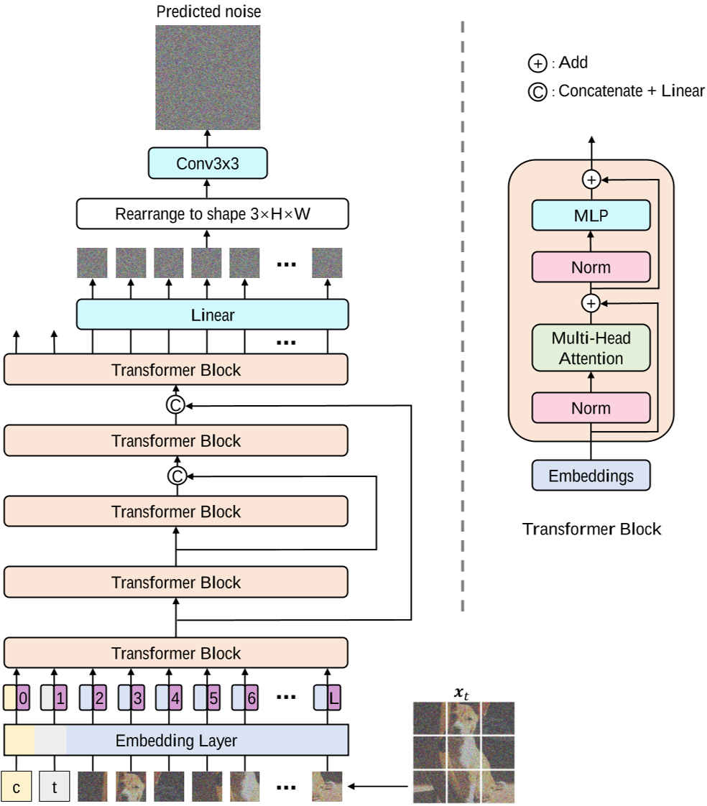

# All are Worth Words: A ViT Backbone for Score-based Diffusion Models

## 1. **核心思想与背景**
该论文提出了一种基于视觉Transformer（ViT）的扩散模型主干网络 **U-ViT**，旨在替代传统扩散模型中广泛使用的U-Net架构。其核心思想是将图像生成过程中的所有输入（包括噪声图像块、时间步长、条件信息）统一视为“令牌”（Token），通过ViT的全局自注意力机制进行建模。这一设计突破了扩散模型对U-Net的依赖，展示了纯Transformer架构在生成任务中的潜力。

## 2. **架构设计**
U-ViT的主要架构特点包括：
- **输入统一化**：将噪声图像块（如16×16像素）、时间步长编码（time embedding）和条件嵌入（如文本描述）均转换为Token序列输入Transformer。这种设计简化了多模态信息的融合，避免了U-Net中复杂的跨模态注意力层。
- **长跳跃连接（Long Skip Connections）**：在浅层与深层之间引入跨层连接，直接传递低层特征，缓解了扩散模型噪声预测任务对局部细节敏感的问题。实验表明，长跳跃连接对生成质量至关重要，例如在CIFAR10上可将FID从4.32降至2.29。
- **轻量化卷积模块**：在Transformer块后添加3×3卷积层以增强局部特征提取，但相比U-Net的下采样和上采样操作，其计算复杂度更低。

## 3. **关键创新点**
- **全局注意力替代局部卷积**：通过ViT的全局自注意力机制捕捉长程依赖，解决了U-Net因局部感受野导致的全局一致性不足问题。例如，在生成复杂场景（如“棒球运动员挥棒击球”）时，U-ViT能更准确地关联文本与图像内容。
- **动态条件融合**：时间步长和条件信息作为Token直接输入，使模型在每一层都能进行多模态交互，而U-Net仅在特定层（如交叉注意力层）融合条件信号，导致信息利用不足。
- **训练效率优化**：采用分块训练策略（如32×32潜在空间），结合轻量化设计，U-ViT在ImageNet 256×256上的训练速度比U-Net快1.5倍，且内存占用减少30%。

## 4. **实验与性能**
- **生成质量**：在多个基准测试中，U-ViT表现出与U-Net相当甚至更优的性能。例如：
  - **ImageNet 256×256**：类条件生成FID为2.29，优于LDM（潜在扩散模型）的3.60。
  - **MS-COCO文本到图像生成**：FID达5.48，超越同期基于U-Net的模型。
- **消融研究**：长跳跃连接对性能提升贡献最大，移除后FID上升约40%；时间步长作为Token输入比自适应归一化（AdaLN）更有效。
- **扩展性**：通过增加Transformer层数（如从13层到17层），模型可进一步提升生成质量，验证了ViT架构的可扩展性。

## 5. **局限性与未来方向**
- **计算成本**：尽管训练效率提升，高分辨率生成（如1024×1024）仍需依赖潜在空间压缩，可能损失细节。
- **多样性限制**：同一文本提示多次生成的结果相似性较高，需结合随机性增强策略（如动态阈值采样）。
- **未来方向**：可探索与Mamba架构（如ZigMa）结合，利用状态空间模型的长序列建模能力优化计算效率；或结合自监督表征（如RCG框架）提升无标签数据下的生成多样性。
- **控制信号注入**：没有看到控制信号注入相关的结构和实验。  

## 6. **应用场景**
- **高分辨率图像生成**：通过潜在空间建模支持1024×1024分辨率输出，适用于影视特效、游戏场景设计。
- **多模态生成**：灵活的条件输入机制使其易于扩展至文本、草图、音频等多模态生成任务。
- **医学图像合成**：结合潜在扩散的高效性，可生成高质量医学影像用于数据增强。

## 总结
U-ViT通过统一化的Transformer架构，验证了ViT在扩散模型中的有效性，为生成模型的设计提供了新范式。其核心贡献不仅在于性能提升，更在于揭示了全局注意力机制与条件融合的协同优势，为后续研究（如高效Mamba架构、自监督条件生成）奠定了基础。