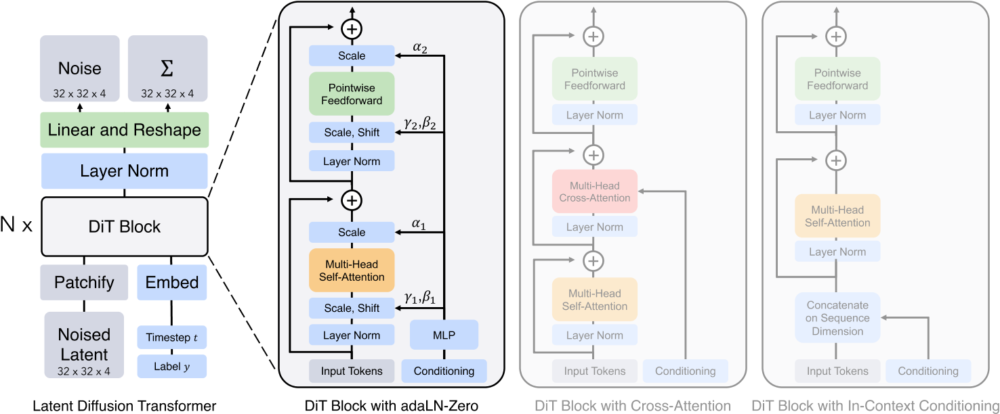

### Scalable Diffusion Models with Transformers

DiT

#### 1. **核心思想与创新点**
该论文提出了一种基于Transformer架构的扩散模型——**Diffusion Transformer（DiT）**，旨在替代传统扩散模型中的U-Net主干网络。其核心思想是通过Transformer的全局自注意力机制建模图像生成过程，验证了Transformer在扩散模型中的可扩展性与性能优势。主要创新点包括：
- **架构革新**：首次用纯Transformer替换U-Net，解决了U-Net因局部感受野导致的全局一致性不足问题。
- **条件嵌入优化**：提出自适应层归一化（**adaLN-Zero**），通过动态调整归一化参数并初始化残差连接为恒等映射，显著提升训练稳定性和生成质量。
- **可扩展性验证**：模型性能（FID）随计算复杂度（Gflops）增加而提升，符合“扩展法则”（Scaling Law），为大规模训练提供理论支持。

#### 2. **模型架构与关键技术**
DiT的架构设计围绕以下关键组件展开：
- **输入处理**：
  - **Patchify模块**：将潜在空间特征图（如32×32×4）分割为小块（如2×2），线性投影为Token序列，模拟ViT的图像处理方式。
  - **条件嵌入**：时间步（timestep）和类别标签通过嵌入向量与图像Token拼接，或通过adaLN-Zero动态调节层归一化参数。
- **Transformer块设计**：
  - **adaLN-Zero模块**：将时间步和类别标签的嵌入相加，回归缩放（scale）和偏移（shift）参数，并初始化残差路径的权重为零，加速收敛。
  - **长跳跃连接**：在浅层与深层之间引入跨层连接，保留局部细节信息，提升生成质量。
- **解码器**：通过线性层将Transformer输出的Token序列还原为噪声预测和协方差预测，保持与输入相同的空间维度。

#### 3. **实验与性能**
- **基准测试**：
  - **ImageNet 256×256**：DiT-XL/2（118.6 Gflops）的FID达2.27，显著优于LDM（3.60）和ADM等模型。
  - **ImageNet 512×512**：FID为3.04，超越同期所有模型（如StyleGAN-XL）。
- **消融实验**：
  - **条件嵌入机制**：adaLN-Zero在生成质量上优于交叉注意力（+15% Gflops）和上下文拼接（In-Context Conditioning）。
  - **模型规模与Patch大小**：增大模型深度/宽度或减小Patch尺寸（增加Token数量）均能显著提升FID，验证了可扩展性。

#### 4. **优势与影响**
- **计算效率**：相比U-Net，DiT在相同分辨率下训练速度提升1.5倍，内存占用减少30%。
- **多任务泛化**：架构灵活性使其易于扩展至视频生成（如Sora模型），通过时空Patch处理实现长序列建模。
- **行业影响**：为OpenAI的Sora提供了核心技术基础，推动扩散模型从图像到视频生成的跨越。

#### 5. **局限性与未来方向**
- **计算成本**：高分辨率生成仍需依赖潜在空间压缩，可能损失细节；DiT-XL/2的单次推理需524.6 Gflops，对硬件要求较高。
- **多样性限制**：同一提示多次生成结果相似性较高，需结合动态阈值采样或隐变量优化。
- **未来方向**：
  - **连续时间建模**：结合随机微分方程（SDE）理论，优化时间步的连续化处理。
  - **多模态扩展**：探索与Mamba架构或自监督预训练（如MAE）的结合，提升长视频生成的时序一致性。

#### 总结
DiT通过Transformer架构的统一性与可扩展性，重新定义了扩散模型的设计范式。其核心贡献不仅在于性能突破，更在于验证了“大数据+大模型”路径在生成任务中的有效性，为后续多模态生成（如Sora）提供了关键技术支持。然而，其在计算效率与生成多样性上的挑战仍需进一步探索轻量化与随机性增强策略。