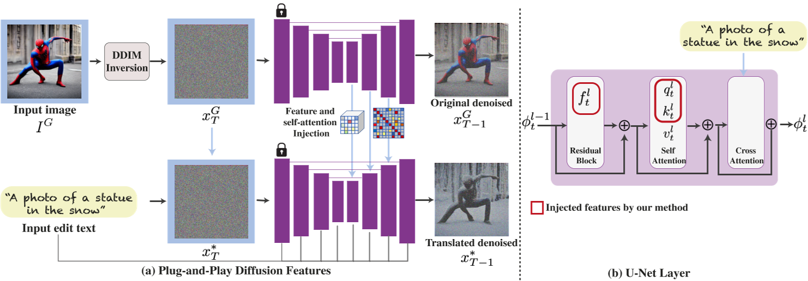

# Plug-and-Play Diffusion Features for Text-Driven Image-to-Image Translation

---

### 一、核心思想与背景
传统基于扩散模型的图像翻译方法常依赖显式标注（如掩码）或联合训练，难以平衡生成内容与源图像结构的保留。本文提出了一种**无需训练或微调**的文本驱动图像到图像（I2I）翻译框架，通过**直接操纵扩散模型内部的空间特征和自注意力机制**，实现生成过程的细粒度控制。其核心思想是：从源图像中提取中间层的空间特征和自注意力图，注入目标图像的生成过程，从而在保留源图像语义布局的同时，根据文本提示修改外观属性。

#### 传统方法的局限性
1. **依赖掩码标注**：如Inpainting等方法需用户指定编辑区域，交互成本高。
2. **结构控制不足**：文本提示的微小修改可能导致全局结构变化。
3. **真实图像适配困难**：多数方法需预训练模型微调，难以直接处理真实图像。

---

### 二、方法原理

#### 1. **扩散特征分析**
- **空间特征**：中间解码器层（如第4层）的特征编码了**局部语义信息**（如物体部件），且受外观变化影响较小。通过PCA可视化发现，这些特征在不同领域的图像中共享相似的语义区域（如人物头部、躯干）。
- **自注意力机制**：自注意力矩阵（self-attention affinity）捕捉了**空间布局和形状细节**。早期层的注意力与语义布局对齐，深层则包含高频纹理信息。

#### 2. **特征注入流程**
1. **DDIM反转编码**：将源图像通过DDIM前向过程编码为隐变量，并记录解码过程中各层的空间特征和自注意力图。
2. **目标生成控制**：
   - **空间特征注入**：将源图像中间层（如第4层）的特征替换目标生成过程的对应特征，保留局部语义结构。
   - **自注意力注入**：替换目标生成的自注意力矩阵，确保布局一致性。
   - **参数控制**：引入时间步阈值（τ_f和τ_A），仅在生成后期注入特征，避免早期噪声阶段干扰。
3. **负提示（Negative-prompting）**：使用源图像的文本描述作为负提示，减少生成图像与源外观的关联，增强编辑自由度。

---

### 三、技术贡献与优势
1. **无需训练**：直接利用预训练扩散模型（如Stable Diffusion），无需微调或额外数据，支持即插即用。
2. **细粒度控制**：通过中间层特征和自注意力机制，实现**结构保留与外观修改的平衡**，优于Prompt-to-Prompt（P2P）的粗粒度布局控制。
3. **多样化任务支持**：涵盖草图转真实图像、物体类别替换、全局属性调整（光照、颜色）等场景。
4. **高效性**：单张图像处理仅需数分钟，显著低于基于微调的方法（如DreamBooth）。

---

### 四、实验验证
#### 1. **定性评估**
- **复杂场景编辑**：在COCO等数据集上展示多对象替换（如“马→机器马”）和风格迁移（如“梵高风格”），生成结果在结构一致性与文本对齐性上优于CycleGAN、SDEdit等基线方法。
- **真实图像处理**：成功将真实照片转换为目标文本描述的场景（如“穿红色裙子的舞者”），保留姿态与背景细节。

#### 2. **定量对比**
- **指标分析**：在Wild-TI2I和ImageNet-R-TI2I基准测试中，综合CLIP（文本对齐）和DINO-ViT（结构相似性）指标，该方法在保真度与编辑自由度间达到最优平衡。
- **用户研究**：70%参与者认为该方法生成结果更符合预期，显著优于P2P和DiffusionCLIP。

#### 3. **消融实验**
- **特征层选择**：仅注入第4层特征可避免外观泄漏（深层特征携带过多纹理信息）。
- **自注意力必要性**：未注入自注意力时，生成结构易错位。

---

### 五、理论分析与局限性
1. **理论基础**  
   该方法本质是通过特征空间对齐实现跨域映射：中间层特征编码语义结构，自注意力约束空间关系。这与扩散模型的跨模态表征能力密切相关。
2. **局限性**：
   - **语义关联依赖**：若源图像与目标文本无语义关联（如“斑马→飞机”），生成结果可能失败。
   - **计算开销**：高分辨率图像需结合分层扩散模型加速处理。
   - **纹理保留问题**：对无纹理图像（如剪影），DDIM反转可能导致低频信息泄漏。

---

### 六、应用与拓展
1. **医学影像编辑**：结合局部注意力控制，实现病灶区域的精准修改（如肿瘤尺寸调整）。
2. **艺术创作**：支持风格-内容解耦，例如将真实照片转为特定艺术风格。
3. **多模态扩展**：与IP-Adapter等框架结合，实现草图+文本联合引导生成。

---

### 七、总结
《Plug-and-Play Diffusion Features》通过深入挖掘扩散模型的内部特征空间，提出了一种高效、灵活的文本驱动图像翻译框架。其核心创新在于将特征注入与自注意力控制结合，无需训练即可实现结构保留与语义编辑的平衡。尽管存在复杂场景适应性和计算效率的挑战，该方法为可控生成与多模态内容创作提供了重要参考，并在医疗影像、数字艺术等领域展现了广阔前景。