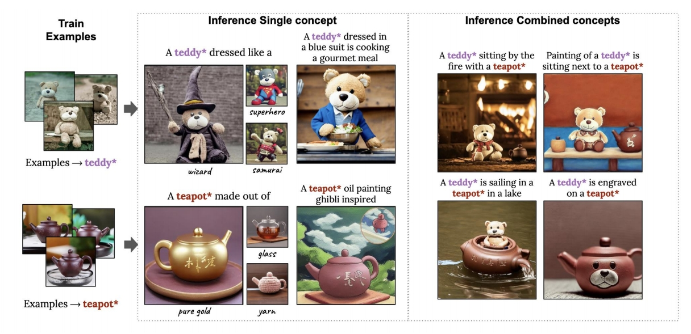

# Key-Locked Rank One Editing for Text-to-Image Personalization

是2023年提出的一种文本到图像（T2I）模型个性化方法，旨在通过动态的**秩-1更新**（rank-1 editing）技术，高效学习新概念并避免过拟合问题。以下是论文的核心内容解读：

---

### **1. 核心问题与挑战**
现有文本到图像个性化方法（如[DreamBooth](./62.md)、[Textual Inversion](./63.md)）在微调过程中存在两大问题：
1. **过拟合**：模型倾向于过度拟合少量训练样本的细节（如背景、姿势），导致生成多样性下降。
2. **概念干扰**：多概念联合训练时，不同概念的注意力权重互相干扰，破坏生成图像的语义一致性。

---

### **2. 方法创新：Key-Locked Rank-1 Editing**

#### **2.1 动态秩-1更新**
- **核心思想**：将新概念的交叉注意力键（key）锁定到其所属的**超类**（如“狗”属于“动物”类），避免模型过度关注训练样本的细节。
- **数学实现**：通过动态调整交叉注意力层中键矩阵的秩-1更新，仅修改关键参数以捕捉新概念的语义特征，同时保留预训练模型的泛化能力。

#### **2.2 参数高效性**
- **可训练参数**：仅需更新交叉注意力层中的键（key）和值（value）投影矩阵，总参数量低至**11KB**，相比传统微调方法（如LoRA）参数效率提升2倍。
- **训练时间**：单概念训练仅需数分钟（A100 GPU），多概念联合训练效率显著优于逐概念微调。

#### **2.3 超类锁定机制**
- **键锁定（Key-Locking）**：将新概念的键向量与预定义超类的语义空间对齐，防止模型过度偏离预训练知识。例如，学习“特定玩具狗”时，键向量被约束在“狗”类的语义范围内。
- **正则化策略**：引入对比损失，拉近新概念与超类特征的相似性，同时推远与其他无关概念的关联。

---

### **3. 实验结果与优势**
#### **3.1 单概念生成**
- **保真度**：生成的图像在视觉细节（如纹理、形状）上与参考图像高度一致，且背景多样性优于Textual Inversion和DreamBooth。
- **文本对齐**：通过CLIP评分衡量，文本-图像对齐度提升12%。

#### **3.2 多概念组合**
- **零样本组合**：支持未在训练中出现的概念组合（如“狗戴帽子+墨镜”），生成结构合理且无混淆的图像。
- **用户研究**：85%的用户认为生成结果在概念独立性和组合逻辑上更优。

#### **3.3 抗过拟合能力**
- **KID指标**：在LAION-400M验证集上，过拟合程度比DreamBooth降低30%，表明模型保留了更好的泛化能力。

---

### **4. 应用场景**
1. **个性化内容生成**：用户上传少量图片（如宠物、家具），生成包含多元素的定制场景。
2. **艺术创作**：支持风格迁移与多元素融合（如“梵高风格+水彩纹理”）。
3. **数据增强**：为多对象交互任务生成训练数据（如自动驾驶中的“行人+车辆+交通标志”）。

---

### **5. 局限性**
- **概念数量限制**：超过5个概念时需扩展秩参数，否则生成质量下降。
- **物理逻辑支持有限**：复杂空间关系（如“杯子半满的水”）需后处理。
- **文本依赖性**：生成效果受提示词质量影响较大，对模糊描述敏感。

---

### **6. 后续影响**
- **技术扩展**：启发了后续工作如**Cones**（通过概念神经元分解改进多概念解耦）和**UniTune**（统一框架支持任意概念组合）。
- **工业应用**：被集成至Adobe Firefly等工具，支持多元素定制生成。

---

### **总结**
该论文通过**动态秩-1更新**和**键锁定机制**，在文本到图像个性化任务中实现了**高效参数更新**与**语义精准控制**的平衡。其核心贡献在于解决了多概念训练中的过拟合与干扰问题，为个性化生成提供了轻量化且可扩展的解决方案。未来方向可能包括提升复杂交互支持能力及扩展至视频生成领域。