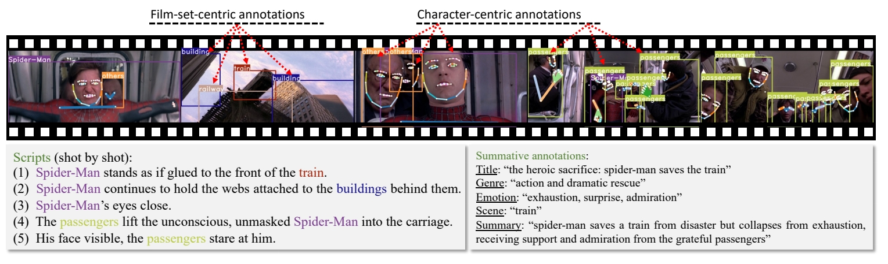

# Learning Long-form Video Prior via Generative Pre-Training

这篇论文提出了一种基于生成式预训练（GPT）的长篇视频先验学习方法，旨在通过结构化视觉位置信息建模视频中的复杂语义关系。以下从研究背景、核心方法、创新点及意义等方面进行解读：

---

### 一、研究背景与问题
1. **长视频建模的挑战**  
   长篇视频包含复杂的人物、物体及其动态交互关系，传统方法直接在像素空间建模存在计算复杂度高、数据需求量大等问题。同时，现有数据集多以短视频为主，缺乏针对长视频的结构化标注数据。
2. **生成式预训练的潜力**  
   GPT模型在文本和图像生成中已展现强大的序列建模能力，但其在视频领域的应用仍受限于数据表示形式和长距离依赖建模。论文提出将视频转换为离散化的视觉位置信息（如边界框、关键点），通过生成式预训练学习视频的隐含先验。

---

### 二、核心方法
1. **视觉位置信息的离散化表示**  
   通过提取视频中关键帧的边界框、关键点等结构化信息，将视频内容离散化为符号序列。这种方式不仅降低了计算复杂度，还保留了视频中对象交互的语义信息，便于GPT模型处理。

 

2. **数据集构建：Storyboard20K**  
   为解决长视频数据稀缺问题，论文从电影中构建了**Storyboard20K**数据集，包含电影概要、逐帧关键帧及细粒度场景与角色注释（如ID一致性、全身关键点）。该数据集支持对长视频语义的层次化建模。

> &#x2705; GPT 缺少一些视觉上的 commen sense 主要是缺少相关数据集。   &#x2705; 因此这里提供了一个数据集**Storyboard20K**。 

3. **两阶段训练框架**  
   - **预训练阶段**：基于视觉位置信息的离散化序列，使用GPT模型进行生成式预训练，学习视频中对象、场景及其动态关系的先验知识。

> &#x2705; 用 GPT-4 In-context learning 机制生成结构化文本

   - **微调阶段**：通过任务特定目标（如视频生成或理解任务）调整模型参数，实现下游任务适配。

### 三、创新点与实验成果
1. **结构化视频表示与高效建模**  
   通过视觉位置信息的离散化，将长视频转化为可扩展的符号序列，突破了传统像素级建模的局限性。这一方法显著降低了模型对计算资源的需求，同时提升了语义建模的清晰度。
2. **自建数据集的科学价值**  
   Storyboard20K是首个针对长视频结构化标注的数据集，为后续研究提供了重要基准。其细粒度标注（如角色ID一致性）支持模型学习跨镜头的语义连贯性。
3. **实验验证的潜力**  
   论文通过实验表明，该方法在长视频生成与理解任务中表现出色，验证了生成式预训练在视频领域的适用性。例如，模型能够生成符合物理规律的角色交互序列，并在场景推理任务中优于传统方法。

---

### 四、意义与未来方向
1. **推动视频生成与理解的范式革新**  
   该研究将GPT的生成能力扩展至视频领域，为长视频内容创作（如电影分镜生成）和自动化分析（如场景理解）提供了新思路。
2. **多模态与持续学习的结合潜力**  
   未来可结合多模态对比学习（如视频-文本检索模型JM-CLIP）增强跨模态对齐能力，或引入持续学习框架（如DIKI）解决预训练知识的动态更新问题。
3. **解决数据瓶颈的扩展路径**  
   借鉴合成数据生成技术（如SICOG框架）或残差知识注入方法（如DIKI），可进一步缓解长视频标注数据的稀缺性，提升模型的泛化能力。

---

### 五、总结
该论文通过结构化视觉位置表示和生成式预训练的结合，为长视频建模开辟了新路径。其核心贡献在于提出了一种高效的长视频先验学习方法，并通过Storyboard20K数据集和实验验证了可行性。未来方向可围绕多模态扩展、数据合成与持续学习展开，推动视频生成与推理技术的进一步发展。