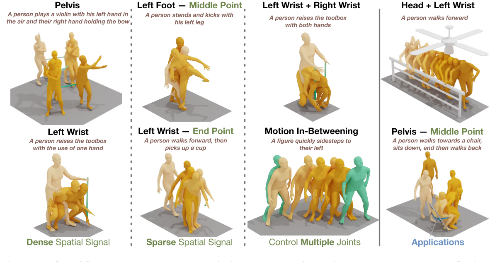
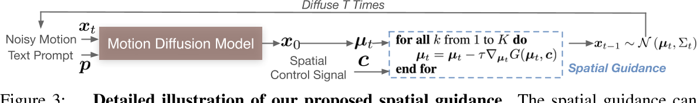
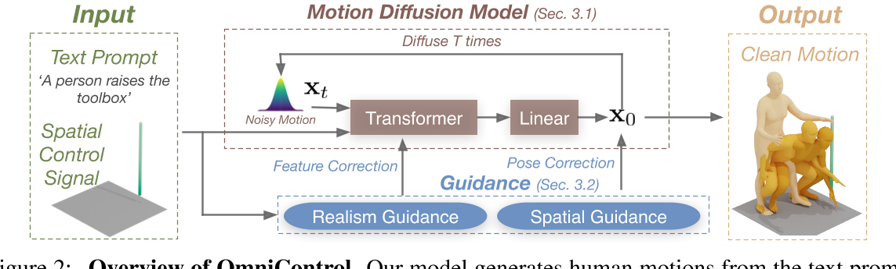
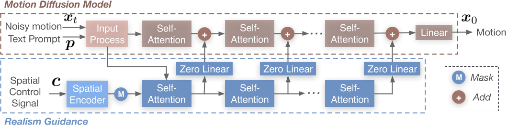
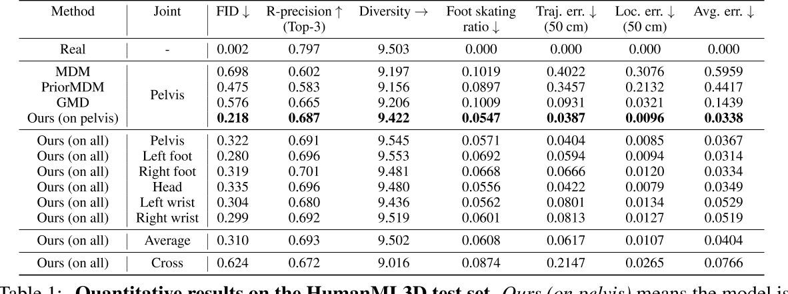
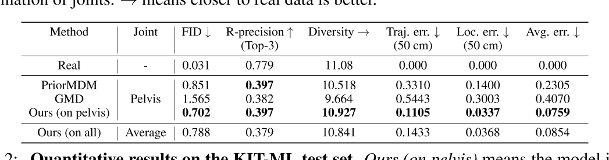

# OmniControl: Control Any Joint at Any Time for Human Motion Generation

这是一篇聚焦于人体运动生成控制的创新性研究论文，旨在解决现有方法在灵活控制人体运动生成中的局限性。以下从研究背景、核心方法、技术亮点及实验成果等方面进行解读：

---

### 1. **研究背景与问题**
传统基于文本条件的人体运动生成模型（如扩散模型）通常仅能通过文本描述生成整体动作，但对具体关节的精细化控制能力不足。例如，现有方法大多只能控制骨盆轨迹，而无法针对不同关节在不同时间点施加动态约束。这种局限性限制了模型在需要高精度运动控制的应用场景（如动画制作、康复训练等）中的实用性。因此，OmniControl提出了一种新的框架，旨在实现**任意关节、任意时间点的灵活空间控制**。

> 颜色由浅至深代表动作的时间顺序。较深的颜色表示序列中的后期帧。  
> 绿线或点表示输入控制信号。

---

### 前情提要

#### Diffusion process for human motion generation

Baseline: MDM

#### Human pose representations

类似于Generating diverse and natural 3d human motions from text中的表示，但把所有相对位置转换为绝对位置。  

### 2. **核心方法**
OmniControl的核心创新在于将**空间引导（Spatial Guidance）**与**真实感引导（Realism Guidance）**结合，通过扩散模型框架实现精准且自然的运动生成。

#### （1）**空间引导**
- **功能**：确保生成的运动严格符合用户输入的空间控制信号（如关节位置、轨迹等）。
- **实现**：通过分析几何约束，将控制信号映射为运动序列的梯度，直接优化扩散模型的生成过程。
- **例子**：

[TODO]公式调整

假设用户希望手腕在时间点 \\( t \\) 的位置为 \\( p_{\text{target}} \\)，而当前生成的手腕位置为\\( p_{\text{current}} \\)，则两者的几何偏差为：  
  \\(\text{偏差} = \| p_{\text{current}} - p_{\text{target}} \|^2  \\)      
  梯度信号即为该偏差对当前生成动作序列 \\( x_t \\) 的导数：    
  \\(   \text{梯度} = \frac{\partial \text{偏差}}{\partial x_t}   \\)       

  它指明了如何调整 \\( x_t \\)，才能使手腕位置更接近目标。     

在扩散模型的每一步去噪过程中：  
- 模型预测噪声 \\( \epsilon_{\text{model}} \\)（常规扩散过程）；  
- **同时**计算控制信号约束的梯度 \\( \nabla_{x_t} \mathcal{C}(x_t) \\)，并调整预测的噪声：   
  \\(  \epsilon_{\text{adjusted}} = \epsilon_{\text{model}} - \lambda \cdot \nabla_{x_t} \mathcal{C}(x_t)  \\)     
  其中，\\( \lambda \\) 是控制信号强度的权重系数。

> 以上过程仅在推断时使用

#### （2）**真实感引导**

尽管空间引导可以有效地强制受控关节遵守输入控制信号，由于相对人体姿势表示的性质，空间引导的梯度不能反向传播到其他关节，因此对其他关节没有影响，正如我们前面提到的。这将导致不切实际的运动。此外，由于扰动位置只是整个运动的一小部分，运动扩散模型可能会忽略空间引导的变化，无法对其余人体关节进行适当的修改，导致人体运动不连贯，脚滑动等artifacts。

- **功能**：修正所有关节的运动细节，提升动作的连贯性和自然性。
- **实现**：引入物理合理性约束（如关节运动范围、动力学特性）和运动风格一致性，避免单纯满足空间控制导致的机械感或不合理姿态。  
实际上没有显示地引入物理约束，而是用ControlNet的方式引入控制信号，然后自己从数据中学到满足物理约束的控制生成。

#### （3）**互补性设计**
两种引导机制通过权重平衡协同工作：空间引导优先满足控制精度，真实感引导则优化整体动作质量。实验表明，二者的结合显著优于单一引导方法。

---

### 4. **实验结果**

- HumanML3D test data

- KIT-ML test data

- **骨盆控制精度提升**：在骨盆轨迹控制任务中，OmniControl的误差较现有方法更低且生成质量更好，证明了空间引导的有效性。
- **多关节控制能力**：实验展示了对手腕、膝盖等非核心关节的精细化控制能力，例如生成“挥手时手腕保持固定高度”的动作，且不影响整体行走的自然性。
- **真实感评估**：通过用户主观评分和物理合理性指标（如关节加速度连续性），OmniControl生成的动作在真实感上优于纯控制优化的基线模型。

---

### 5. **应用与意义**
- **动画与游戏**：为角色动画提供高效、精准的动作设计工具，减少手动调整成本。
- **医疗康复**：生成符合患者特定关节活动需求的训练动作，辅助个性化康复方案制定。
- **机器人运动规划**：为仿人机器人提供更接近人类运动模式的参考轨迹。

---

### 6. **局限性与未来方向**
- **实时性限制**：扩散模型的迭代生成过程导致计算延迟较高，未来可通过蒸馏或加速采样算法优化。
- **复杂场景扩展**：当前实验集中于单人物体交互，多人与环境交互的复杂场景仍需探索。

### 总结
《OmniControl》通过**梯度驱动的空间引导**与**物理约束的真实感引导**，在扩散模型框架内实现了人体运动生成的精细化控制。其核心创新在于将控制信号直接映射为生成过程的优化目标，而非依赖外部模块。其代码和数据集的开源将进一步推动相关领域的研究。