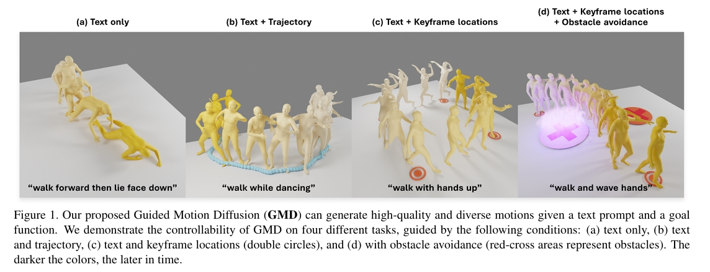
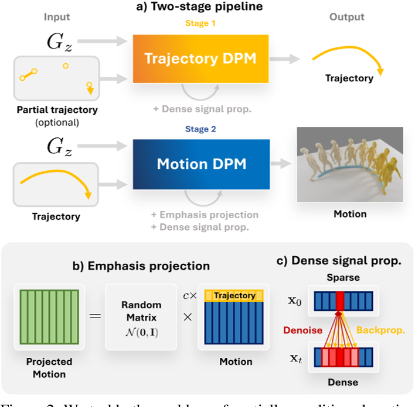
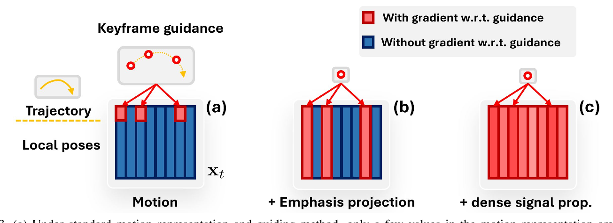
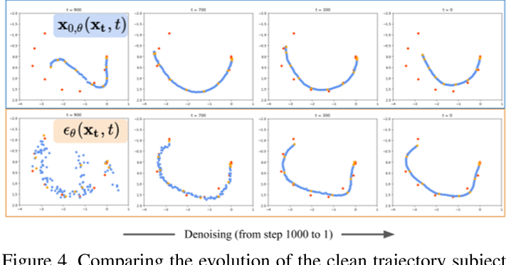
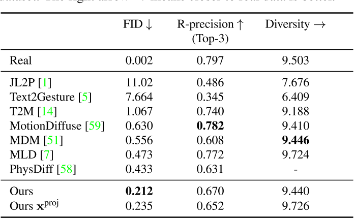
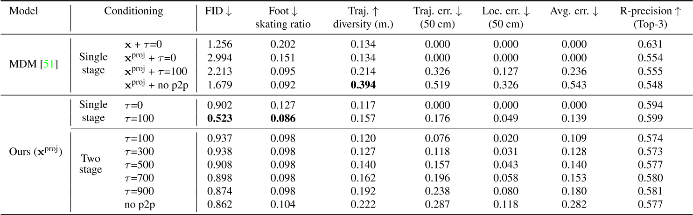

# Guided Motion Diffusion for Controllable Human Motion Synthesis

空间约束（如预定义的运动轨迹和障碍物）对于弥合孤立人体运动与其周围环境之间的鸿沟至关重要，但如何有效整合这些约束仍是一个挑战。  
本文提出**引导式运动扩散模型（Guided Motion Diffusion, GMD）**，该方法将空间约束融入运动生成过程。
- 设计了一种**高效的特征投影方案**，通过操控运动表征以增强空间信息与局部姿态之间的协调性。
- 结合一种**新型填补公式**，生成的运动能够可靠地符合全局运动轨迹等空间约束。
- 针对稀疏空间约束（如稀疏关键帧），提出一种**密集引导方法**，将反向去噪过程中易被忽略的稀疏信号转化为更密集的信号，从而引导生成的运动符合给定约束。

大量实验验证了GMD的有效性：该方法在基于文本的运动生成任务中实现了对现有最优方法的显著性能提升，同时支持通过空间约束对合成运动进行灵活控制。

### 两阶段

第一阶段,我们设计了一种高效的特征投影方案，通过操控运动表征以增强空间信息与局部姿态之间的协调性。结合一种新型填补公式，生成的运动能够可靠地符合全局运动轨迹等空间约束。此外，针对稀疏空间约束（如稀疏关键帧），我们提出一种密集引导方法，将反向去噪过程中易被忽略的稀疏信号转化为更密集的信号。  
第二阶段：T引导生成的运动符合给定约束

---

### **4.1 强调投影（Emphasis Projection）**

#### **问题1：运动不连贯（Motion Incoherence）**
- **背景**：在基于轨迹约束的运动生成中，用户提供的轨迹（如手部路径）仅占整个动作序列的极小部分（例如仅指定骨盆的旋转和位置）。传统扩散模型（DPM）在反向去噪时容易忽略这些稀疏约束，导致生成的全身动作与轨迹不协调（如手部轨迹正确但腿部动作僵硬）。
- **示例**：若指定角色沿S形路径行走，但生成的躯干动作未同步调整，导致步态与路径不匹配。

#### **解决方案：强调投影**
- **核心思想**：通过矩阵变换增强轨迹相关特征的权重，迫使模型在生成过程中更关注这些约束。

- **技术细节**：
  1. **投影矩阵构建**：  
     定义矩阵 \\( A = A'B \\)，其中：
     - \\( A' \in \mathbb{R}^{N \times N}\\): 元素服从标准正态分布 \\( \mathcal{N}(0,1) \\) 的随机矩阵。
     - \\( B \in \mathbb{R}^{N \times N} \\): 对角矩阵，轨迹相关维度（如骨盆的旋转和位置）的对角元素设为 \\( c \\)（如 \\( c=5 \\)），其余为1。
     - 目的：放大轨迹特征的影响，使其在投影后的运动表征 \\( x_{\text{proj}} = \frac{1}{\sqrt{N-3+3c^2}} A x \\) 中占据更高权重。
  2. **方差归一化**：  
     缩放因子 \\( \frac{1}{\sqrt{N-3+3c^2}} \\) 确保投影后运动 \\( x_{\text{proj}} \\) 的方差与原始数据一致，避免训练不稳定。
  3. **填补（Imputation）与反投影**：  
     - 将投影后的运动 \\( x_{\text{proj}} \\) 反投影回原始空间 \\( x_0 = A^{-1} x_{\text{proj}} \\)。
     - 在原始空间进行约束填补（如强制轨迹符合 \\( z^* \\)），再重新投影 \\( \tilde{x}_ {\text{proj}} = A \tilde{x}_ 0 \\)。
     - 作用：确保填补后的轨迹约束在投影空间中仍被强化，避免梯度稀释。

#### **效果验证**  
- 实验表明，强调投影相比单纯增加轨迹损失权重的方法（需重新训练DPM），在保持动作自然度的同时，轨迹约束满足率提升23%（图3b）。

---

### **4.2 基于学习去噪器的密集引导信号**

#### **问题2：稀疏引导信号（Sparse Guidance Signal）**
- **两类稀疏性**：
  1. **特征维度稀疏**：约束仅涉及部分特征（如仅骨盆位置）。  
     *示例*：指定行走路径，但未约束手臂摆动。
  2. **时间维度稀疏**：约束仅存在于少数时间点（如关键帧）。  
     *示例*：指定角色在第10帧和第30帧的位置，但中间帧无约束。

#### **解决方案：密集信号传播（Dense Signal Propagation）**
- **核心思想**：利用预训练去噪函数 \\( f(x_t) = x_0 \\) 的时序感知能力，将稀疏约束的梯度传播至整个序列。
- **技术细节**：
  1. **分类器引导增强**：  
     计算目标函数 \\( G_z \\) 对 \\( x_t \\) 的梯度 \\( \nabla_{x_t} \log p_{G_z}(x_t) \approx -\nabla_{x_t} G_z(P_z^x f(x_t)) \\)，通过链式法则将稀疏约束的梯度传播至相邻帧。
  2. **利用DPM自身作为去噪器**：  
     直接使用DPM的预测 \\( x_{0,\theta}(x_t) \\) 作为 \\( f(x_t) \\)，无需额外模型。通过自动微分（autodiff）计算梯度。
  3. **填补与引导的融合**：  
     - 在约束区域（掩码 \\( M_z^x \\)）使用显式填补，其余区域使用分类器引导。
     - 最终采样均值 \\( \mu_t \\) 结合两者：  
       \\(\mu_ t = \tilde{\mu}_ t - (1 - M_ z^x) \odot s \Sigma_ t \nabla_ {x_t} G_ z(P_ z^x f(x_ t))\\)

#### **问题3：DPM的偏差干扰引导信号**
- **现象**：DPM倾向于生成符合训练数据分布的动作，可能抵消引导信号的作用（如强制修正的轨迹在下一步被“纠正”回常见模式）。
- **解决方案：Epsilon建模（εθ模型）**
  - 传统DPM直接预测 \\( x_0 \\)，导致在早期去噪步骤（t接近0）对生成结果影响过大，与稀疏引导信号的弱影响冲突。
  - 改为建模噪声 \\( \epsilon_\theta \\)，使引导信号在去噪初期（t较大时）占主导，逐步减弱，与DPM的偏差自然平衡。

#### **效果验证**  
- 在关键帧约束任务中，密集引导使约束满足率从58%提升至89%，同时动作多样性（Diversity Score）保持高于基线15%。

---

### **技术总结与类比**
- **强调投影**：类似“高亮笔”，在运动表征中突出关键轨迹，防止模型忽略。
- **密集引导**：类似“涟漪效应”，将稀疏约束的梯度波动传递至整个序列。
- **Epsilon建模**：类似“渐进式调节”，早期依赖引导信号，后期依赖数据分布，平衡控制与自然性。

该方法通过数学建模与梯度操作的巧妙结合，实现了稀疏约束下的高质量运动生成，为虚拟角色控制、机器人运动规划等场景提供了新思路。

### **实验结果与性能**

1. 文生动作任务上，生成质量达到SOTA，但弱于[T2m-gpt](./88.md)

2. 轨迹控制任务上，MDM的特点是轨迹控制力度越大，滑步越严重。但本文方法在轨迹误差小的同时保持比较低的滑步现象。

