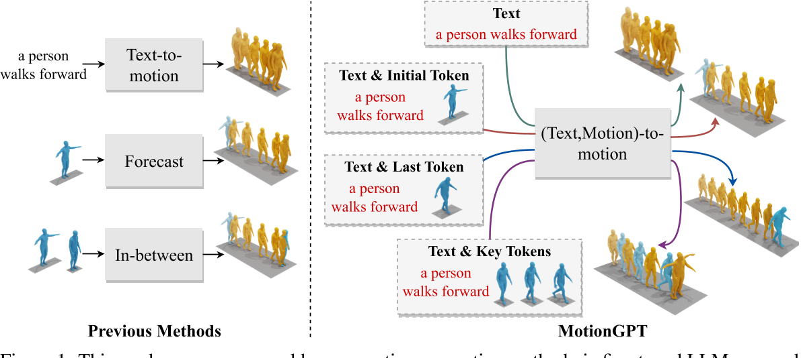
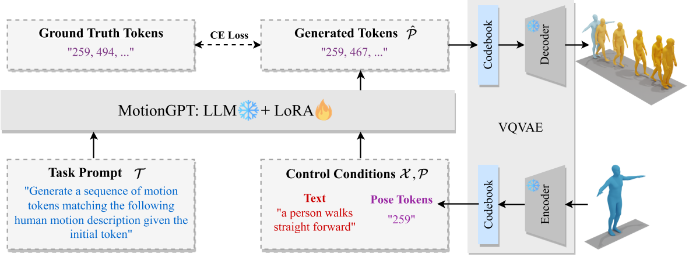
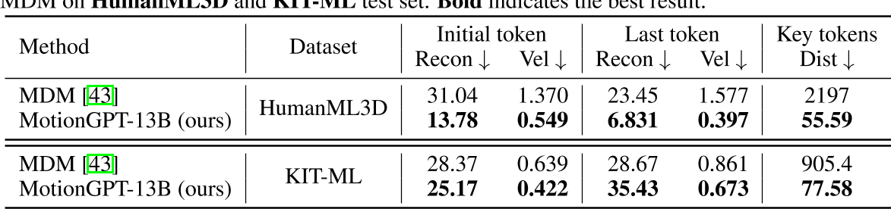
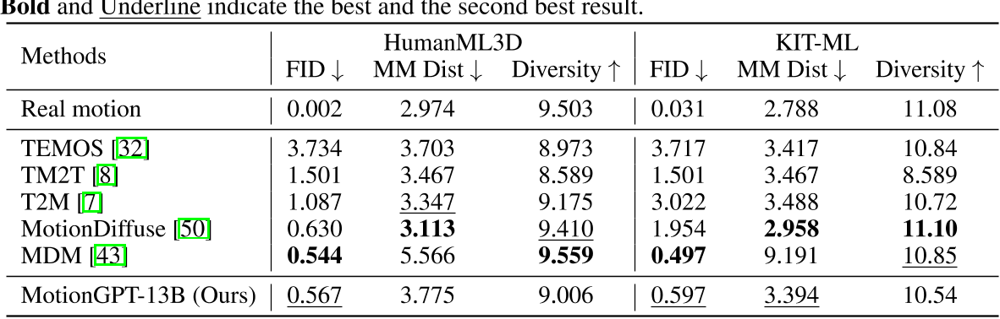

# MotionGPT: Finetuned LLMs are General-Purpose Motion Generators



这项工作提出了一种新型的人类运动生成方法，该方法通过微调LLM，名为MotionGpt。与以前的方法相比，MotionGpt具有接受多个控制条件并使用统一模型解决各种运动生成任务的独特能力。

---

### **1. 核心思想与创新点**
- **跨模态生成框架**：MotionGPT将语言模型的生成能力扩展到运动领域，通过将3D人体运动数据编码为离散的“运动令牌”（motion tokens），并利用微调后的LLM（如LLaMA）实现从文本到动作的端到端生成。

> LLaMA [45] is a series of open-sourced LLMs, which match the performance of proprietary LLMs such as GPT-3.   
> [VQ-VAE](./94.md): Neural Discrete Representation Learning



> 预训练模型：
VQ-VAE: [T2M-GPT](./88.md)

- **统一语言与运动建模**：受自然语言处理的启发，论文将运动序列视为一种特殊“语言”，通过类似文本的分词方式（如VQ-VAE）对运动数据进行离散化表示，使其能够被语言模型直接处理。
- **灵活性与通用性**：支持多种输入条件（如文本描述、初始姿势、关键帧等），并能生成连贯且多样化的动作序列，适用于复杂场景。

---

### **2. 技术实现路径**
1. **数据编码与离散化**  
   - 使用**VQ-VAE**（向量量化变分自编码器）将连续的运动数据（如关节位置、速度）压缩为离散的运动令牌序列。这一过程类似于自然语言中的词嵌入，使LLM能够直接处理运动信息。
   - 通过**LoRA**（低秩适应）技术对预训练的LLM（如LLaMA）进行微调，使其能够理解和生成运动令牌，同时保留语言模型的文本生成能力。

2. **多任务生成能力**  
   - **文本驱动生成**：根据文本描述（如“走路后跳跃”）生成对应动作序列。
   - **运动补全与预测**：基于初始帧或中间状态预测后续动作。
   - **多模态交互**：结合文本和动作输入，生成符合逻辑的连续动作。

3. **关键技术创新**  
   - **混合模态训练**：通过融合运动令牌与文本令牌的联合训练，模型能够同时处理语言和运动数据，实现跨模态对齐。

```
% General control condition format 
Control Conditions: Text control condition X <x1, x2, ..., xnx > Pose control conditions P<p1, p2, ..., pnp > 
% General instruction format 
Instruction I: {Task Prompts T <t1, t2, ..., tnt >} {Control Conditions}
Answer ˆP: {Sequences of Human Motions }
```

其中，Task Prompts可以是多种任务类型，例如:   
```
"Generate a sequence of motion tokens matching the following human motion description."
"Generate a sequence of motion tokens matching the following human motion description given the init/last/key pose tokens."
```

Control Conditions可以同时包含语言token和动作token。  

   - **动态调整机制**：支持通过输入条件（如关键帧）动态调整生成结果，提升生成动作的多样性和可控性。

> 这里所谓的『动态调整』，应该『可调整，不用重训』的意思。不是实时调整的意思，因为先输入控制条件再进行生成，生成过程中是不会再修改控制信号的。

---

### **3. 实验结果与性能**

1. 在多模态控制的动作生成任务上，其可控性比MDM要好很多。  



2. 在单纯的文生动作任务上，其生成质量接近SOTA。


---

### **4. 应用潜力与局限性**
- **应用前景**：  
  - **游戏开发**：快速生成角色动画，提升游戏沉浸感。
  - **机器人控制**：通过语言指令生成机器人动作策略。
  - **医疗康复**：模拟人体运动模式，辅助康复训练。
  
- **当前局限**：  
  - **数据依赖**：高质量运动数据集的稀缺性可能限制模型泛化能力。
  - **长序列生成**：复杂动作的长期连贯性仍需优化。

---

### **5. 与相关工作的对比**
- **与传统生成模型（如VAE、GAN）**：MotionGPT利用LLM的强序列建模能力，生成动作的语义一致性和多样性更优。
- **与扩散模型（如MoRAG）**：MotionGPT通过离散化表示降低了计算复杂度，而扩散模型（如MoRAG）则依赖检索增强生成，两者在任务适应性上各有侧重。

---

### **总结**
MotionGPT通过将大语言模型与运动生成任务结合，开创了文本驱动动作生成的新范式。其核心贡献在于证明了LLM在非文本模态（如3D运动）中的通用生成潜力，并为多模态AI的发展提供了重要参考。未来，结合更高效的训练策略（如参数高效微调）和更大规模的多模态数据集，可能进一步推动该领域的突破。