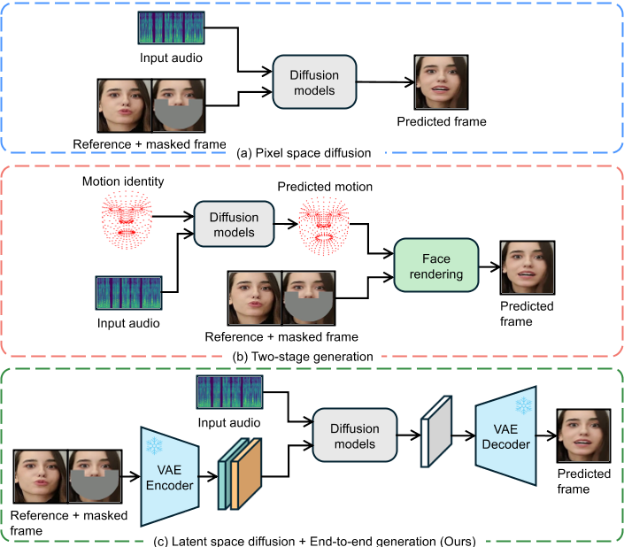
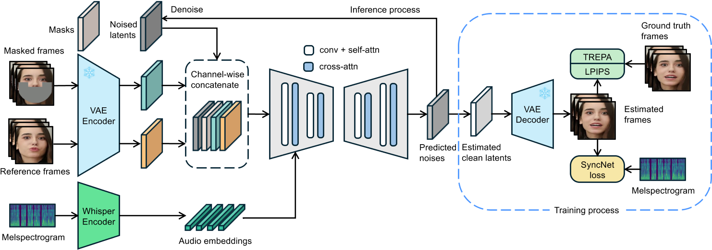
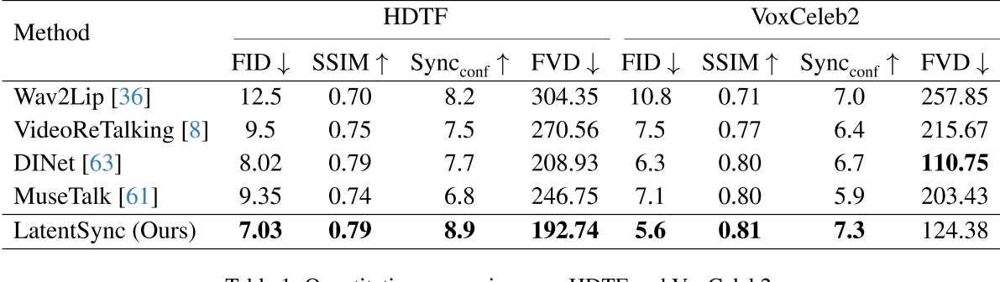

# LatentSync: Audio Conditioned Latent Diffusion Models for Lip Sync

这是一篇聚焦于唇形同步（Lip Sync）任务的创新性论文，旨在通过音频驱动的潜在扩散模型生成高质量且时间一致的唇部动作视频。以下是论文的核心内容解读：

---

## **1. 研究背景与问题**    
唇形同步技术需要根据输入的音频生成对应的唇部动作，同时保持头部姿态和人物身份的一致性。传统方法如基于GAN的模型（如Wav2Lip）存在生成质量低、时间一致性差的问题，而基于扩散模型的方法（如DiffTalk）虽然生成质量高，但受限于像素空间扩散的计算成本或两阶段生成导致的语义信息丢失。此外，现有方法在时间连贯性（帧间动作的流畅性）和SyncNet监督模型的收敛性上也存在不足。

---

## **2. 核心创新**    
### **(1) LatentSync框架**  

#### **端到端潜在扩散模型**：

直接利用Stable Diffusion的生成能力，在**潜在空间**而非像素空间中生成视频帧，避免了传统两阶段方法（如先生成运动表示再合成图像）的语义损失和计算瓶颈。

#### **音频条件输入**： 

通过预训练的音频特征提取模型Whisper模型从梅尔频谱图中提取音频嵌入（audio embeddings），并通过交叉注意力机制与U-Net结合，实现音频到唇部动作的直接映射。   
由于唇部运动可能受相邻多帧音频的影响，且更广范围的音频输入可为模型提供更丰富的时序信息，因此，针对每一生成帧，我们将其周围若干帧的音频组合作为输入。对于第\\( f \\)帧，其输入音频特征\\( A(f) \\)定义为：   

\\(A(f) = \left[ a(f - m), \ldots, a(f), \ldots, a(f + m) \right],\\)

其中\\( m \\)为单侧相邻音频特征的数量。为了将音频嵌入整合至U-Net [42]中，我们直接利用其原生交叉注意力层（cross-attention layer）实现特征融合。

#### **输入结构**：

结合噪声潜在变量、掩码图像和参考图像（共13个通道输入），支持动态生成与遮挡处理。

#### SyncNet Loss

##### 预测噪声 -> 预测图像 

LatentSync模型在噪声空间（noise space）中进行预测，而SyncNet的输入需为图像空间（image space）。为解决这一问题，我们利用预测的噪声\\(\epsilon_\theta(z_t)\\)，通过一步计算得到估计的干净潜在变量\\(\hat{z}_0\\)，其公式为：  

\\( \hat{z}_ 0 = \frac{z_t - \sqrt{1 - \bar{\alpha}_ t} \epsilon _ \theta(z_ t)}{\sqrt{\bar{\alpha}_ t}} \quad (1) \\)
 

##### 监督图像空间 or 监督潜在空间  

另一挑战在于模型的预测基于潜在空间（latent space）。我们探索了两种为潜在扩散模型添加SyncNet监督的方法：   
**(a) 解码像素空间监督**：直接在解码后的像素空间中训练SyncNet。  
**(b) 潜在空间监督**：需在潜在空间中训练SyncNet，其视觉编码器的输入为VAE [12, 26] 编码得到的潜在向量（如图3所示）。   

实验发现，与像素空间训练相比，潜在空间中的SyncNet收敛性较差。我们推测这是由于VAE编码过程中唇部区域的信息丢失所致。根据第4.3节的实验结果，潜在空间SyncNet的收敛性不足也导致监督扩散模型的音唇同步精度下降。因此，LatentSync框架最终采用解码像素空间监督方法。  

### **(2) 时间表示对齐（TREPA）**     
- **问题**：逐帧生成导致时间不一致性，表现为唇部动作的抖动或不连贯。   
- **解决方案**：引入TREPA技术，利用自监督视频模型（如VideoMAE-v2）提取时间表示，通过最小化生成帧与真实帧的时间特征距离作为损失函数，增强帧间连贯性。   
- **效果**：在保持唇形同步精度的同时，显著提升生成视频的流畅性。   

### **(3) SyncNet的优化**

**SyncNet的作用**：作为监督网络，评估生成唇部动作与音频的同步性。   
**改进点**：通过调整模型架构、训练超参数和数据预处理方法，解决了SyncNet的收敛问题，将其在HDTF测试集上的准确率从91%提升至94%。  
**通用性**：优化经验可迁移至其他依赖SyncNet的任务（如肖像动画生成）。   

#### Batchsize

大的batchsize（1024）不仅使该模型能够更快，更稳定地收敛，而且在训练结束时会导致较低的验证损失。   
较小的batchsize（128）可能无法收敛，损失仍处于0.69。  
稍大的batchsize（256），尽管可以实现收敛，但训练损失在下降过程中也会显示出明显的振荡。  

#### Architecture

用不同的Encoder结构影响不大   

#### Self attention

去掉self-attention层使得   
1. 初始训练阶段更快地收敛   
2. 降低了验证损失   
3. 并且有助于降低模型大小并加速推理和训练速度。   
分析原因：self-attention没有CNN的固有诱导偏见，因此，如果没有足够的数据，它们不能很好地概括。   

#### Number of frames

输入帧的数量确定了Syncnet可以感知的视觉和音频信息的范围。   

较小数量的帧（例如5）使得模型收敛慢，且较高的验证损失。   
较大数量的帧（例如16）可以帮助模型收敛。   
过高当量的帧（例如25），在训练的早期阶段，模型会卡在0.69左右。且验证损失没有明显优势。    

#### **数据预处理**：  

1. 使用仿射变换（affine transformation）实现面部正面化（face frontalization）。该方法[18]可使模型有效学习面部特征，尤其在侧脸等复杂视角场景中表现优异。     
2. 对数据做audio-video对齐，并去除对齐置信度低的数据，有明显的效果。  

#### 监督图像空间 or 监督潜在空间

Latent Space: SyncNet收敛性较差。   
Pixel Space: SyncNet收敛性较好。   
实验发现，与像素空间训练相比，潜在空间中的SyncNet收敛性较差。我们推测这是由于VAE编码过程中唇部区域的信息丢失所致。根据第4.3节的实验结果，潜在空间SyncNet的收敛性不足也导致监督扩散模型的音唇同步精度下降。因此，LatentSync框架最终采用解码像素空间监督方法。   
---

## **3. 实验与结果**

- **数据集**：在HDTF和VoxCeleb2数据集上进行评估，涵盖多人物、多场景的复杂情况。   
- **指标对比**：在视觉质量（FID）、唇形同步准确性（Sync_conf）和时间一致性（FVD）等指标上均超越现有方法。   

> 本文使用Sync_conf来估计唇形同步性，但之前的论文使用LSE-C。   

- **消融实验**：验证了TREPA和SyncNet监督的有效性，并展示TREPA对其他方法的通用性（如提升[Wav2Lip](./91.md)的时间一致性）。   

---

## **4. 技术细节**

### 基模型

基于Stable Diffusion 1.5初始化模型，使用Adam优化器和线性学习率调度。   

问：为什么使用SD而不使用SVD？    
答：现有方法（SVD）中的时间层使用temporal self-attention）来增强时间一致性。实验发现，这会显著降低唇形同步精度。而本文提出的TREPA不仅未损害同步精度，反而对其有一定提升。我们推测原因如下：    
1. **参数干扰**：时间层为U-Net引入额外参数，导致反向传播中部分梯度被分配至时间层参数，弱化了音频交叉注意力层（audio cross-attention）参数的学习；  
2. **信息依赖强化**：TREPA不增加模型参数，为提升时间一致性，模型需更高效利用音频窗口中的信息（因唇形同步模型依赖音频窗口捕捉时序信息），从而进一步训练并强化音频交叉注意力层（定量结果见第4.3节）。  

### **两阶段训练策略**：  

#### **第一阶段**：

此阶段不进行像素空间解码，且不引入SyncNet损失函数。其核心目标是利用大批次（large batch size）训练使U-Net充分学习视觉特征。该阶段的训练目标仅包含基础噪声预测损失。   

#### **第二阶段**：

此阶段采用解码像素空间监督方法，引入SyncNet损失。   

1. SyncNet损失：   

将SyncNet的输入帧长度扩展至16帧（SyncNet结构调整细节参见第3.3节）。通过解码后的16帧视频序列\\( D(\hat{z}_ 0)_ {f:f+16} \\)及对应音频序列\\( a_{f:f+16} \\)计算SyncNet损失   

2. LPIPS损失   

由于唇形同步任务需生成唇部、牙齿及面部毛发等细节区域，我们进一步引入LPIPS损失[59]以提升生成图像的视觉质量。   

3. 为增强时间一致性，我们还引入提出的TREPA(Temporal Representation Alignment)损失。  

综上，第二阶段的总损失函数为：  

\\(\mathcal{L}_ {\text{total}} = \lambda_1 \mathcal{L}_ {\text{simple}} + \lambda_ 2 \mathcal{L}_ {\text{sync}} + \lambda_3 \mathcal{L} _ {\text{lpips}} + \lambda_ 4 \mathcal{L}_ {\text{trepa}} \quad (5)  \\)
 
通过实证分析，我们确定最优损失权重系数为：\\( (\lambda_1, \lambda_2, \lambda_3, \lambda_4) = (1, 0.05, 0.1, 10) \\)。  

### **推理加速**：

采用DDIM采样加速生成过程，并通过无分类器指导（CFG）提升生成质量。   

---

## **5. 应用与影响**
- **应用场景**：视频配音、虚拟化身、深度伪造检测等。   
- **潜在风险**：可能被滥用生成高保真伪造视频，需结合伦理与安全措施。    
- **技术启示**：展示了潜在扩散模型在多模态任务（如视听关联建模）中的潜力，为后续研究（如全身动作生成）提供参考。    

---

## **总结**    
LatentSync通过结合潜在扩散模型的高效生成能力、TREPA的时间对齐机制，以及对SyncNet的优化，显著提升了唇形同步任务的性能。其端到端设计和高扩展性（如兼容SDXL等更强大的扩散模型）为未来研究提供了重要方向。   