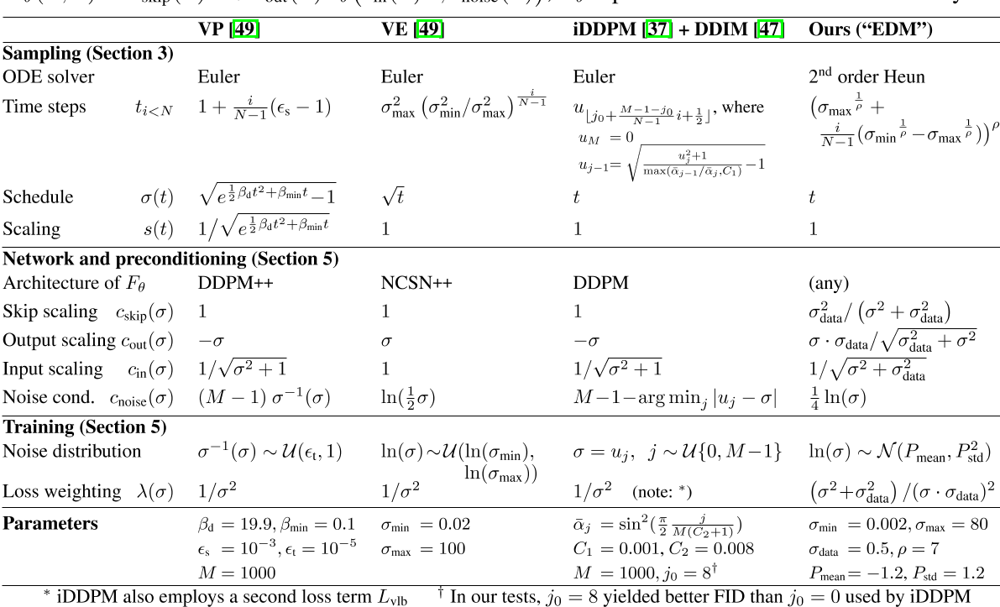

# Elucidating the Design Space of Diffusion-Based Generative Models

## 核心问题是什么?

diffusion model模型的文献在理论方面非常丰富，采样计划、训练动态、噪声水平参数化等的推导往往尽可能直接基于理论框架，这确保了模型具有坚实的理论基础。然而，这种方法存在模糊可用设计空间的危险——所提出的模型可能会显示为紧密耦合的包，其中任何单个组件都无法在不破坏整个系统的情况下进行修改。  

## 核心贡献是什么？

文章用一种新的设计框架统一diffusion-based model，并使用模块化（modular）的思想，分别从采样、训练、score network设计三个方面分析和改进diffusion-based model。  
1. 我们从实践的角度来审视这些模型背后的理论，更多地关注训练和采样阶段出现的“有形”对象和算法，而不是它们可能来自的统计过程。目标是更好地了解这些组件如何连接在一起以及整个系统设计中可用的自由度。
2. 采样：我们确定了采样的最佳时间离散化，对采样过程应用高阶龙格-库塔方法，评估不同的采样器计划，并分析随机性在采样过程中的有用性。这些改进的结果是合成过程中所需的采样步骤数量显着减少，并且改进的采样器可以用作几种广泛使用的扩散模型的直接替代品。
3. 训练：虽然我们继续依赖常用的网络架构（DDPM [16]、NCSN [48]），但我们在扩散模型设置中提供了对网络输入、输出和损失函数的预处理的第一个原理分析，并得出提高训练动力的最佳实践。我们还建议在训练期间改进噪声水平的分布，并注意到non-leaking augmentation [25]（通常与 GAN 一起使用）也有利于扩散模型。
总而言之，我们的贡献可以显着提高结果质量。同时，通过明确列出设计空间的所有关键要素，我们相信我们的方法将使各个组件更容易创新，从而能够对扩散模型的设计空间进行更广泛和有针对性的探索。

## 大致方法是什么？

### Expressing diffusion models in a common framework

假设有方差是\\( \sigma_{data} \\)的数据分布 \\(p_{data}(\mathbf x) \\)。通过多次对数据添加方差为\\( \sigma \\)的高斯噪声，得到的\\(p(x; \sigma_{max})\\为纯高斯噪声（此处没有考虑缩放）。

则有下面的ODE描述数据分布随着时间的变化：

如果把缩放考虑进去，则公式变为：

> 为了让p(x)与t无关，以下都是基于不考虑缩放的版本。

diffusion-based model都是逐步添加高斯噪声的过程，主要就是两个不同，一个是缩放 s(t)，一个是噪声的大小σ(t)。

作者在三个预训练模型进行了重构。三个预训练模型代表不同的理论框架和模型系列，都重构到一套统一的框架中。且重构后所有组件之间不存在隐式依赖关系——原则上，各个公式的任何选择（在合理范围内）都会产生一个功能模型。换句话说，更改一个组件并不需要更改其他组件，以便保持模型收敛到极限数据的属性。在实践中，某些选择和组合当然会比其他选择和组合效果更好。

> 表 1：N 是采样期间执行ODE solver迭代的次数。相应的时间步序列是{t0, t1,...。 。 。 , tN }，其中 tN = 0。降噪器定义为\\(Dθ (x; σ) = c_{skip}(σ)x + c_{out}(σ)Fθ(c_{in}(σ)x; c_{noise}(σ));\\) Fθ 表示原始神经网络层。  
> 一些公式看起来与原始论文有很大不同，因为间接和递归已被删除；详细信息请参见附录 C。

求解ODE的过程可以把积分离散化，即在离散时间间隔上采取有限步骤。这需要选择离散化方案（例如，Euler 或 Runge-Kutta 的变体）以及离散采样时间 {t0, t1,...。 。 。 ，tN}。许多先前的工作使用欧拉方法，但我们在第 3 节中表明二阶求解器提供了更好的计算权衡。

### Improvements to deterministic sampling

我们的假设是，与采样过程相关的选择在很大程度上独立于其他组件，例如网络架构和训练细节。  

对 ODE 进行数值求解是遵循真实解轨迹的近似值。在每一步中，求解器都会引入局部截断误差，截断误差会在N 步中累积。

1. 局部误差通常相对于步长呈超线性缩放，因此增加 N 可以提高解决方案的准确性。
2. Euler方法是一阶solver，步长 h 的局部误差为 \\(O(h^2)\\)。而高阶方法有较小的截断误差，但在每一步需要进行多次网络预测。Heun二阶方法则在误差精度与推断次数之间有比较好的权衡。
3. 步长{ti}应该随着 σ 的减小而单调减小，并且不需要根据每个样本而变化（附录 D.1）。
4. s(t)和σ(t)的选择提供了一种减少上述截断误差的方法，因为它们的大小预计与 dx/dt 的曲率成比例。作者认为这些函数的最佳选择是 σ(t) = t 和 s(t) = 1，这也是 DDIM [47] 中做出的选择。通过这种选择，ODE公式(4) 简化为 dx/dt = (x − D(x; t))/t， 并且 σ 和 t 可以互换。

### Stochastic sampling

确定性采样有许多好处，例如，能够通过反转 ODE 将真实图像转换为其相应的潜在表示。然而，它输出的质量差于SDE [47, 49]。鉴于 ODE 和 SDE 理论上恢复相同的分布，那么随机性到底有何作用？

这揭示了为什么随机性在实践中有帮助：隐式朗之万扩散在给定时间将样本推向所需的边缘分布，主动纠正早期采样步骤中发生的任何错误。

但是，用离散 SDE 求解器步骤逼近 Langevin 项本身会引入误差。之前的结果 [3, 24 , 47 , 49 ] 表明非零 β(t) 是有帮助的，但Song 等人对 β(t) 的隐式选择[49]只是根据经验确定。

我们提出了一种随机采样器，它将二阶确定性 ODE 积分器与添加和消除噪声的显式的类似 Langevin 的“搅动”相结合。算法 2 中给出了伪代码。

我们的方法和 Euler-Maruyama 之间的主要区别在于在离散化公式6时存在细微的差异。 Euler-Maruyama方法先添加噪声，然后执行 ODE 步骤。ODE不是从噪声注入后的中间状态开始，而是假设 x 和 σ 在迭代步骤开始时保持在初始状态。在我们的方法中，算法 2 第 7 行用于评估 Dθ 的参数对应于噪声注入后的状态(而Euler-Maruyama 的方法将使用 xi;ti 代替 \\(\hat x_i; \hat t_i\\)).在 Δt 接近零的极限下，这些选择之间可能没有区别，但当以大步长追求低 NFE 时，区别就变得很重要了。

## 有效

### Stochastic sampling

我们的随机采样器明显优于以前的采样器 [24,37,49]，特别是在低步数的情况下

## 缺陷

## 验证

### Improvements to deterministic sampling

我们首先使用这些模型的原始采样器实现测量基线结果，然后使用表 1 中的公式将这些采样器引入我们的统一框架，然后进行改进。这使我们能够评估不同的实际选择，并对适用于所有模型的采样过程提出一般改进。

## 启发

## 遗留问题

## 参考材料

https://blog.csdn.net/icylling/article/details/133840948