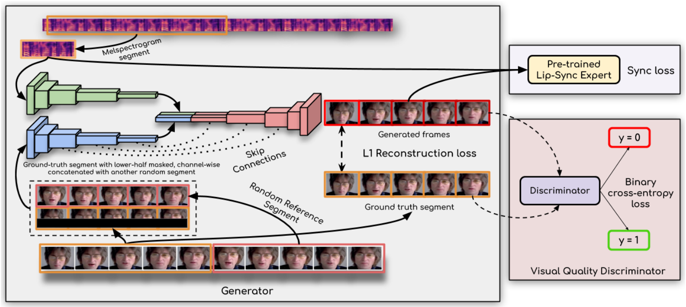
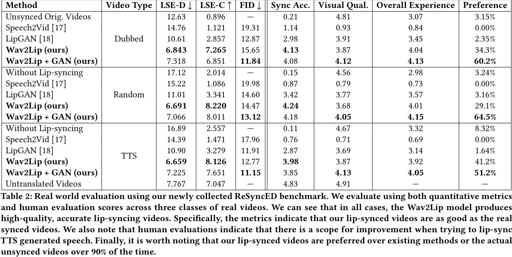

# A Lip Sync Expert Is All You Need for Speech to Lip Generation In The Wild

这是2020年发表于ACM国际多媒体会议的一篇论文，提出了Wav2Lip模型，旨在解决无约束视频中语音与唇形同步生成的问题。该模型通过引入预训练的唇形同步专家鉴别器和多阶段训练策略，显著提升了动态视频中唇形与语音的同步精度，成为该领域的代表性工作。以下从核心贡献、方法创新、实验结果及局限性等方面进行解读：

---

### 一、核心贡献与创新点
1. **提出Wav2Lip模型**  
   该模型**首次实现了对任意身份、语音和语言的视频进行高精度唇形同步生成**。其核心在于通过预训练的唇形同步鉴别器（SyncNet改进版）提供强监督信号，迫使生成器学习准确的唇形动作。与之前基于GAN的方法（如LipGAN）相比，Wav2Lip的同步准确率从56%提升至91%。

2. **改进唇形同步鉴别器（SyncNet）**  
   - **输入改进**：从灰度图像改为彩色图像，保留更多细节；
   - **结构优化**：引入残差连接以增加模型深度；
   - **损失函数调整**：使用余弦相似度和二元交叉熵损失替代原SyncNet的L2距离损失，提升同步判断精度。

3. **引入新的评估框架与数据集**  
   论文提出了ReSyncED数据集和新的评估指标（如Lip-Sync Error-Distance和Confidence），为无约束视频的唇形同步性能提供了标准化测试基准。

---

### 二、方法解析

1. **生成器架构**  
   生成器基于编码-解码结构，包含三个模块：
   - **身份编码器**：编码参考帧和姿态先验（下半脸遮罩）；
   - **语音编码器**：提取语音特征；
   - **面部解码器**：融合特征生成唇形同步帧。  
   生成器通过L1重建损失、同步损失（由预训练鉴别器提供）和对抗损失联合优化，确保同步性与视觉质量的平衡。

2. **双鉴别器机制**  
   - **唇形同步鉴别器**：冻结权重，仅用于监督生成器的同步损失，避免GAN训练中的模式崩溃问题；
   - **视觉质量鉴别器**：通过对抗训练提升生成图像的清晰度，减少模糊和伪影。

3. **时间一致性处理**  
   生成器独立处理每帧图像，但通过堆叠连续5帧输入，确保时间窗口内的唇形连贯性。

---

### 三、实验结果与优势
1. **性能对比**  
   Wav2Lip在多个数据集（如LRS2、ReSyncED）上的唇形同步误差（Lip-Sync Error-Distance）接近真实视频，人类评估显示其生成的视频在90%以上的案例中优于现有方法。

2. **应用场景**  
   模型支持多语言音频驱动，适用于视频翻译、影视配音、虚拟数字人等场景，且推理速度较快。

3. **优势总结**  
   - **高泛化性**：无需特定人物数据，可处理任意身份的视频；
   - **实时性**：生成速度满足实际应用需求。

---

### 四、局限性及改进方向
1. **生成质量不足**  
   中文语音驱动时牙齿细节还原较差，可能与训练数据（如LRS2数据集）的清晰度限制有关。

2. **侧脸与快速运动问题**  
   侧脸视频的上下半脸衔接易出现瑕疵，因训练时下半脸被完全遮罩，缺乏上下文信息。

3. **改进方向**  
   - 使用超分辨率模型预处理训练数据；
   - 精细化遮罩设计（基于人脸关键点检测）；
   - 提升输入分辨率以增强细节。

---

### 五、总结
Wav2Lip通过预训练唇形同步鉴别器和多损失联合优化策略，解决了动态视频中语音驱动的唇形同步难题，成为该领域的基准模型。其开源代码和预训练模型推动了后续研究与应用发展，但在生成质量与复杂场景适应性上仍需进一步优化。