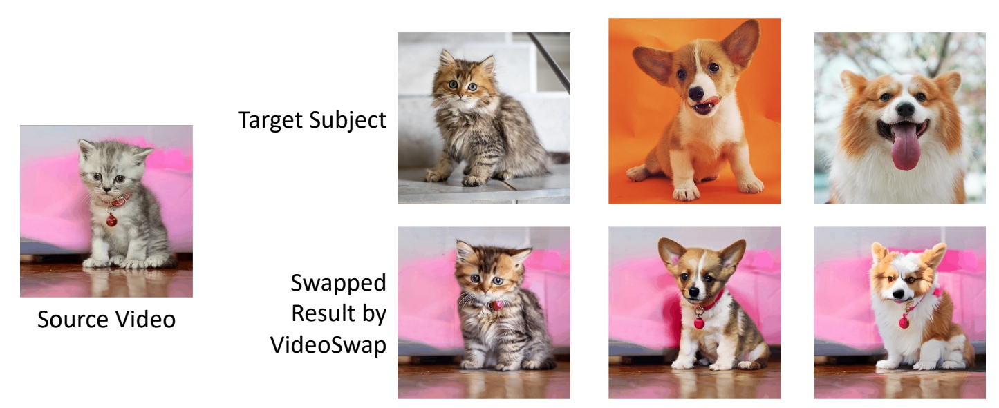
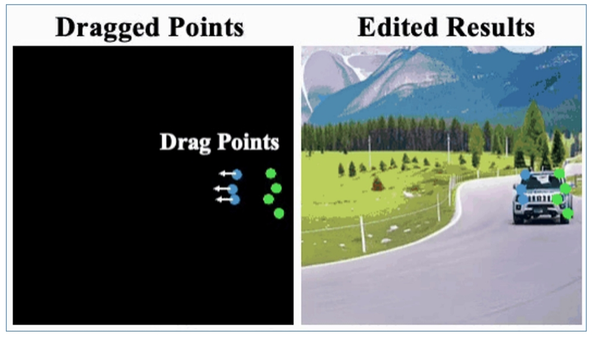
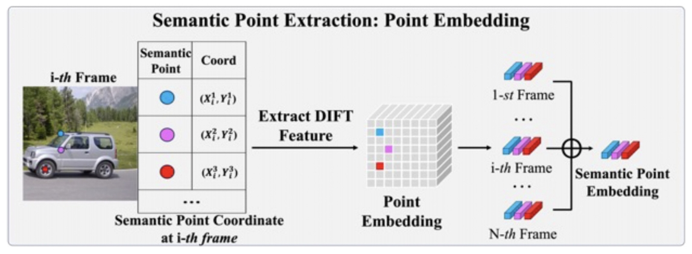
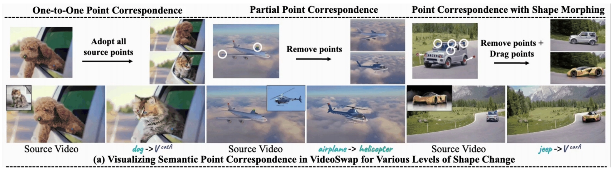

## VideoSwap

Customized video subject swapping via point control

**Problem Formulation**

 - Subject replacement: change video subject to a **customized** subject    
 - Background preservation: preserve the unedited background same as the source video    

 

Gu et al., “VideoSwap: Customized Video Subject Swapping with Interactive Semantic Point Correspondence,” 2023.    

> &#x2705; 要求，背景一致，动作一致，仅替换前景 content.   
> &#x2705; 因比对原视频提取关键点，基于关键点进行控制。   

P227    

**Motivation**

 - Existing methods are promising but still often motion not well aligned   
 - Need ensure precise correspondence of <u> **semantic points** </u> between the source and target   

  

> &#x2705; (1) 人工标注每一帧的 semantic point．（少量标注，8帧）    
> &#x2705; (2) 把 point map 作为 condition．   

P228    

**Empirical Observations**

 - **Question**: Can we <u> learn semantic point control </u> for a specific <u>source video subject</u> using only a <u>small number of source video frames</u>   
 - **Toy Experiment**: Manually define and annotate a set of semantic points on 8 frame; use such point maps as condition for training a control net, i.e., [T2I-Adapter](https://caterpillarstudygroup.github.io/ReadPapers/65.html).    

 

> &#x2705; 实验证明，可以用 semantic point 作为 control．   
> &#x2705; 结论：T2I 模型可以根据新的点的位置进行新的内容生成。   

P229    

**Empirical Observations**

 - **Observation 1**: If we can drag the points, the trained T2I-Aapter can generate new contents based on such dragged new points (new condition)  →  feasible to use semantic points as condition to control and maintain the source motion trajectory.

 

> &#x2705; 也可以通过拉部分点改变车的形状。   

P230    

**Empirical Observations**

 - **Observation 2**: Further, we can drag the semantic points to control the subject’s shape   
 
 

> &#x2705; 虚线框为类似于 control net 的模块，能把 semanti point 抽出来并输入到 denoise 模块中。    
> &#x2705; Latent Blend 能更好保留背景信息。   
> &#x2705; 蓝色部分为 Motion layer.    

P231    

 

**Framework**

 - **Motion layer**: use pretrained and fixed AnimateDiff to ensure essential temporal consistency    
 - **ED-LoRA** \\(_{(Mix-of-Show)}\\): learn the wconcept to be customized   

 - **Key design aims**: 
    - Introduce semantic point correspondences to guide motion trajectory   
    - Reduce human efforts of annotating points    

 
Gu et al. “Mix-of-Show: Decentralized Low-Rank Adaptation for Multi-Concept Customization of Diffusion Models.” NeurIPS, 2023.   

P232   

**Step 1: Semantic Point Extraction**

 - Reduce human efforts in annotating points    
    - User define point at one keyframe    
    - Propagate to other frames by point tracking/detector   
 - Embedding    

   

> &#x2705; 什么是比较好的 Semantic point 的表达？   

P233   

**Methodology – Step 1: Semantic Point Extraction on the source video**

 - Reduce human efforts in annotating points   
 - Embedding   
    - Extract DIFT embedding (intermediate U-Net feature) for each semantic point   
    - Aggregate over all frames   

 
  

> &#x2753; Embedding, 怎么输人到网络中？   
> &#x2705; 网络参数本身是 fix 的，增加一些小的 MLP, 把 Embeddin 转化为不同的 scales 的 condition map, 作为 U-Net 的 condition.   

P234    

**Methodology – Step 2: Semantic Point Registration on the source video**  

 - Introduce several learnable MLPs, corresponding to different scales
 - Optimize the MLPs    
    - Point Patch Loss: restrict diffusion loss to reconstruct local patch around the point    
    - Semantic-Enhanced Schedule: only sample higher timestep (0.5T, T), which prevents overfitting to low-level details    

 

> &#x2705; 有些场景下需要去除部分 semanfic point, 或移动 point 的位置。   

P235     

**Methodology**   

 - After Step1 (Semantic Point Extraction) and Step2 (Semantic Point Registration), those semantic points can be used to guide motion   
 - User-point interaction for various applications   

 
 

> &#x2705; 在一帧上做的 semantic point 的移动，迁移到其它帧上。   

P236   

**Methodology**

 - How to drag point for shape change?   
    - Dragging at one frame is straightforward, propagating drag displacement over time is non-trivial, because of complex camera motion and subject motion in video.   
    - Resort to canonical space (i.e., Layered Neural Atlas) to propagate displacement.   

  

P237   

**Methodology**

 - How to drag point for shape change?   
 - Dragging at one frame is straightforward, propagating drag displacement over time is non-trivial because of complex camera motion and subject motion in video.   
 - Resort to canonical space (i.e., Layered Neural Atlas) to propagate displacement.    

 
  

P238    

 

P239   

  

> &#x2705; point contrd 可以处理形变比较大的场景。   

P240   

**Qualitative Comparisons to previous works**

 - VideoSwap can **support shape change** in the target swap results, leading to the correct identity of target concept. 

  

P241   
> &#x2705; 重建 3D 可以解决时间一致性问题。 