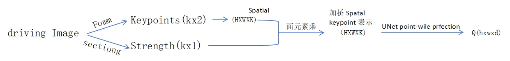
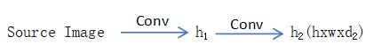

# Template Implicit Warping 

NVIDIA   

## 核心问题是什么?

### 目的

.    
.    
.    
.    
.    

### 现有方法及局限性

.    
.    
.    
.    
.    

### 本文方法

.    
.    
.    
.    
.    

### 效果

.    
.    
.    
.    
.    

## 核心贡献是什么？

.    
.    
.    
.    
.    
.    
.    
.    
.    
.    
.    
.    
.    
.    
.    
.    
.    
.    
.    
.    

## 大致方法是什么？

 

1. 找出 source和driving 的 dense correspondence     
2. 基于 dense corresponence 的 warp，称其为 impicit warping 作者认为一个CA可以完成 1 和 2.     

 

不需要显式地提取光流，Q 和 K 的相似度描述了隐式的光流。  

### 构造 Q. K .V    

**K**: Source keypoint feature     
**Q**: driving keypoint feature   
**V**: Source image feature   

Q 的构造：    

 

spafial keypoint 表示，[:,:,i] 为以第i个 keypoint 位置为中心，特定均值和方差的二维一通道高斯。        
   
Q 和 K 的区别：UNet 的输入 concat (加权利spafial keypoint 表示，source Image)     
优势：后面由模块与 keypoint 的个数无关。     

V 的构造：
 

Q、K、V 在空间上是对应的。     

CA 存在的问题：所有的 key 与 query 都相似度不高时，也会从 key 中选择一个 Score 最高的，但这个 key 可能并不合适，或者选择任何一个 key 都不合适。      
  
解决方法：   
1. 增如额外的 KV 
2. 使用 dropout 来鼓励使用额外的 KV      

[&#x2753;] 额外的 KV 从哪里来？    

dropout 仅应用于 attention layer，不能应用于 Conv. 因为conv 是有位置关系的。    

### crsss - modal attention   

**Q**: qxd, **K**: kxd,**V**: kxd'    
由于 source image 可能有多张，因此 q 和 k 不一定相等。    

$$
\begin{matrix}
 Q=Q+PE, &K=K+PE \\
  A=\text{Softmax} (\frac{Q- K^\tau }{C}), & qxk \\
\text{output feature}  =A- V,& qxd{}'  &
\end{matrix}
$$

MLP(concat(A \\(\cdot\\) concat(pixel,K),Q))    

 

目的：除了用 A warp 3 V，在 warp 3 原图和 key，用于提取 skew, rotation 等“对 V 做加权平均”难以学到的信息，可提升生成质量和颜色一致性。    

效来提升：1- D attention layer ， spatial-redution attention        

.  
.  
.  
.  
.  
.  
.  

## 训练

.  
.  
.  
.  
.  
.  
.  
.  
.  
.  
.  
.  
.  
.  
.  
.  
.  
.  
.  
.  

### 数据集

TalkinqHead-IkH
VoxCeleb2TED Talk
自评价指材
生成图像质量 ，PSNR，Ll，LPIPS,FID运动相似度，AKD (average keypint distaneMRCmissing keypont ratio]
.  
.  
.  
.  
.  
.  
.  
.  
.  
.  
.  
.  
.  

### loss

.  
.  
.  
.  
.  
.  
.  
.  
.  
.  
.  
.  
.  
.  
.  
.  
.  
.  
.  
.  

### 训练策略

.  
.  
.  
.  
.  
.  
.  
.  
.  
.  
.  
.  
.  
.  
.  
.  
.  
.  
.  
.  

## 实验与结论

.  
.  
.  
.  
.  
.  
.  
.  
.  
.  
.  
.  
.  
.  
.  
.  
.  
.  
.  
.  
.  
.  
.  
.  
.  
.  
.  
.  
.  
.  
.  
.  
.  
.  
.  
.  
.  
.  
.  
.  
.  
.  
.  
.  
.  
.  
.  
.  
.  
.  
.  
.  
.  
.  
.  
.  
.  
.  
.  
.  

## 有效

.  
.  
.  
.  
.  
.  
.  
.  
.  
.  
.  
.  

## 局限性

.  
.  
.  
.  
.  
.  
.  
.  
.  
.  
.  
.  
.  
.  
.  

## 启发

.  
.  
.  
.  
.  
.  
.  
.  
.  
.  
.  
.  
.  
.  
.  
.  
.  
.  
.  
.  

## 遗留问题

.  
.  
.  
.  
.  
.  
.  
.  
.  
.  
.  
.  
.  
.  
.  
.  
.  
.  
.  
.  

## 参考材料